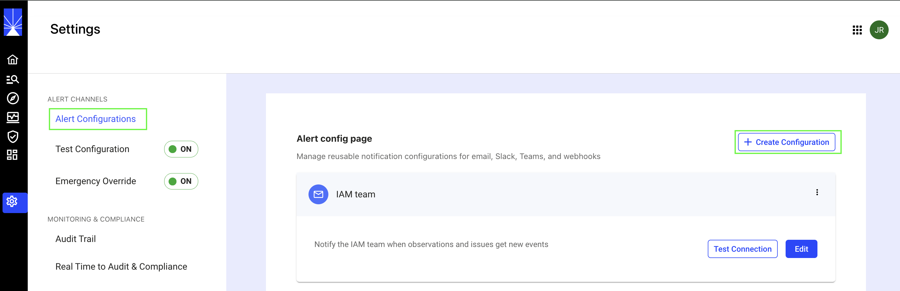
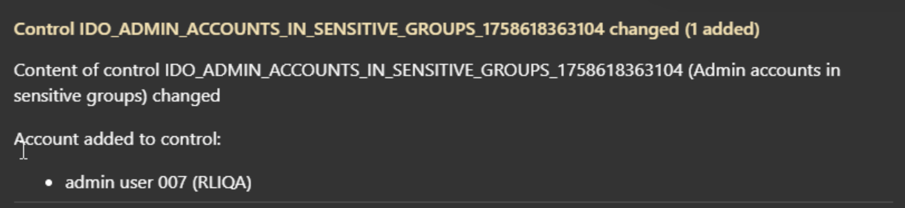
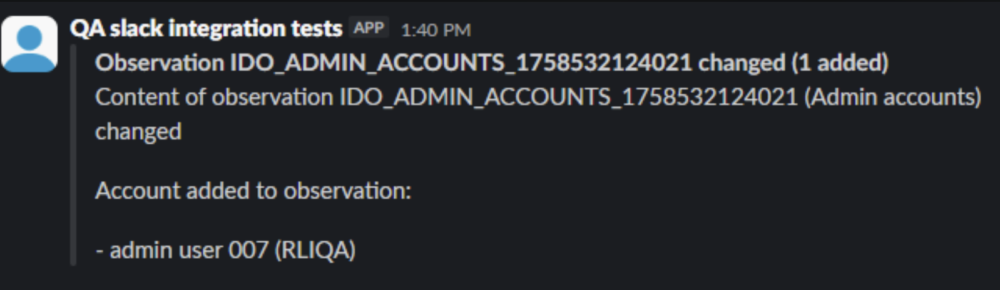
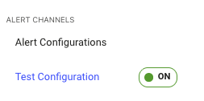
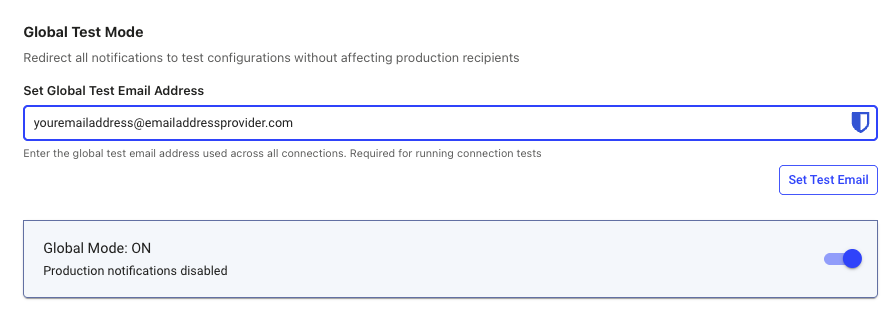
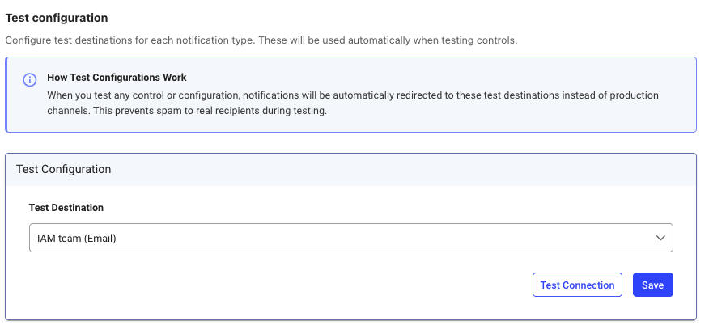

## Overview 
 
Alerts inform you about changes related to observations and/or controls that you have enabled in your Identity Observability portal.  
 
When you create a new observation or control, you have the option to enable alerts and configure it for your observation and control. This document provides information on how to create configuration templates defining channels and recipients that can be used (Alert Configuration menu). In addition, the options you can use for testing and emergency override.  
 
 
### Steps to configure alerts 
 
Before using alerts, you (technical administrator) must configure templates that specify the notification channels and recipients. Follow these steps to configure alerts:  

1. Navigate to Admin > Settings > Alert Configurations.

   

 
2. Once you are in the Alert Configurations page, click on the Create Configuration button.  

3. Enter a name for the configuration template and select the notification channel type: Email, Slack, Microsoft Teams, Webhook. Choose where the alert should be delivered: 
 
   **Email:**
   
   For email notifications, you will need to provide a brief description for the configuration template, from address (sender’s email address) and to address (recipients’ email address).  
    
   **Other delivery channels:**
   
    For Slack, Microsoft and Webhook notifications, you will need to provide a configuration file. This file should be in JSON format. 

   > The examples below use generic values for demonstration purposes. Be sure to collaborate with your IT team to confirm the correct values and verify that the intended recipients are included in the specified channels.
    
   Here is an example of a Slack configuration file:  
   
   ```
       { 
   
           "service": "slack", 
   
           "displayname": "Test Slack", 
   
           "config": { 
   
               "api-url": "https://idodocumentation.slack.com/api/chat.postMessage", 
   
               "channel": "fun-channel", 
   
               "username": "@ido_alerts", 
   
               "http-config": { 
   
                   "authorization": { 
   
                       "credentials": "xxxx-xxxx", 
   
                       "type": "Bearer" 
   
                   } 
   
               } 
   
           } 
   
       } 
   ``` 
    
   Here is an example of Microsoft Teams configuration file: 
   
   ```
       { 
   
           "service": "msteams", 
   
           "displayname": "Test MS Teams", 
   
           "config": { 
   
               "webhook-url": "https://idodocumentation.08.environment.api.powerplatform.com:443/powerautomate/automations/direct/workflows/xxxxxx/triggers/manual/paths/invoke/?api-version=1&sp=%2Ftriggers%2Fmanual%2Frun&sv=1.0&sig=xxxx" 
   
           } 
   
       } 
   ```

 
4. After you provide the required information, review it and click save configuration.  
 
### Examples of Alerts 


Here is an example of a Microsoft Teams alert: 




Here is an example of a Slack alert: 



 
### Test Configuration

Prior to enabling alerts in production, you can enable **Test Mode** to safely redirect notifications related to observation or control events. This is useful for testing notification flows. We strongly recommend keeping this option enabled in your environment until you are ready to recieve alerts in  production.

 


- **Global Mode**: Enter an email address to redirect *all* notifications to a single recipient when Global Mode is ON.  

  


- **Test Configuration Templates**: You can also apply one of your predefined configuration templates. When end users test these templates, notifications will be redirected to the specified channel or recipient.  

  


### Emergency Override

If you are performing maintenance, making significant changes to identity data, or uploading new environments to Identity Observability, you may want to temporarily pause notifications to avoid overwhelming recipients.

To do this, enable the Emergency Override option and disable all notifications.  

> When notifications are re-enabled, any events or alerts that occurred during the disabled period will *not* be sent.

 
