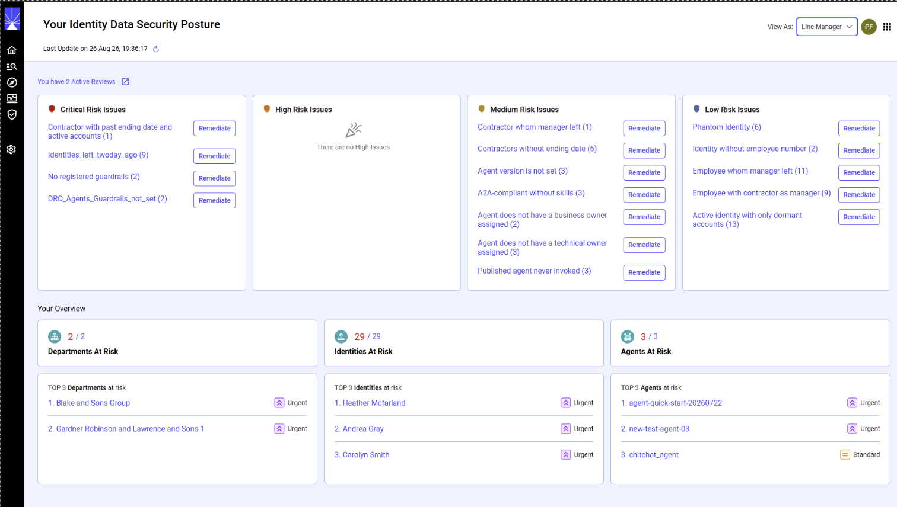
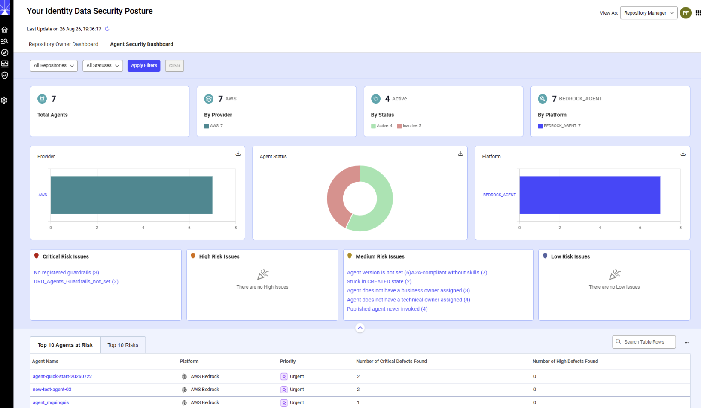
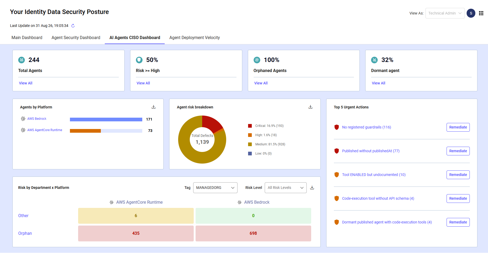
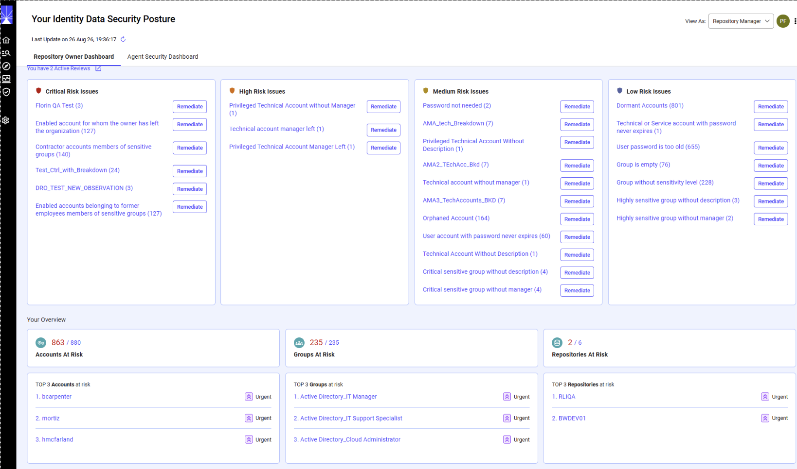
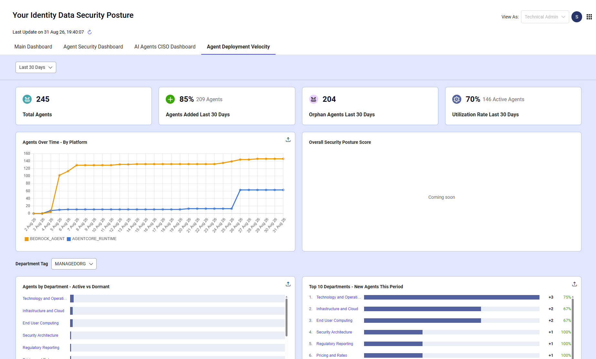

# AI Agent Dashboards

Use AI Agent dashboards to monitor identity-related events through current visual insights. The dashboards help you assess agent data and take timely, appropriate action to maintain effective oversight of user identities, agent identities, and access.

After you sign in to the Observability portal, the landing page displays the dashboards available to you. Your assigned role determines the agents, controls, dashboards, and details that you can view.

## Role-based access

| Role | Agent visibility | Default dashboard access |
| --- | --- | --- |
| Technical Administrator | All agents in the environment | Agent Security Dashboard, AI Agents CISO Dashboard, Agent Deployment Velocity, and agent navigation |
| Repository Manager | Agents in repositories the user manages | Repository Owner Dashboard and Agent Security Dashboard with repository-scoped agent information |
| Line Manager | Agents owned by managed identities or departments, including applicable sub-departments | Main Dashboard with agent-related risk tiles and overview information |
| Auditor | Read-only access within the existing auditor scope | Read-only agent data available within that scope |

Users can open agent and control details from their dashboards. However, links on detail pages are limited to objects within the user's assigned scope. This prevents access to unrelated objects outside the user's permitted visibility.

## Switch views

If you have access to more than one role-based view, use the **View As** role selector in the top navigation bar to change views.

1. Open the role selector.
2. Select the view you want to use.
3. The platform reloads the workspace and displays the default dashboard for that view.

For example, a user who is both a Repository Manager and an Agent Owner can switch between a repository-focused view and a view containing only the agents they own.

## Dashboard types

### Main Dashboard

The **Main Dashboard** provides a high-level view of identity security posture. It groups risk issues by severity—Critical, High, Medium, and Low—and highlights the identities, departments, groups, accounts, repositories, or agents that require attention.

Use **Remediate** next to an issue to investigate and address the associated risk. The dashboard also provides an overview of the entities with the highest risk.

**Who can access it:** Line Managers. Results are limited to the identities, resources, and departments the user is permitted to manage.

### Agent Security Dashboard

The **Agent Security Dashboard** provides an operational view of AI agents across connected platforms. It shows the total number of agents, their provider, platform, and lifecycle status, as well as agent-related risks grouped by severity.

Use this dashboard to identify agents with Critical, High, Medium, or Low risk issues; review the agents or risks with the greatest exposure; and prioritize remediation. Risk issues are grouped into control categories—Authentication, Identity Lifecycle, Privilege & Access, and Hygiene—and each category links to its underlying controls. Repository Managers can filter the dashboard by repository and agent status to focus on the relevant scope.

**Who can access it:** Technical Administrators and Repository Managers. Technical Administrators can view the broader agent-security posture. 

Repository Managers view data only for repositories they are authorized to manage.

### AI Agents CISO Dashboard

The **AI Agents CISO Dashboard** provides an executive-level view of the organization's AI-agent security posture. It summarizes total agents, the percentage of agents with High-or-higher risk, orphaned agents, dormant agents, platform distribution, and risk distribution.

The dashboard also highlights the **Top 5 Urgent Actions** that require remediation and shows risk by department and platform. Use it to assess organizational exposure, identify trends, and prioritize high-impact security actions.

**Who can access it:** Technical Administrators and other users who have been granted access to organization-wide AI-agent security reporting.

### Repository Owner Dashboard

The **Repository Owner Dashboard** helps Repository Managers identify identity and repository risks within repositories they own or manage. It groups issues by severity and highlights accounts, groups, and repositories at risk.

Use this dashboard to review risks such as orphaned accounts, sensitive-group membership concerns, missing ownership, password-policy risks, and repository-related exposure. Select **Remediate** for an issue to begin addressing it.

**Who can access it:** Repository Managers. Data is limited to the repositories for which the user has management responsibility.

### Agent Deployment Velocity

The **Agent Deployment Velocity** dashboard provides a business-oriented view of AI-agent adoption over a selected time period. Use it to understand how quickly agents are being deployed, whether agent usage is increasing, and how adoption is distributed across platforms and departments.

Unlike the Agent Security Dashboard and AI Agents CISO Dashboard, this dashboard does not focus on risk exposure or control defects. Instead, it uses business-analytics visualizations—such as trend lines, bar charts, and gauges—to help you measure deployment and adoption velocity.

The dashboard includes the following information:

- **Total Agents:** The total number of discovered agents within the selected scope.
- **Agents Added:** The number and percentage of agents added during the selected reporting period, such as the last 30 days.
- **Orphan Agents:** The number of agents added during the selected period that do not have an assigned owner.
- **Utilization Rate:** The percentage of active agents during the selected reporting period.
- **Agents Over Time - By Platform:** A line chart that shows changes in agent count over time for each platform, helping you identify adoption trends.
- **Overall Security Posture Score:** A future capability intended to provide a consolidated posture indicator. This tile currently displays **Coming soon**.
- **Department Tag:** A filter that lets you view deployment and adoption metrics for a selected department or organizational tag.

Select the reporting-period filter, such as **Last 30 Days**, to change the time range used for the dashboard metrics and trend chart.

**Who can access it:** Technical Administrators. Data is shown for the agents within the user's authorized environment scope.

## Complete your first review

Use the following workflow to begin assessing agent security information.

1. Open the **Agent Security Dashboard**.

   

2. Review the dashboard to determine how many agents were discovered, where they run, their lifecycle status, and the departments associated with them.

3. Review the security posture section to identify the risk areas with the greatest exposure.

4. In the **Top 10 Agents at Risk** table, select an agent name to open its details.

   

5. Review the agent's model, guardrails, tools, accessible resources, resource sensitivity, runtime identity, and subagents.

6. Select **Access Chain** in the upper-right area of the interface to trace the agent's access chain.

   

   

7. Take the appropriate action. Depending on your role and available permissions, you may be able to assign an owner, update the agent description or business intent, address a control defect, disable the agent, or quarantine the agent when necessary.

   
