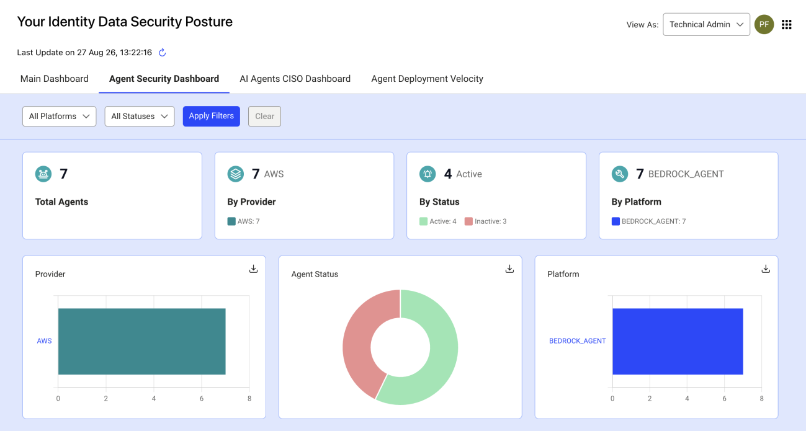
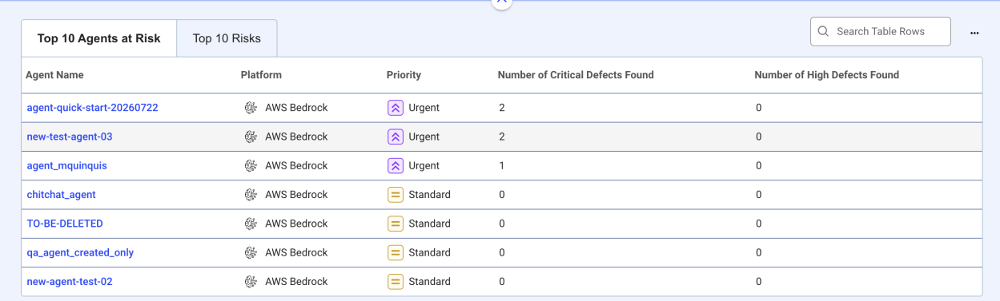
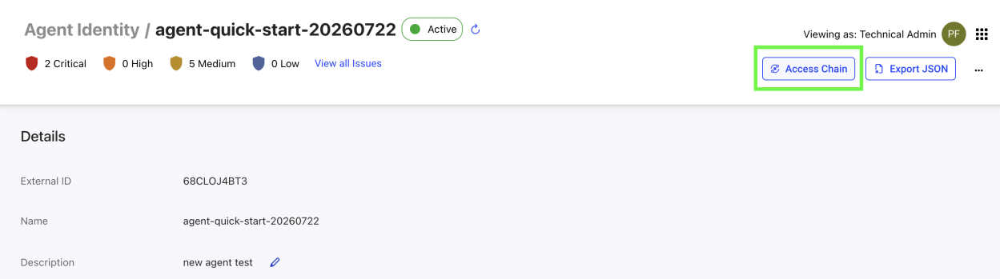
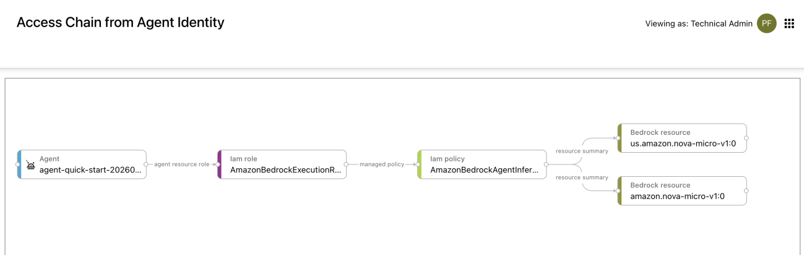
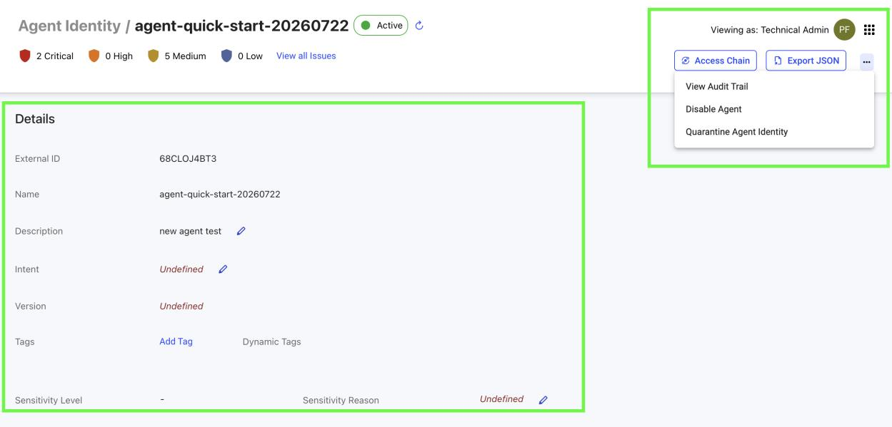

# Getting started

Radiant Logic's Identity Data Platform offers observability for Agentic AI, helping you discover AI agents across your organization, understand their access and ownership, and identify risks that require attention.

To get started, complete these three main steps:

1. Enable observability for Agentic AI in your environment.
2. Connect one or more supported agent platforms.
3. Allow the first synchronization to discover agents and populate inventory.

After the first synchronization, the platform begins applying the included agent controls, dashboards, and canonical data mapping. You can then review discovered agents, investigate their access, assign owners, and address identified risks. You can also create custom controls and observations.

## Enable the capability

Ensure that you are subscribed to the Agentic AI License to access this feature and review the following:

1. In the **Environment Operations Center**, make sure the **Agentic AI** option is enabled for your Identity Observability application. You must have Identity Observability version 3 or higher to access this feature.
2. Assign the **AI Agents** entitlement to the users and groups who need access.

Activating the Agentic AI capability enables the agent data model, controls, dashboards, and interface components available. Agent-specific pages remain hidden until Radiant One connects with agent data. For example, the agent dashboard does not appear when no agents have been discovered. Similarly, a repository does not show an **Agents** tab until it contains at least one agent.

## Connect agent platforms

Configure agent data synchronization using RadiantOne data source for at least one supported agent platform.

By using a data source connector, Radiant One retrieves identity, configuration, access, and metadata information needed for observability, but does not retrieve secret values. Where credentials are detected, Radiant One records credential references and material types rather than secret contents.

The only supported write-back action is quarantine. It is disabled by default and must be explicitly enabled before Radiant One can request a source-platform quarantine action.

### Supported platforms

| Platform | Supported agent types | Identity context |
| --- | --- | --- |
| Amazon Web Services | Amazon Bedrock Agents and Bedrock AgentCore Runtimes | AWS IAM, IAM roles, and STS AssumeRole chains |
| Microsoft Azure | Azure AI Foundry agents | Microsoft Entra ID, Azure RBAC, service principals, managed identities, and Dataverse security roles |
| Google Cloud | Vertex AI agents | Google Cloud IAM, service accounts, and workload identity |

For connector-specific requirements, setup instructions, and least-privilege permissions, refer to the connector listing in Connector marketplace.

## Understand access and roles

Observability for Agentic AI uses the existing role model. No separate agent-specific role is required.

Your assigned role determines which agents, controls, dashboards, and details you can view.

| Role | Agent visibility | Default experience |
| --- | --- | --- |
| Technical Administrator | All agents in the environment | Dedicated agent dashboard and agent navigation |
| Repository Manager | Agents in repositories the user manages | Existing repository dashboard with agent security information |
| Line Manager | Agents owned by managed identities or departments, including applicable sub-departments | Existing dashboard with agent-related tiles |
| Agent Owner | Agents for which the user is a business or technical owner | Dedicated Agent Owner dashboard |
| Auditor | Read-only access within the existing auditor scope | Read-only agent data available within that scope |

Repository Manager and Agent Owner views use constrained navigation. Users can open agents and control details from their dashboards, but links within those detail pages are limited to the objects available within their scope. This helps prevent access to unrelated objects outside of their assigned visibility.

### Switch views

If you have access to more than one role-based view, use the role selector in the top navigation bar.

1. Open the role selector.
2. Select the view you want to use.
3. The platform reloads the main workspace with that view's default dashboard.

For example, a user who is both a Repository Manager and an Agent Owner can switch between a repository-focused view and a view of only the agents they own.

### Apply tags

Tags are labels that help you organize agents, apply policy, and support reporting across your environment.
There are three types of tags:

| Tag type | Assigned by | Editable |
|---|---|---|
| **Manual tag** | An administrator | Yes |
| **Dynamic tag** | A rule defined in an observation or supported control | No |
| **Backend label** | The source platform, imported by the connector | No |

Tag names are unique across the platform.

**Manual tags** are applied and removed by administrators at any time, directly from the agent's details page or in bulk through Query Builder.

To add manual tags:

- **Single agent** — Open the agent's details page and use the tag editor to add or remove manual tags.
- **Multiple agents** — Use Query Builder to find the agents you want to tag, select them in the results list, then choose the bulk tag action. Bulk tagging applies to all selected agents or none — it is an all-or-nothing operation. Dynamic tags cannot be assigned through bulk tagging.

**Dynamic tags** are assigned and removed automatically based on rule criteria you define. When an agent matches a rule, the tag is applied at the next evaluation cycle. When the agent no longer matches, the tag is removed. Each dynamic tag displays the rule that assigned it.
To set one up, open an observation or supported control, define the criteria that identify the agents you want to group, and select the tags to apply. Tags are applied automatically at the next evaluation cycle and removed as soon as an agent no longer meets the criteria.

**Backend labels** originate from the source platform — for example, cloud resource tags imported by a connector. They appear in the agent's provider details and can be searched and filtered by key or value, but cannot be edited or used to scope policy.

## Complete your first review

After you connect a platform, allow the initial synchronization to complete. The platform creates an agent record for each discovered agent and automatically links it to a repository representing its hosting scope, such as an AWS account, Google Cloud project, or Azure subscription.

Use the following workflow to begin assessing your agent environment:

1. Open the agent security dashboard.

   

2. Review the information shown to see how many agents were discovered, where they run, their lifecycle status, and the departments associated with them.

3. Review the security posture section to identify the risk areas with the greatest exposure.

4. Navigate to the **Top 10 agents at risk** table and click on the agent's name to review its details.

   

5. Review the agent's model, guardrails, tools, accessible resources, resource sensitivity, runtime identity, and subagents.

6. Click the Access Chain option on the top right corner of the UI to trace the agent's access chain.

   

   

7. Take appropriate action, such as assigning an owner, updating the agent's description or business intent, addressing a control defect, or quarantining the agent when that action is available and necessary.

   

A useful first objective can be to establish inventory and ownership coverage, then prioritize agents with access to sensitive resources, missing owners, weak guardrails, or high-risk permission flows.
