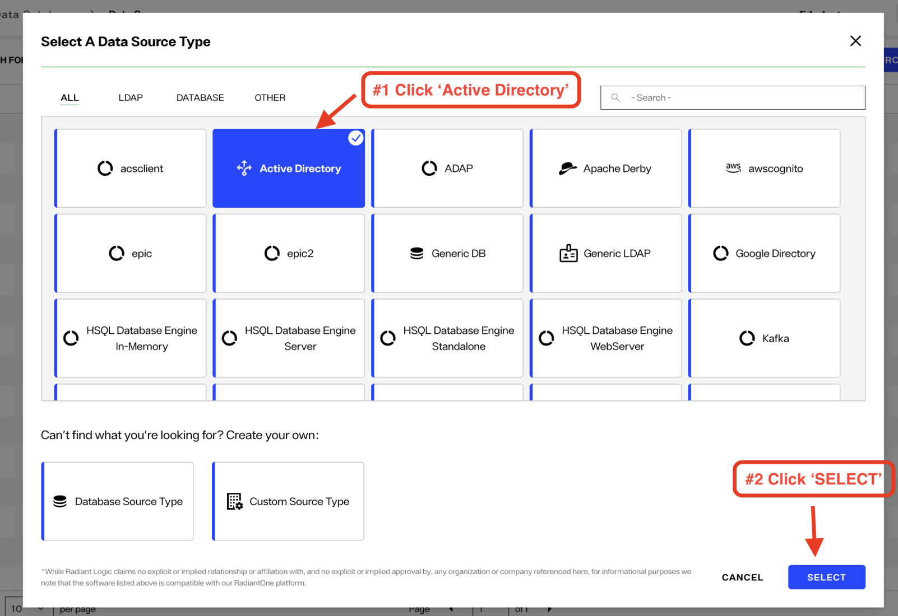
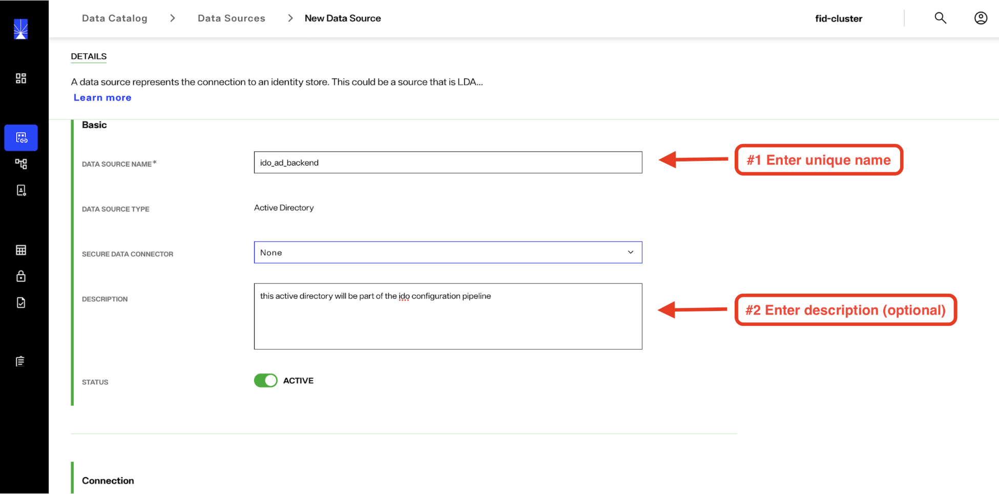
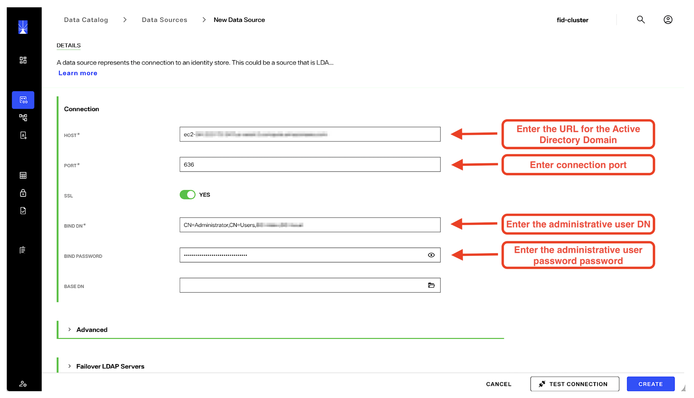
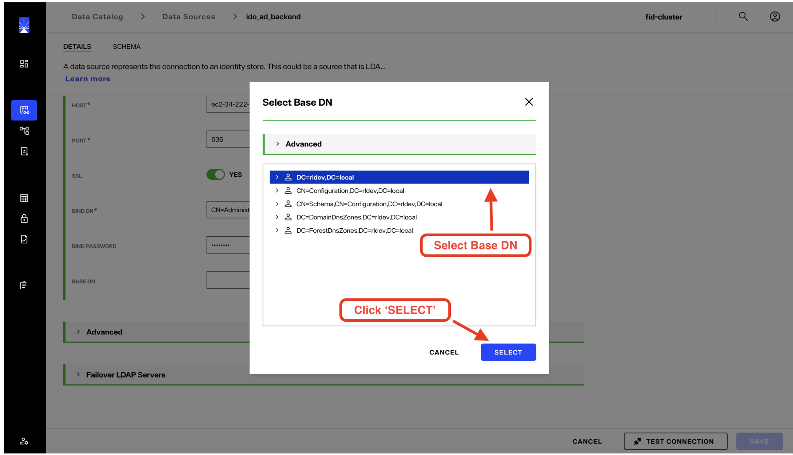

## Overview

This document provides steps to configure active directory as a data source for Identity Observability. 

## Creating Data Source

1. Log in to the **Identity Observability Data Sync Config** portal. From the left navigation pane, select **Data Catalog > Data Sources**. Click **NEW SOURCE**.

    

2. In the **Data Source Types** template gallery, select the **Active Directory** tile, then click **SELECT**.

     

3. Enter a unique name for the data source. Optionally, provide a description. Ensure the **ACTIVE** toggle is enabled. Leave the **Secure Data Connector** setting at **None**, as it is not required for this configuration.

     

> Certain characters are not permitted in the data source name, including dashes (-). If an invalid character is used, the system will display an error message.

4. Scroll to the **Connection Info** section and enter the required connection details for the target Active Directory environment.

     

5. Click **TEST CONNECTION** to validate connectivity and credentials. A pop-up notification will display the test results. If the test fails, additional details will be provided to assist with troubleshooting.

6. Click the folder icon to browse the available data contexts in the target Active Directory domain. Select the **Base DN** corresponding to the identity objects you intend to manage in IDO.

    

> If the connection to the target Active Directory environment uses SSL/TLS (e.g., port 636), you must import the target server’s certificate into RadiantOne. To do this, navigate to **Global Settings > Client Certificates** and click **IMPORT** to add the certificate.

7. After selecting the desired **Base DN**, click **SELECT**. The process for identifying and selecting the objects to be synchronized and managed by Identity Observability varies depending on the data source type. LDAP sources behave similarly to Active Directory, whereas databases or other systems (such as Entra) require data-model–specific methods for selecting objects.

8. When configuration and validation are complete, click **CREATE**. Once the data source is created, you will be returned to the main **Data Sources** page, where the newly created source should appear with a status of **ACTIVE**.

The next step is to create a configuration pipeline. Refer to [this example](../pipeline-configuration/#configuration-example) for details. 

