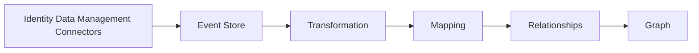

# Graph Pipelines Configuration

## Overview

The declarative Graph Pipelines Configuration is used to define the structure and behavior of the entire data ingestion process from the connectors to the graph.



It sets the data binding strategy to adopt between the sources and the graph data model. This declarative strategy defines the data normalization and dictates how the pipelines engine configures its execution plan.

This page describes the structure of the graph pipelines configuration to help you define your own configuration and templates, do not build your configuration all in one YAML file, instead build it using templates, preferably one template per datasource. See the [graph pipeline configuration templates](./template-configuration.md) for more details.

<!-- This strategy is validated at submission time against the graph data model schema to ensure integrity and alignment with the expected graph structure. -->

## Structure of a configuration

The configuration is expressed in YAML and consists of several key components:

1. **Source Objects**: Defines the data sources and their objects that feed into the graph.
2. **Vertices**: Represents the nodes in the graph, including their properties and linkage to the source objects.
3. **Edges**: Defines the relationships between vertices in the graph.
4. **Functions**: Specifies the signature of the functions that can be applied to the source objects.

### Source Objects

Source objects represent Identity Data Management's data sources, the objects and the attributes required in the graph. Each source object includes:

- **Name**: The name of the source object, it must be unique within the graph configuration.
- **Datasource name**: The name of a datasource in Identity Data Management.
- **Object name**: An objectclass for directories or a table name if the source is a database. In case of auxiliary objectclasses, the source object name is the composite name of the main objectclass and the auxiliary objectclass separated by the keyword `-merge-`, e.g. `user-merge-ndsLoginProperties`.
- **Backend Attributes**: The attributes that are fetched from the source. Available options:
  - `type`: Defaults to `STRING`. Indicate the type when used in a computed attribute - more info in the functions section.
  - `cardinality`: The cardinality of the attribute. Defaults to `HIGH`. More info in the behavioral settings section.
- **Computed Attributes**: Attributes augmentation based on the source object attributes. Order matters and will be applied to the execution plan based on the `function` and the `fields` used.
    Available options:
  - `compute-strategy`: Defaults to `OVERIDE`. More info in the behavioral settings section.
  - `cardinality`: The cardinality of the attribute. Defaults to `HIGH`. More info in the behavioral settings section.
  - `compute-phase`: Compute only during the `INIT` phase or during the `EVENT_DRIVEN` phase (real-time events sent by the connectors). Empty means both.
  - `event-types`: Arrays of event types to trigger the computation of the attribute. Empty means all. Allowed values are `INSERT`, `UPDATE` and `DELETE`.
  - `fields.active`: The fields are used by default as input for the function. Use the `attribute-name` to refer to the source object attribute and optionally set the `active` flag to `false` to exclude it from the computation but instead use it as a dependency to trigger the computation.
- **Meta Attributes**: Additional metadata about the source object.

```yaml title="source-objects-example.yaml"
source-objects:
  - name: ad_users
    datasource: ad
    object-name: user
    backend-attributes:
      - name: cn
      - name: sn
      - name: sAMAccountName
      - name: description
      - name: mail
      - name: createTimestamp
        type: LONG
      - name: useraccountcontrol
        type: INTEGER
      - name: objectguid
    meta-attributes:
      - name: repositoryName
        literal: Active Directory
      - name: repositoryDescription
        literal: On-prem AD server West2
      - name: uacDisabled
        literal: "ACCOUNTDISABLE"
    computed-attributes:
      - name: disabled
        function: getUserAccountControlAttribute
        fields:
          - useraccountcontrol
          - uacDisabled
      - name: creation_datetime
        function: convertTimestamp
        fields:
          - createTimestamp
      - name: objectguid
        function: convertBase64ObjectGuidToUuid
        fields:
          - objectguid
```

### Vertices

Vertices define the nodes in the graph named after the concept they represent.

```yaml title="vertices-example.yaml"
vertices:
  - name: rt_account
```

Each vertex can be linked to one or more source objects, and one source object can be linked to multiple vertices. The linkage definition must include:

- **Source Object Name**: The name of the source object that this vertex represents.
- **Vertex UID**: An attribute name from the source object that will be used as unique identifier for the vertex. Can be a backend attribute or a computed attribute. When available, operational attributes such as `objectguid`, `EntryUUID`, `UUID` are the recommended choice.
- **Properties**: The properties of the vertex, they are mapped from the source object attributes. For the list of properties available for each vertex, refer to the the graph schema and list the tags composing a concept. If a property is required on the vertex but is not part of the graph schema, for instance for edge resolution, it can be flagged as `transient` and be referenced in the edge link condition.

```yaml title="vertices-example.yaml"
vertices:
  - name: rt_account
    linkage:
      - source-object-name: ad_users
        vertex-uid: objectguid
        properties:
          - name: name
            attribute-name: cn
          - name: full_name
            attribute-name: cn
          - name: surname
            attribute-name: sn
          - name: samaccountname
            attribute-name: sAMAccountName
          - name: description
            attribute-name: description
          - name: email
            attribute-name: mail
          - name: link_key_temp
            attribute-name: computedaccountkey
            transient: true
          - name: creation_date
            attribute-name: creation_datetime
          - name: disabled
            attribute-name: disabled
          - name: object_guid
            attribute-name: objectguid
```

### Edges

We support 3 types of edges:

- **Basic normalization**: Simplest relationship possible. Use it when 1 source object can be transformed into 2 vertices and 1 edge connecting them.
- **Key-based**: When the relationship between 2 entities is based on their actual foreign keys or reference keys, i.e. the `ad_group` source object having a `member` attribute pointing to the `ad_user` source object.
- **Attribute-based**: When entities are linked through non-key attributes (such using the `email` addresses to link 2 entities from different databases).

#### Basic normalization edges

```yaml title="edges-basic-normalization-example.yaml"
source-objects:
- name: hr_people
    datasource: hr_db
    object-name: app.employee
    backend-attributes:
      - name: employeeNumber
      - name: department
        cardinality: LOW # more info on this in the behavioral settings section
      - name: jobTitle
vertices:
- name: rt_identity
    linkage:
      - source-object-name: hr_people
        vertex-uid: employeeNumber
        properties:
          - name: email
            attribute-name: mail
- name: rt_department
    linkage:
      - source-object-name: hr_people
        vertex-uid: department
        properties:
          - name: name
            attribute-name: department
edges:
- name: is_working_for
    source-vertex-name: rt_identity
    target-vertex-name: rt_department
    properties:
      - name: job_title
        attribute-name: jobTitle
```

#### Key-based edges

```yaml title="edges-key-based-example.yaml"
source-objects:
  - name: ad_groups
    datasource: ad
    object-name: group
    backend-attributes:
      - name: cn
      - name: member
      - name: objectguid
    computed-attributes:
      - name: membershipCreationTime
        function: computeDateTimeNow
vertices:
  - name: rt_group
    linkage:
      - source-object-name: ad_groups
        vertex-uid: objectguid
        properties:
          - name: name
            attribute-name: cn
edges:
  - name: is_in_group
    source-vertex-name: rt_account
    target-vertex-name: rt_group
    rules:
      - name: membership
        event-sources: [ad_groups]
        event-types: [INSERT, UPDATE] # more info in the behavioral settings section
        properties:
          - name: created_at
            attribute-name: membershipCreationTime
        link-condition:
          predicates: # rt_account.dn = ad_groups.member
            - field: dn # dn is automatically fed by the pipeline engine
              operator: EQUALS
              value: member
  - name: is_in_group
    source-vertex-name: rt_group
    target-vertex-name: rt_group
    rules:
      - name: recursive_membership
        event-sources: [ad_groups]
        event-types: [INSERT, UPDATE]
        properties:
          - name: created_at
            attribute-name: membershipCreationTime
        link-condition:
          predicates: # rt_group.dn = ad_groups.member
            - field: dn
              operator: EQUALS
              value: member
```

#### Attribute-based edges

The heterogeneous nature of the relationships makes it more complex to handle and therefore requires more settings depending on the data quality and its maintenance strategy:

- **Cascading rules**: multiple rules can be used, when 1 attribute has no match then try to use another attribute.
- **Confidence level**: when using multiple rules, you can set a level of confidence: `HIGH`, `MEDIUM` or `LOW`.
This confidence level may later be factored into the risk computation. Rules with confidence levels must be grouped together using a `group-name` to indicate they are working together on the same relationship.
- **Cardinality**: When using multiple confidence levels, a one-ended relationship must be used (either `ONE_TO_ONE`, `ONE_TO_MANY`, `MANY_TO_ONE`). This is to ensure the relationship is not ambiguous and can be maintained internally when the confidence levels up following an event by removing deprecated edges with lower confidence levels.

Both sides of the relationship must be configured, since both sources of vertices are heterogeneous and can impact the relationship maintenance:

```yaml title="edges-attribute-based-example.yaml"
edges:
  - name: is_owned_by
    source-vertex-name: rt_account
    target-vertex-name: rt_identity
    cardinality: MANY_TO_ONE
    rules:
      - name: identity2account_email_lookup
        group-name: identity2account
        event-sources: [hr_people]
        event-types: [INSERT, UPDATE]
        link-condition:
          confidence: HIGH
          predicates:
            - field: email
              operator: EQUALS
              value: mail
      - name: identity2account_name_lookup
        group-name: identity2account
        event-sources: [hr_people]
        event-types: [INSERT, UPDATE]
        link-condition:
          confidence: LOW
          predicates:
            - field: name
              operator: EQUALS
              value: cn
      - name: account2identity_email_lookup
        group-name: account2identity
        event-sources: [ad_users]
        event-types: [INSERT, UPDATE]
        link-condition:
          confidence: HIGH
          predicates:
            - field: email
              operator: EQUALS
              value: mail
      - name: account2identity_name_lookup
        group-name: account2identity
        event-sources: [ad_users]
        event-types: [INSERT, UPDATE]
        link-condition:
          confidence: LOW
          predicates:
            - field: displayname
              operator: EQUALS
              value: cn
```

### Functions

See [here](./functions.md) for more information.

### Advanced behavioral settings

The behavioral settings are small indicators in the configuration that allow the pipeline engine to make the right decisions when maintaining the graph based on real-time events. They are critical to ensure the data is correctly propagated into the graph.

- **Source Object attribute cardinality**: This is required when an non-key attribute from the source is used as the `vertex-uid` of a vertex. It allows the pipeline engine to know that a delete event from the the source doesn't necessarily translate into a delete of the vertex. Available options are `HIGH` and `LOW`.
- **Source Object Computed Attribute Strategy**:
  - `OVERIDE` (default): This option replaces the existing data with the function's result.
  - `MERGE`: This combines the computed data with the existing data, preserving both where possible.
  - `IF_EMPTY`: Compute the attribute only if the existing attribute's data is empty.
  - `IF_NOT_EMPTY`: Compute the attribute only if the existing attribute's data is not empty.
- **Edge cardinality**: When using multiple rules with different confidence levels, a one-ended relationship must be used (either `ONE_TO_ONE`, `ONE_TO_MANY`, `MANY_TO_ONE`). This is to ensure the relationship is not ambiguous and can be maintained internally when the confidence levels up following an event. In other word, we maintain a cache on the one-end of the relationship which allows us to remove deprecated edges with lower confidence levels.
- **Edge cardinality enforcement**: This defaults to false. The cardinality of the relationship can also be enforced at insertion time. If the cardinality is `ONE_TO_ONE` or `ONE_TO_MANY` and the target vertex already has an incoming edge, the event will be dropped. This is to ensure the integrity of the graph if needed.
We usually don't enforce the cardinality though since we want to detect in the graph data misconfiguration, i.e. an account owned by 2 identities.
- **Edge rule event-types**: The event types to consider when maintaining the relationship. It can be `INSERT` or `UPDATE` or both. Edges are automatically deleted when a vertex is removed from the graph.
- **Vertex transient property**: If a property is required on the vertex but is not part of the graph schema, it can be flagged as `transient` and be referenced in the configuration as a normal property. This is useful for edge resolution when the key used in the predicate is computed but not meant to be stored in the graph database.
