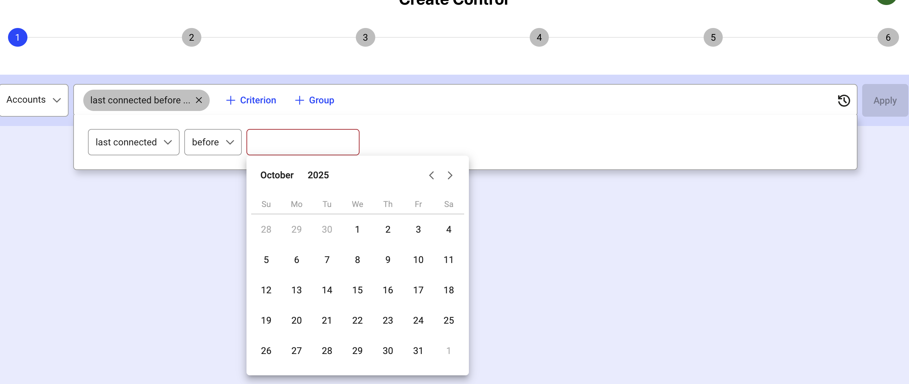
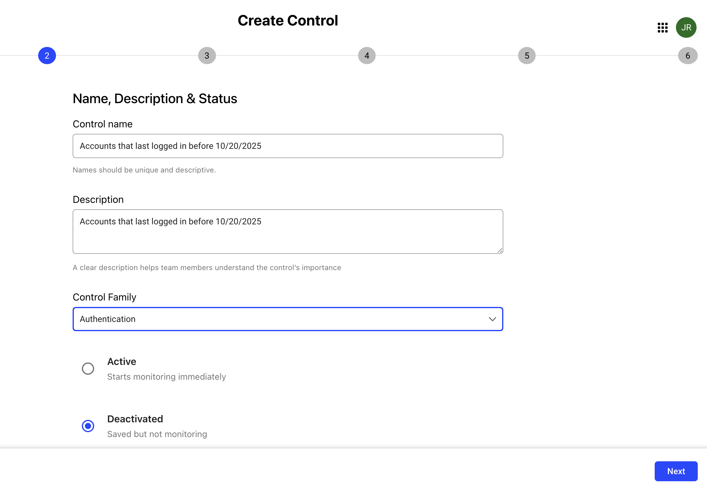
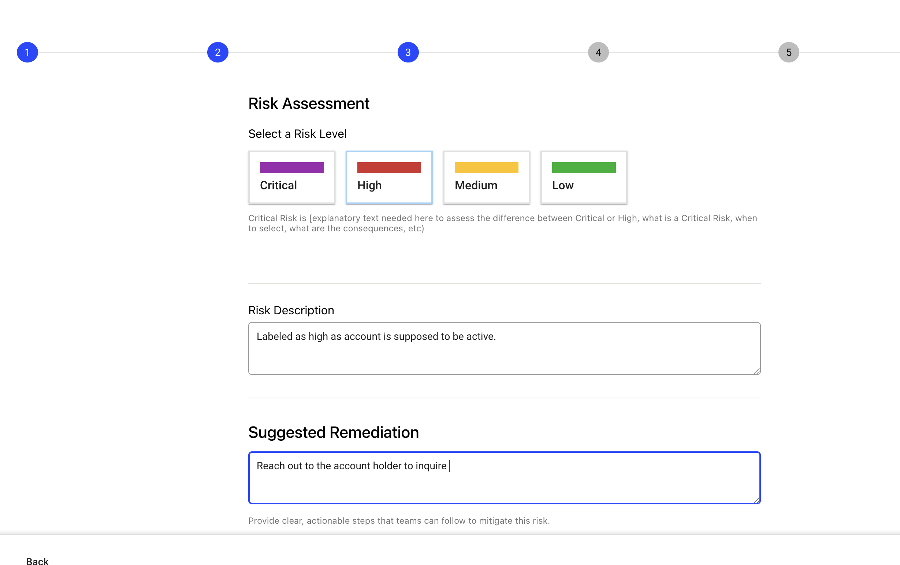

## Overview 
 
Controls provide automated detection mechanisms to identify potential security risks and compliance violations within the identity infrastructure. Users can enable relevant controls for their specific context or create their own custom controls. 
A control represents an issue with a risk level, risk description and a remediation plan to fix it. Control risk levels are used to compute the risk score of an item (Accounts, Identities, Departments, and More). 

Like observations, controls are based on a rule that contains the criteria of what needs to be monitored in real time. The result of the rule which is a list of items is maintained in real time. Those controls can be used in out-of-the-box or custom dashboards. Notifications can also be activated by control to notify people when a change occurs in the list of items, meaning new items are returned or removed from the list by the rule. 

 
## Default controls 
 
Default controls are pre-configured security and compliance checks designed to identify and manage risks in your identity environment. These controls help enforce best practices by automatically monitoring for potentially dangerous situations, enabling you to catch issues proactively. Default controls include controls for human identities as well as agent identities. 
 
### Examples 

The control "Account with abnormal login attempts" alerts you to accounts with repeated unsuccessful login attempts, flagging them for possible brute force attacks. 
"Contractor with past ending date and active accounts" highlights cases where contractors who have left the company still possess active accounts, which could be exploited for unauthorized access.  
 
Another common default control is "MFA is not registered," which identifies accounts that are missing multi-factor authentication, exposing them to higher risk of takeover. 
 
You can enable or disable any of these default controls. You can also create your own control by following the steps below.  

### Agent controls

Agent controls are a specialized subset of controls targeting AI agents registered in the platform. Agents are treated as first-class entities within the existing governance framework — the same risk-scoring engine used for accounts aggregates agent control defects into per-agent risk scores and family-level rollups displayed across dashboards. No separate scoring system is introduced for agents.

Agent controls are organized around the OWASP Agentic Security Initiative (ASI) Top 10 (2026) — a taxonomy designed specifically for agentic systems, distinct from the OWASP Top 10 for Web Applications and the OWASP Top 10 for LLM Applications. Each ASI family maps to exactly one control family in the platform.

These controls are available across the following ASI families as preconfigured default agent controls. 

| ASI family                                    | Controls count | Highest risk |
| --------------------------------------------- | -------- | ------------ |
| ASI01 — Agent Goal Hijack                     | 3        | Critical     |
| ASI02 — Tool Misuse and Exploitation          | 1        | High         |
| ASI05 — Unexpected Code Execution (RCE)       | 3        | High         |
| ASI07 — Insecure Inter-Agent Communication    | 3        | High         |
| ASI09 — Human-Agent Trust Exploitation        | 6        | Critical     |
| ASI10 — Rogue Agents                          | 4        | Critical     |
| ASI00 — Others                                | 1        | Medium       |

For the full catalogue of built-in agent controls with descriptions and remediation guidance, see [Agent control catalogue](#agent-control-reference).

To create a custom control beyond the default controls, see [Creating a new control](#creating-a-new-control) below.

## Creating a new control 

1. Click the Control menu item on the left navigation.  This will open the Control management interface. 
 
   
2. Click on the "Create control" button to open the control creation interface.
3. Select the entity type that the control will evaluate, then define one or more criteria. For standard account and access controls, choose the relevant identity or entitlement entity. Suppose you want to create a control for Accounts that last logged in before a certain date. To do so, select the “Account” category from the dropdown and set the criteria to a certain date such as “before 10/20/2025.”

   To evaluate AI agents, select **Agent Identity**. You can then build criteria against:

   * **Top-level agent attributes** — name, status, lifecycle state, version, description, publication timestamp, and custom metadata fields.
   * **Sub-objects** — tools (executor reference, API schema, permission level), subagents (endpoint, forwarding configuration), knowledge resources, and guardrails.

   Criteria can be combined using `AND`, `OR`, and negated groups. Sub-object criteria follow the same logic as top-level criteria — for example, you can flag any agent that has at least one tool with no API schema, or any agent with a subagent endpoint using plaintext HTTP.

   > Note that risk is surfaced at the agent level, not the sub-object level. When an agent matches a control, its at-risk tools, subagents, or resources are implied. It does not generate separate defects per sub-object.

   
   
4. Click “Apply” to review and then click “Next” to proceed through the remaining steps. 
 
5. On the Name, Description & Status tab, provide a suitable name and description for the control. Choose the relevant control family from Authentication, Identity Lifecycle, Privilege and Access, or Identity Hygiene. 
   
Then, choose whether you want the control to be active immediately or saved in a deactivated state for future use.  
6. On the Risk Assessment page, select a risk level that you think is appropriate for this control, provide description for this risk and include clear actionable steps for remediating this risk.
   
 
7. On the Breakdown configuration tab, you can add additional filters or criteria for your control by clicking the Configuration Breakdown option and selecting the configurations that you would like to add. This step is optional. Click “Skip for now” to skip this step.  
 
8. On the Alert Configuration tab, activate and configure how and when alerts fire for this control:

   * **Triggering event** — when to fire: on new defect opened, defect closed, risk level change, or a scheduled digest.
   * **Grouping window** — the time window within which multiple matching events are bundled into a single alert notification (for example, every 30 minutes, 1 hour, 4 hours, or daily). Use this to avoid alert fatigue when a control matches many agents at once.
   * **Flood protection** — the maximum number of alerts sent within a rolling time period. Once the threshold is reached, further notifications are suppressed until the window resets.
   * **Channel** — delivery method: Email, Slack, Microsoft Teams, or Webhook.
   * **Recipients** — the users, groups, or webhook endpoints to notify.

   > Note that alert delivery channels must be configured by a technical administrator under **Admin > Settings > Alert templates** before they are available for selection here. Contact your platform administrator if a channel is missing.
 
9. On the Setting Visible Attributes tab, select the attributes that you want to hide or display in the Controls table by clicking on the “eye” icon next to the attribute name. If you do not see a desired attribute in the displayed list, click Advanced settings to add additional attribute(s).  Click Next after selecting the attributes. 
 
10. After making all the desired changes, select “Submit”. To view the control you just created, navigate to Controls > My Controls and click the control name. If the Control isn't already activated, you can activate it from the My Controls page.

## Agent control reference

Use this reference to review the built-in controls available for AWS agents. Controls are organized by ASI family and identify common configuration, lifecycle, and security gaps.

You can enable or disable each control. You can also duplicate a control and modify it to meet your project’s requirements.

### ASI01: Agent Goal Hijack

| ID | Control | Category | Risk | What it identifies |
| --- | --- | --- | --- | --- |
| ASI01-C1 | No registered guardrails | Privilege & Access | Critical | A published AWS agent has no guardrail that actively enforces a restriction. This can mean no guardrails are configured, or that none are enabled with a blocking or human-review action. |
| ASI01-C4 | Agent version is missing | Identity Hygiene | Medium | The AWS agent does not have a recorded version. Without version information, it is difficult to track configuration changes over time. |
| ASI01-C5 | Agent has no description | Identity Hygiene | Medium | The AWS agent does not have a documented purpose or scope. Without a defined baseline, it is difficult to tell whether the agent is behaving as intended or has drifted from its original goal. |

### ASI02: Tool Misuse and Exploitation

| ID | Control | Category | Risk | What it identifies |
| --- | --- | --- | --- | --- |
| ASI02-C3 | Enabled tool is undocumented | Identity Hygiene | High | An enabled tool has no executor reference or API schema. Reviewers cannot validate its inputs or determine which code runs when the tool is called. |

### ASI05: Unexpected Code Execution

| ID | Control | Category | Risk | What it identifies |
| --- | --- | --- | --- | ---|
| ASI05-C2 | Code-execution tool has no API schema | Identity Hygiene | High | The tool does not provide an API schema, so its inputs cannot be validated before execution. |
| ASI05-C3 | Code-execution tool has no executor reference | Identity Hygiene | High | The tool does not identify its runtime target. This may allow the agent to resolve the target dynamically from untrusted context. |
| ASI05-C4 | Inactive published agent has code-execution tools | Identity Lifecycle | High | A published AWS agent has never been invoked but still has code-execution tools enabled. This creates a remote-execution exposure that may go unnoticed because the agent is inactive. |

### ASI07: Insecure Inter-Agent Communication

| ID | Control | Category | Risk | What it identifies |
| --- | --- | --- | --- | --- |
| ASI07-C3 | Full conversation data sent to an external subagent | Authorization | High | The AWS agent sends its full conversation context to an external agent. Because the outbound destination is outside your control, this can expose more data than necessary. |
| ASI07-C5 | A2A-compliant agent has no skills | Identity Hygiene | Medium | The AWS agent declares A2A compliance but does not publish any skills. This may indicate that the agent advertises capabilities it cannot provide. |
| ASI07-C6 | Subagent endpoint uses plaintext HTTP | Authentication | High | The subagent endpoint uses `http://` rather than HTTPS. Data sent to the endpoint may be transmitted in plaintext, regardless of the configured authentication method. |

### ASI09: Human-Agent Trust Exploitation

| ID | Control | Category | Risk | What it identifies |
| --- | --- | --- | --- | --- |
| ASI09-C4 | State transition history is disabled | Identity Hygiene | Medium | The AWS agent does not have the `stateTransitionHistory` feature enabled. This can limit visibility into changes to the agent’s state. |
| ASI09-C9 | No business owner assigned | Identity Hygiene | Medium | The AWS agent does not have an assigned business owner. |
| ASI09-C10 | No technical owner assigned | Identity Hygiene | Medium | The AWS agent does not have an assigned technical owner. |
| ASI09-C11 | Business owner is no longer employed | Identity Hygiene | Medium | The assigned business owner is no longer part of the organization. |
| ASI09-C12 | Technical owner is no longer employed | Identity Hygiene | Medium | The assigned technical owner is no longer part of the organization. |
| ASI09-C13 | Business owner is a contractor | Identity Hygiene | Medium | The assigned business owner is external to the organization. Consider assigning an internal owner who can provide long-term accountability. |

### ASI10: Rogue Agents

| ID | Control | Category | Risk | What it identifies |
| --- | --- | --- | --- | ---|
| ASI10-C1 | Published agent has no publication date | Identity Lifecycle | Critical | The AWS agent is in `PUBLISHED` status, but its publication timestamp is missing. |
| ASI10-C7 | Agent remains in the created state | Identity Lifecycle | Medium | The AWS agent has been in `CREATED` status for more than 30 days. This can indicate abandoned provisioning or an agent that is outside the expected lifecycle process. |
| ASI10-C8 | Published agent has never been invoked | Identity Lifecycle | Medium | The AWS agent was published more than 30 days ago but has never been invoked. This creates inactive attack surface and provides no usage baseline for detecting unexpected activity. |
| ASI10-C9 | Previously used agent is now inactive | Identity Lifecycle | Medium | The AWS agent was used in the past but has not been invoked in the last 90 days. Review the agent to determine whether it should be reactivated, retired, or formally deprecated. |

### ASI00: Other Controls

| ID | Control | Category | Risk | What it identifies |
| --- | --- | --- | --- | ---|
| ASI00-C1 | Dormant agent | Identity Lifecycle | Medium | A published AWS agent has not been used for more than 90 days. Its associated workflow may no longer be needed, but the agent can retain access and permissions until it is decommissioned. |
