# Creating a Data Source for AI Agents

To integrate AI agent data sources with RadiantOne, create an **agentic data source** which is a custom data source that uses an agentic connector, such as Amazon Bedrock.

The setup process includes five steps:

1. Download the connector .jar file and observability mapping profile for your platform from the [Radiant Logic Connector Marketplace](https://github.com/radiantlogicinc/connector-marketplace).
2. Import the mapping profile to define how agent data is represented in the Identity Observability data model.
3. Create a data source template to associate with the connector downloaded in Step 1.
4. Create the agentic data source based on the template you created in step 3.
5. Run the observability auto-setup for the data source you created in step 4, then add the generated mapping to your pipeline configuration.

This document describes each step in detail.

## Prerequisites

- **Platform credentials:** Obtain read-only credentials for the account you want to crawl. For Amazon Bedrock, provide an access key and secret key, with an optional session token, or use an assumable role ARN (Amazon Resource Name).
- **RadiantOne permissions:** Use an account authorized to manage data sources, drivers and templates, and Identity Observability settings in RadiantOne Control Panel.

## Download the Connector Files

Each agentic AI data source has its own connector file and Identity Observability mapping profile.

Download both the connector file and mapping profile for the appropriate data source type/platform from the [Radiant Logic Connector Marketplace](https://github.com/radiantlogicinc/connector-marketplace). 

| File | Details |
| --- | --- |
| Connector .jar | The connector plugin (.jar) for the target platform. |
| Observability mapping profile | The mapping profile that is used to associate source agent objects and attributes to the canonical model used by Observability. An example mapping profile is `agent_canonical_model_template_v1`. |

## Add the Observability mapping profile

1. Login to your RadiantOne Data Sync Config endpoint and navigate to **Identity Observability > Template Management**.

2. Select **Add Template**.

   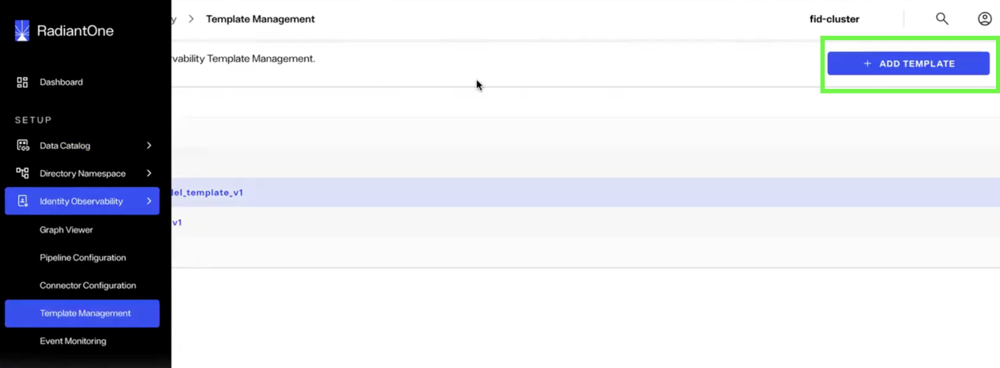

3. Enter a template name. This is the name you will be selecting at a later step during provisioning.

4. In the editor, paste the content from the Observability mapping profile file you downloaded in step 1 of the previous section.

5. Save the template.

## Create the Data Source template

1. Go to **Data Catalog >Template Management**.

2. Click **Create template** and select Agentic Source type.

   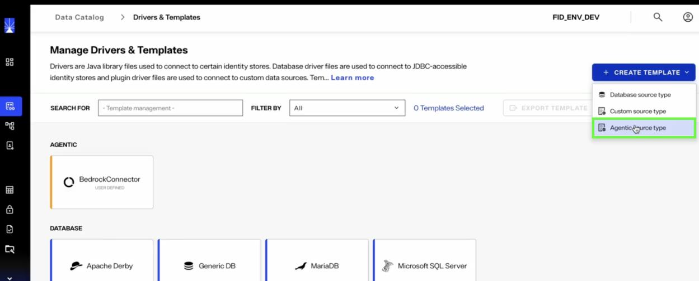

3. In the New Custom Template screen, click choose a file to select the connector .jar file that you downloaded from the Radiant Logic Marketplace.

   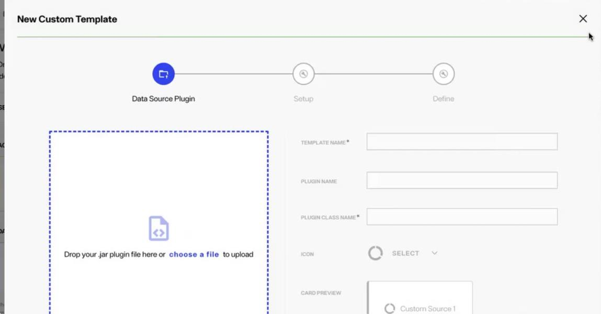

4. After uploading the file, click **Next**, then click **Add**.

   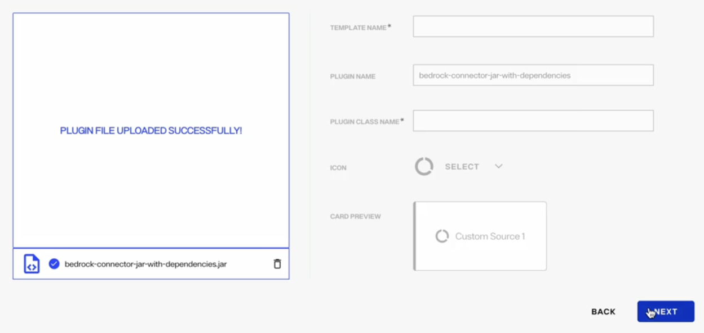

The template should appear in the **Agentic** category.

## Create the Agent data source

1. Go to **Data Catalog > Data Sources** and click on the New Source button.

   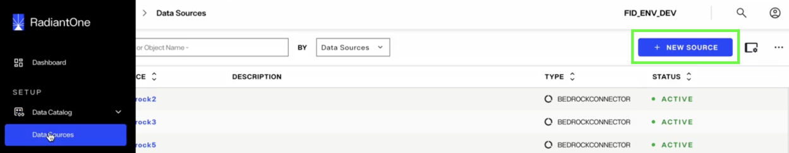

2. Under **Select a Data Source Type**, open the **Agentic** tab and select the template created in step 2. In the image below, you can see an example for the AWS Bedrock connector.

   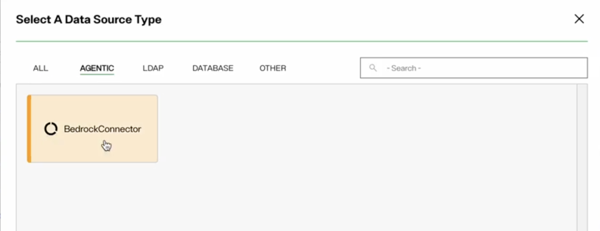

3. On the Details tab, enter the following information, then click Create:

   a. **Name:** Data source name, also used to derive the default naming-context DN.

   b. **Description:** Optional text to describe the connector.

   c. **Secure Data Connector:** Leave this set to **None since in this example it isn't required to reach the agent data source**

   d. **Status:** Active by default.

4. Enter the platform connection properties. For example, for Amazon Bedrock, specify the AWS Region, access key ID, and secret access key. You can optionally provide a session token, assumable role ARN, external ID, and role session name.

5. Select **Test Connection** and confirm that it succeeds.

6. Click **Create**.

7. In the next provisioning screen click "Continue" and follow the instructions listed below.

## Run auto-setup for Observability

After creating the data source, select **Continue** in the provisioning dialog.

The provisioning process performs steps to auto-setup configuration required for ingesting AI Agent data into Observability:

- A mounted naming context
- A persistent cache
- An LDAP proxy view
- Object and attribute mapping for source agents into the observability data model.

Most settings are prefilled and do not need further changes. The table below describes each setting.

| Section | Purpose | Editable settings |
| --- | --- | --- |
| Server schema | Publishes the agent data source schema to the RadiantOne server schema | None |
| Publish Source View | Creates a query-able naming context | Naming-context DN and mount object |
| Publish Proxy View | Creates a proxy for change detection | Optional custom host, port, bind DN, and password |
| Persistent cache Refresh Type | Creates the persistent cache of agent data and a refresh strategy to be used as a source of change event detection. | None or Periodic Refresh |
| Identity Observability Data Mapping | Generates the source agent object and attribute mapping | Config archive name and mapping template to be used in the Observability pipeline configuration. |

Typically, the only options you need to select are the cache refresh strategy and an Observability mapping profile.

1. In Persistent Cache Refresh Type, choose **Periodic Refresh** and enter the required fields. If you select **None**, the cache loads once and later source changes are not captured. Real-time refresh is not yet available for agentic data sources.

   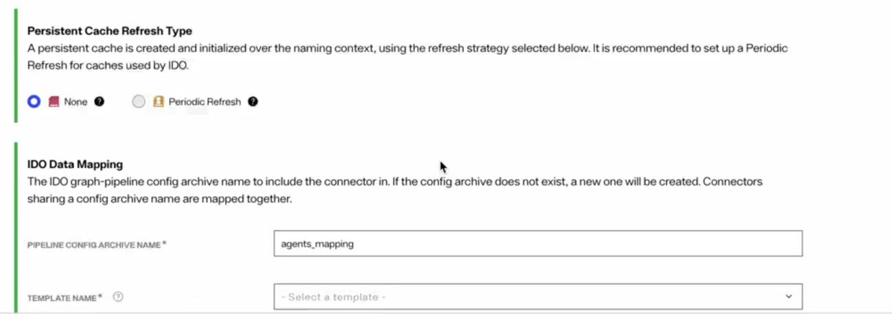

2. Select **Create** to start the auto-setup. The process includes schema publication, naming-context creation, proxy creation, cache initialization, and mapping preparation. It continues in the background, and task logs are available for each step. Provisioning settings cannot be edited after creation. If a setting is wrong, you will need to delete the provisioned resources and create them again.

3. Once the provisioning completes, click the **View staged mapping** link and copy the displayed text that references the object and attribute mapping that you will use in the pipeline configuration. You will utilize this in the next step.

   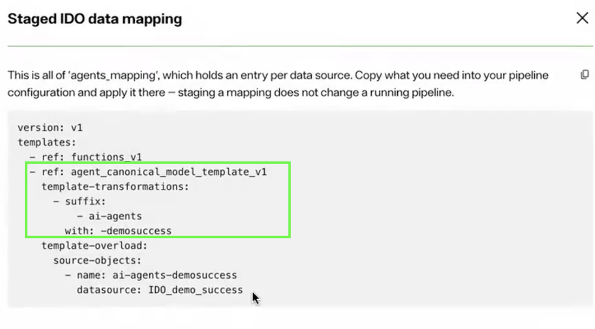

## Add the mapping to the pipeline configuration

Provisioning prepares the mapping but does not apply it to an active pipeline.

1. Go to **Identity Observability > Pipeline Configuration**.

2. Paste the copied entries to the templates section of the applied configuration.

Do not replace the entire pipeline configuration. Replacing it can remove existing custom templates, overloads, or attributes, and duplicate references can cause errors.

An example of the config copied over is shown below:

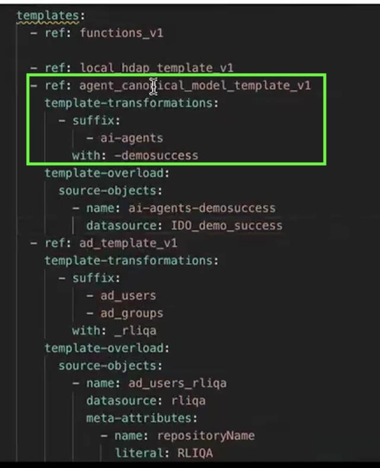

3. Save and click Apply to apply the configuration to the pipeline.

Applying the pipeline configuration takes effect immediately. Review the changes before applying them. After the pipeline is applied, discovered agents appear in the inventory, dashboards, and controls of the Identity Observability interface.

## Managing provisioned configuration

### Provisioning failures

If provisioning stops, open the task log for the failed step. Connection failures are the most common cause.

- **Retry** continues from the first incomplete step and preserves completed resources.
- **Delete Resources** removes provisioned resources so you can start again.

Retry will not fix an invalid provisioning value because those values cannot be edited after provisioning begins.

### Missing resources

The provisioning page detects resources that were deleted outside the workflow and allows the affected step to be retried. It does not detect direct configuration changes to existing resources.

### Editing or deleting data sources

Saving changes to a provisioned data source does not update its schema, naming context, proxy, cache, or mapping. Deleting a data source also does not remove those resources automatically. Delete provisioned resources from the **Provisioning** tab before deleting the data source.

### Persistent Cache

Persistent cache configuration can be managed from Setup > Directory Namespace > Namespace Design.

Select the cached naming context and click the CACHE tab.

#### Editing Persistent Cache Refresh

1. Click "..." inline with the configured cache and choose Edit.

2. Select the 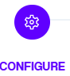 option to change the periodic refresh schedule.

#### Re-initialize Persistent Cache

Select the 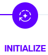 option to re-initialize the persistent cache.

#### Delete Persistent Cache

Click "..." inline with the configured cache and choose Delete Cache.
