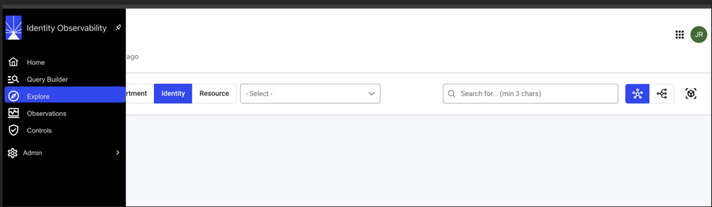
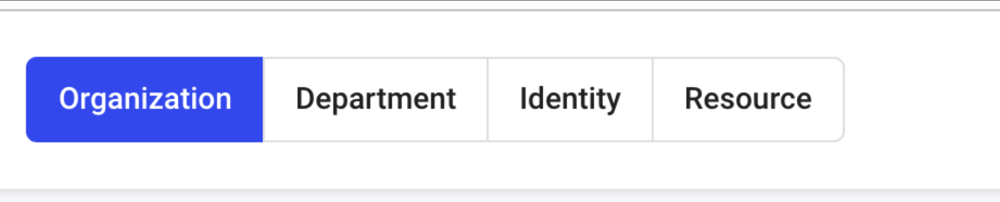
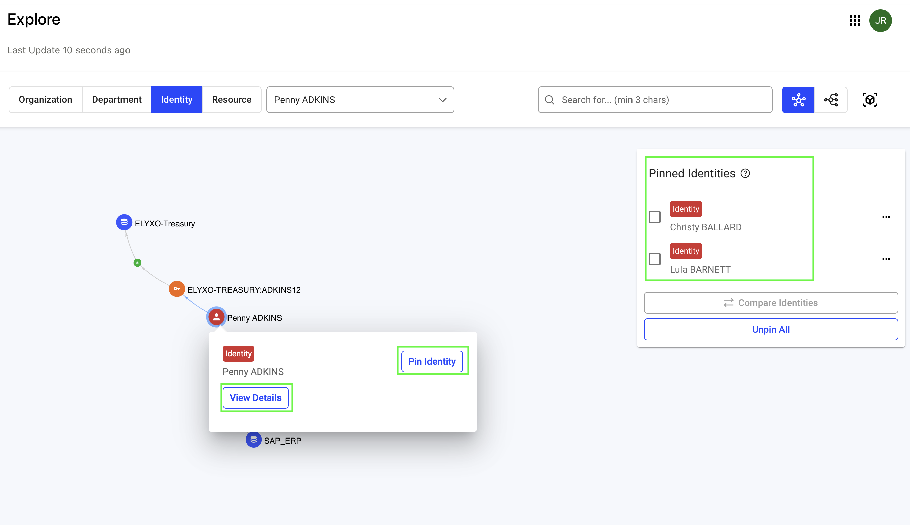
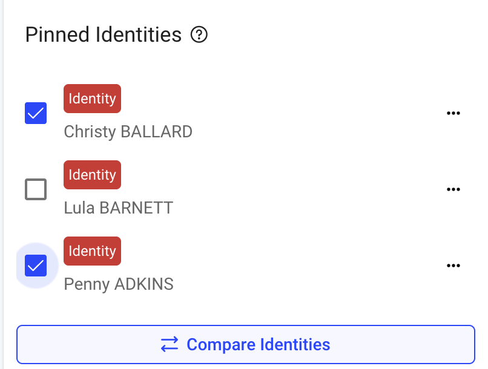
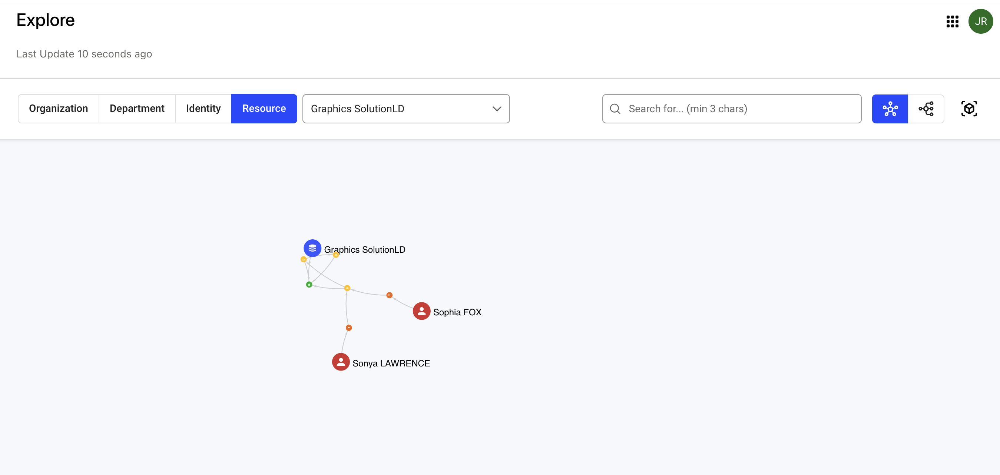
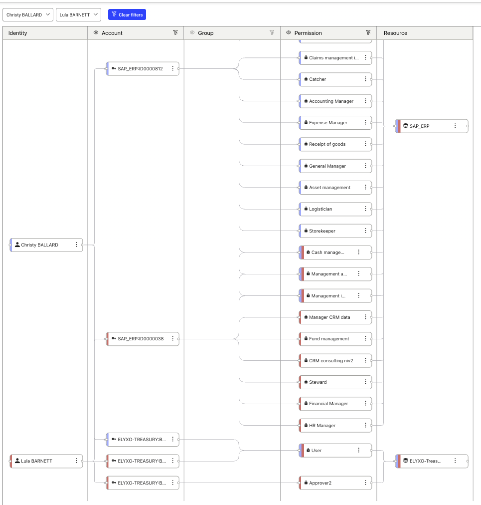

# Explore 

The Explore page serves as a data visualization tool to navigate, understand, and analyze different parts of your organization’s identity and resource structure.  
 
Using this interface, you can drill down into various organizational components.  
 
## Getting started 

To open the Explore page, login to the Identity Observability portal and click the Explore option in the left navigation panel. 
 
  

Once you’re in the page, you can explore available data in the following ways: 

  

* Organization: See the whole organization’s structure. 

* Department: Filter and focus on specific departments. 

* Identity: Search for and review individual identities within the system. 

* Resource: Explore various resources available within the organization. 

### Filters and views  

Use the search bar to find a particular identity or resource. You can also view data in different layouts (Cloud layout, org layout or 3D view) by switching between the dsiplayed icons. Note that the 3D view is not recommended for large data sets. 

When you search for an identity or an resource, you can find different interactive components in the displayed result. 

Here is an example image that shows an identity's data displayed in cloud layout including the resources available to the identity. 

  

You can click on the name of the identity to view more details about the identity. You can also pin one or more identities for easy retrieval and access comparison. 

  

Here is an example image that shows a resource's data in cloud layout including the identities that have access to the resource.

 

You can click on the resource name, group or identity names to view more details.

### Example scenarios 

Here are some examples of how you can utilize the Explore feature. 

* Department Analysis: Quickly narrow down to a department to view its people and resources. 

* Identity Lookup: Find details about a specific user or identity by name or attribute. 

* Compare Resource access: Compare access rights granted to two identities to see if there are any comparable differences. 

  

* Resource Discovery: Identify and analyze resources associated with departments or users. 

* Organizational Mapping: Understand how departments, users, and resources are interrelated through graphical views. 
