## Overview

This guide explains how to configure Okta as an external OpenID Connect (OIDC) identity provider for **Radiant Logic Identity Observability**. This allows users to log in to the Identity Observability portal using their Okta credentials.

### Prerequisites
  
- Admin access to the Okta Admin Console
- Admin access to IDP console
- Access to your Identity Observability application 
    - You can access Identity Observability's services (the main Identity Observability Portal and the **IDP console** URLs) by logging into the [application endpoints](../installation/installation-steps/#log-in-to-identity-observability-endpoints) that appear on your application's **overview page**. Use the **IDP CONSOLE** endpoint whenever this guide refers to the IDP console.

Follow the steps below to configure Okta as an OIDC provider for Radiant Logic Identity Observability.

### 1. Create the Okta application integration

1. In the Okta Admin Console, go to **Applications > Applications**.
2. Click **Create App Integration**.

   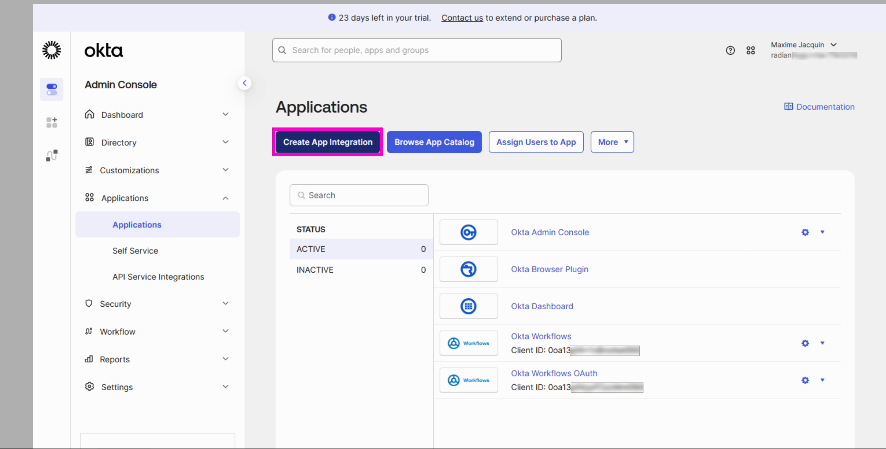

3. Choose **OIDC - OpenID Connect** as the sign-in method and **Web Application** as the application type, then click **Next**.

   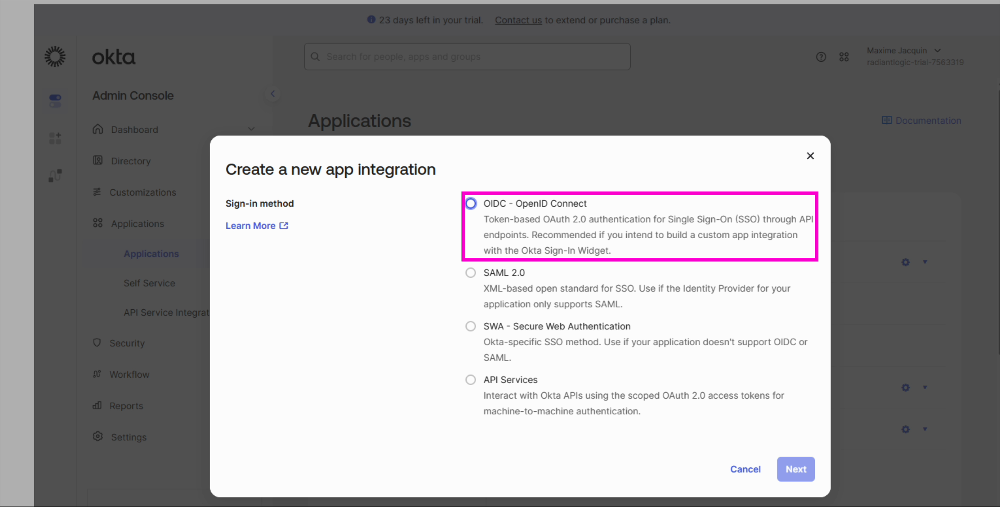

4. On the **New Web App Integration** screen, give the app a name (for example, `IDO`). Leave the other defaults for now, you'll add the redirect URI in the next section.

### 2. Add the redirect URI from the IDP console

1. Open the **IDP console** of Identity Observability in a second tab.
2. Go to **Identity providers > OpenID Connect v1.0**.
3. Copy the **Redirect URI** that the IDP console displays — this is the callback URL Okta must trust.

   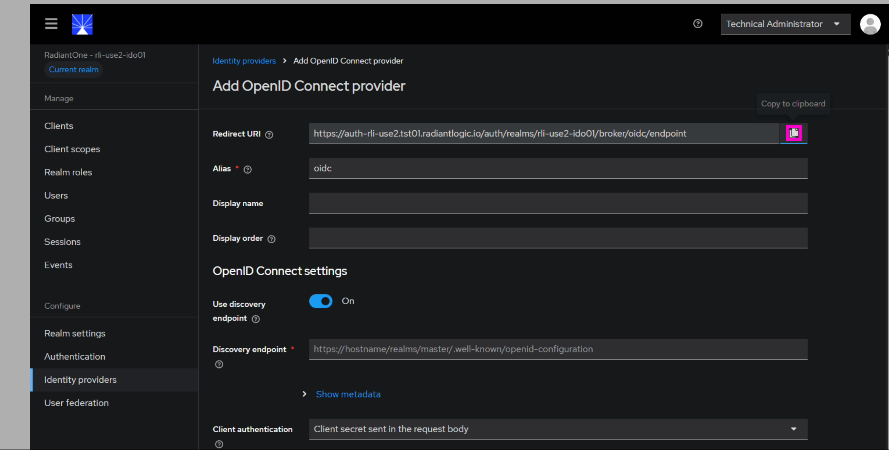

4. Back in Okta, paste that value into **Sign-in redirect URIs**.
5. Scroll down and click **Save**.

   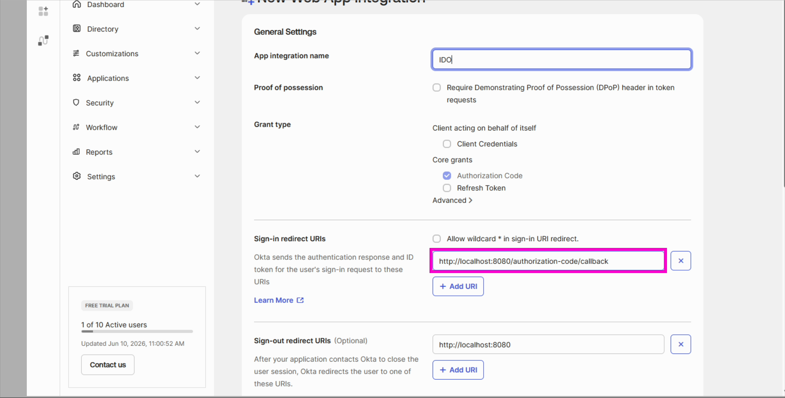

### 3. Create an Okta group for IDO access

1. In Okta, go to **Directory > Groups > Add group**.
2. Name the group `IDO` and click **Save**.

   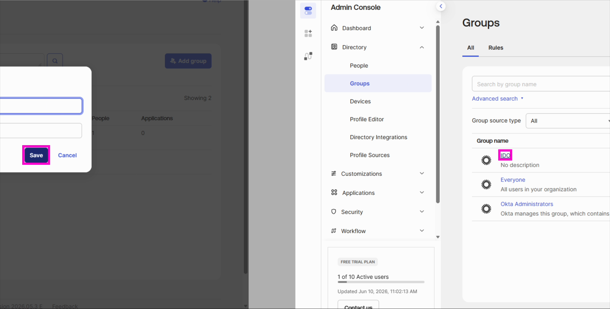

3. Open the new **IDO** group and click **Assign people**.
4. Add the user(s) who should have access, then click **Done**.

   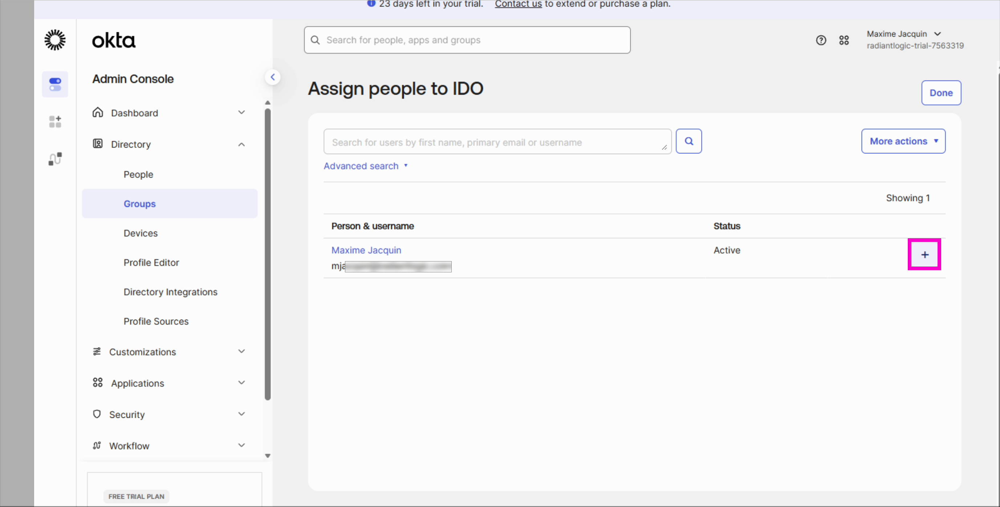

### 4. Assign the group to the IDO application

1. Go to **Applications > Applications** and open the **IDO** app.
2. Switch to the **Assignments** tab.
3. Click **Assign > Assign to Groups**.
4. Assign the **IDO** group, then click **Done**.

   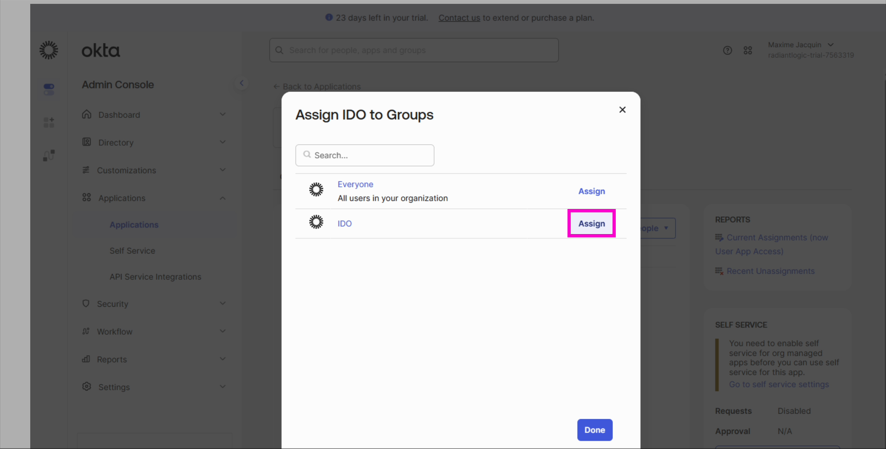

### 5. Copy Client Credentials to the IDP console

1. In the IDO application in Okta, click the **General** tab.
2. Copy the **Client ID** and the **Client Secret** values.

   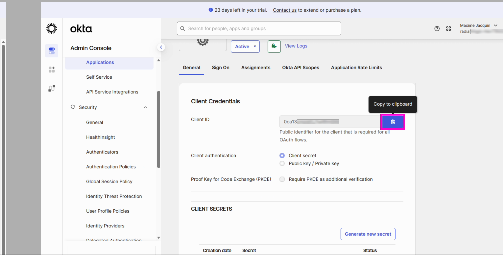

3. In the IDP console of Identity Observability, paste the appropriate values into the **Client ID** and **Client Secret** fields respectively.

### 6. Copy the Discovery Endpoint

1. In Okta, go to **Security > API > Authorization Servers** and click the **default** authorization server.
2. Copy the **Metadata URI** located under the **Settings** tab.

   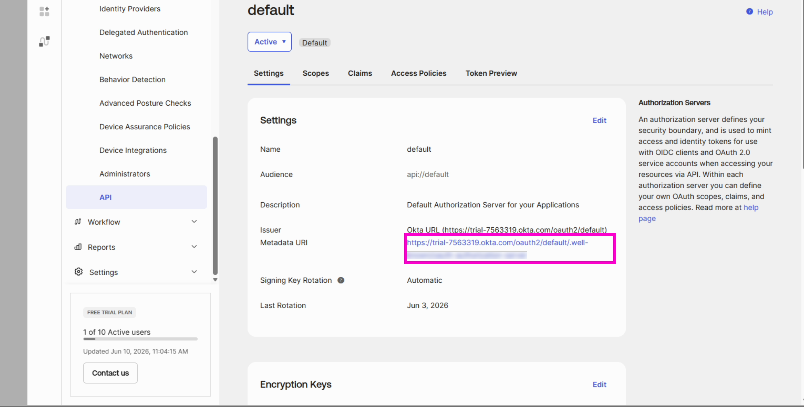

3. In the IDP console, paste the Metadata URI into the **Discovery endpoint** field.
4. Click **Show metadata** and review the retrieved metadata to confirm the connection is valid.

   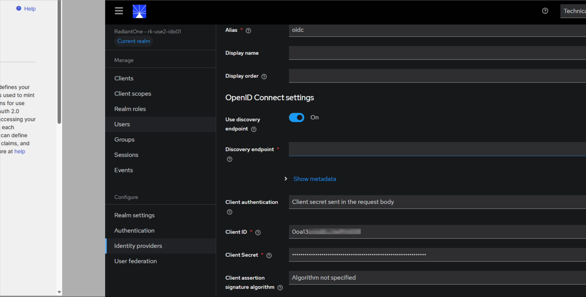

### 7. Configure Identity Provider settings in the IDP console

1. In the IDP console, click **Advanced** on the identity provider configuration page.
2. Scroll down and enable **Trust Email**.

   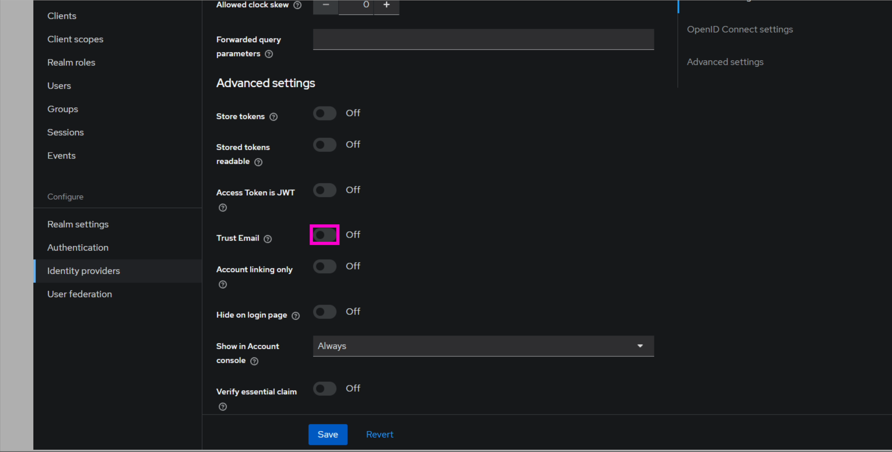

3. Click **Scopes**.
4. Enter the following scopes: `openid`, `email`, `profile`, `groups`.
5. Click **Save**.

   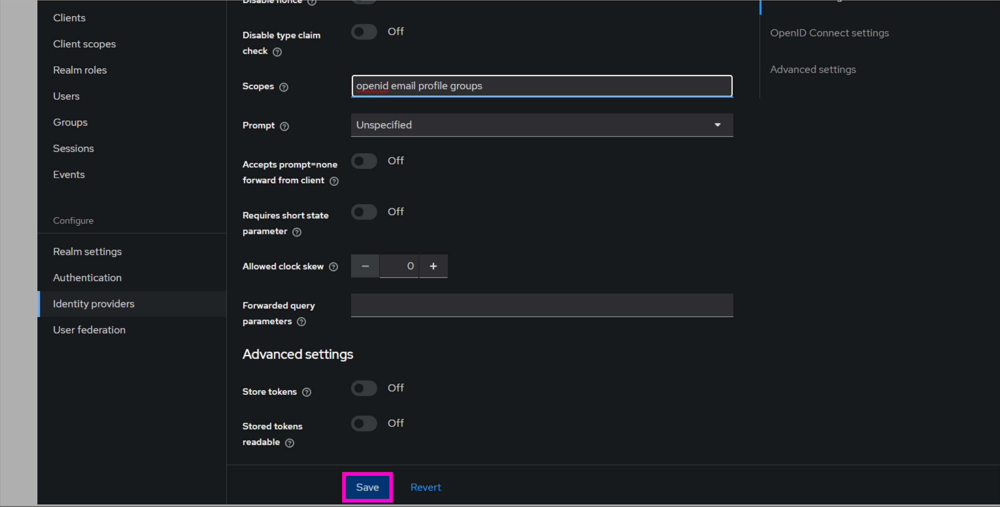

### 8. Create a custom scope in Okta

1. Return to Okta's default authorization server and open the **Scopes** tab.
2. Click **Add Scope**.
3. Name it `groups`, then add a display phrase and description.
4. Click **Create**.

   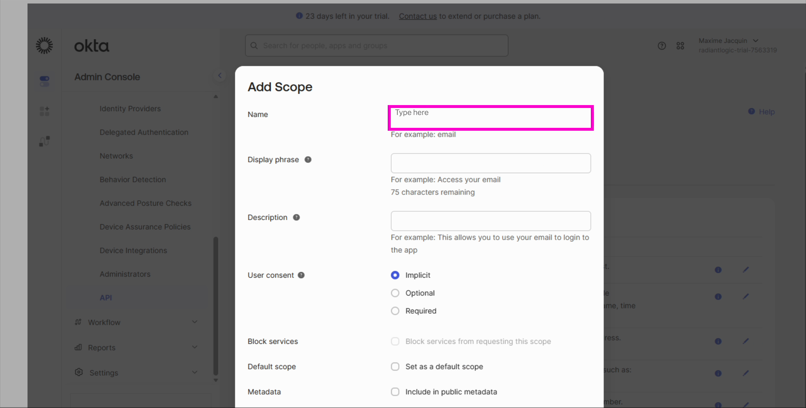

### 9. Create a groups claim in Okta

1. Open the **Claims** tab and click **Add Claim**.
2. Configure the claim:
   - **Name:** `groups`
   - **Include in token type:** ID Token, and set it to **Always**
   - **Value type:** Expression, sourced from **Groups**
   - **Filter:** `Equals` `IDO`
   - **Include in:** the following scopes → `groups`

   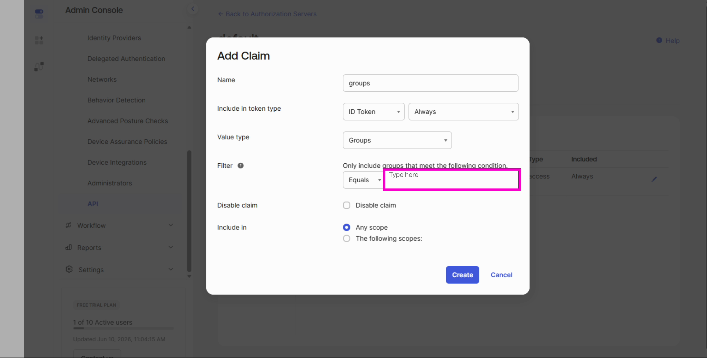

3. Click **Create**. The new `groups` claim now appears in the claims list.

   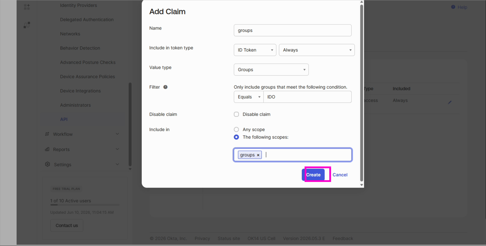

### 10. Create an access policy

1. Open the **Access Policies** tab and click **Add Policy**.
2. Give it a name and description.
3. Set **Assign to > The following clients** and select the **IDO** client.
4. Click **Create Policy**.

   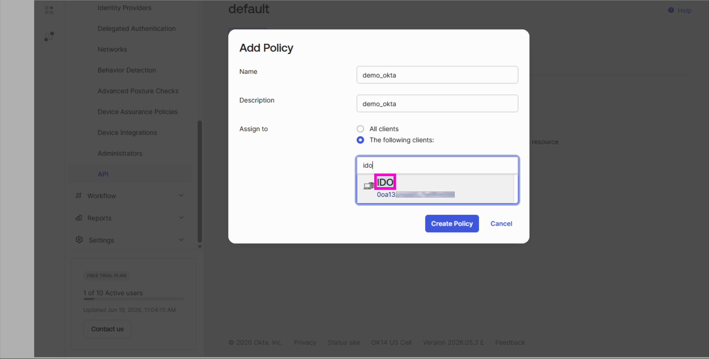

### 11. Add a rule to the policy

1. On the new policy, click **Add rule** and name it.
2. Uncheck **Client Credentials** and **Device Authorization**.
3. Under **Scopes requested**, choose **The following scopes**, add the OIDC default scopes, and include `groups`.
4. Scroll down and click **Create rule**.

   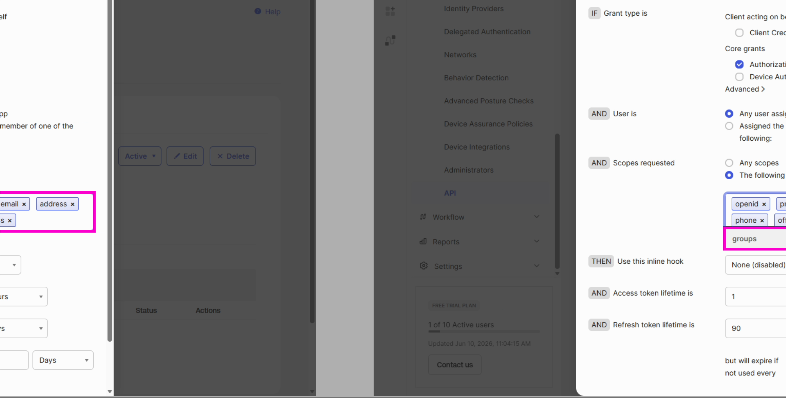

### 12. Test with Token Preview

1. Open the **Token Preview** tab.
2. Set the **OAuth/OIDC client** to **IDO**, the **Grant type** to **Authorization Code**, pick a test **User**, and add the scopes `openid`, `email`, and `groups`.
3. Click **Preview Token**.

   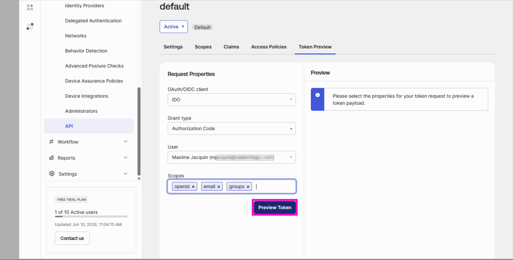

4. In the previewed token, confirm the payload contains a **`groups`** claim with the value **`IDO`**. This proves Okta is issuing group membership correctly.

   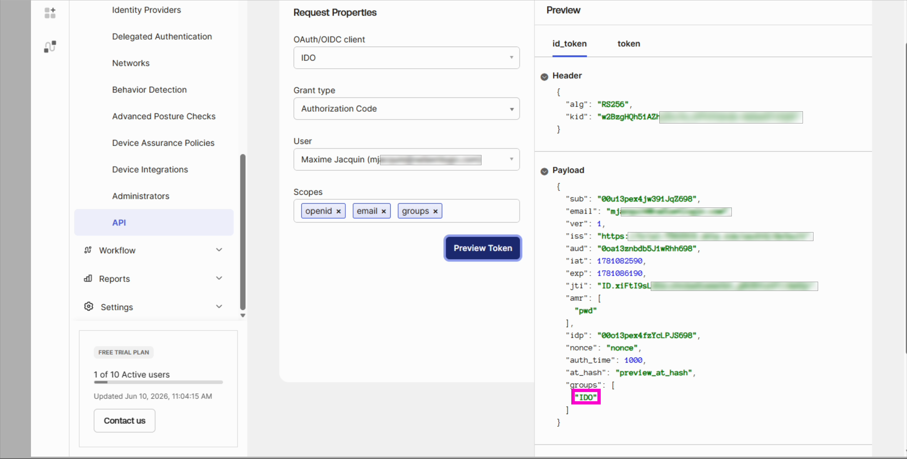

### 13. Map the Okta group to an IDO role in the IDP console

1. In the IDP console, open the provider's **Mappers** tab and click **Add mapper**.
2. Name it, set **Sync mode override** to **Force**, and set **Mapper type** to **Claim to Role**.

   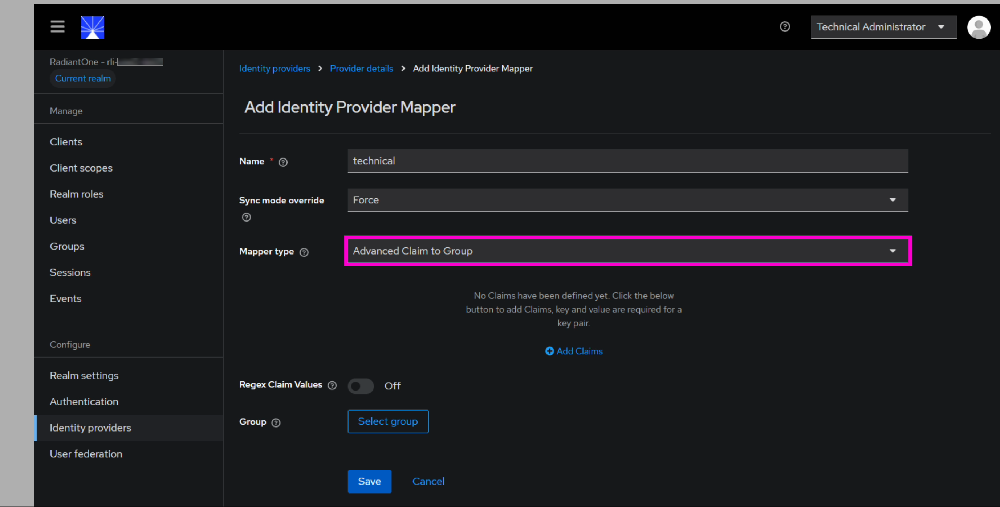

3. Set **Claim** to `groups` and **Claim Value** to `IDO`.

   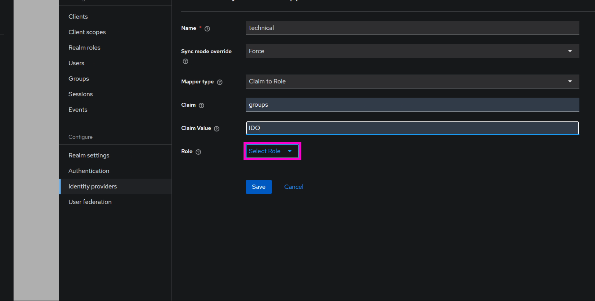

4. For the role, click **Select Role > Client roles**, search for `technical`, and select the **technicaladmin** role, then click **Assign**.
5. Click **Save**.

   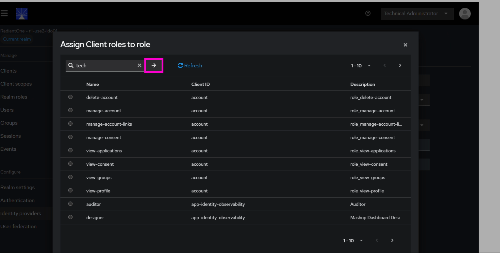

### 14. Manage users and role mappings

1. In IDP console, go to **Users**.
2. Create a new user, or locate an existing user and update their role mapping as needed.
3. To remove the `technicaladmin` role from an existing user, open the user's **Role mapping** tab, click the (⋮) menu next to the role, select **Unassign**, and confirm by clicking **Remove**.

   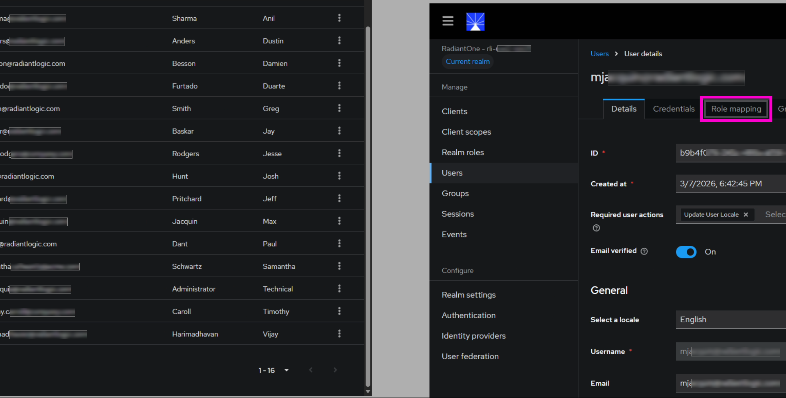

### 15. Verify login through the Identity Observability portal

1. Open the Identity Observability portal sign-in page and click **oidc** to sign in with Okta.

   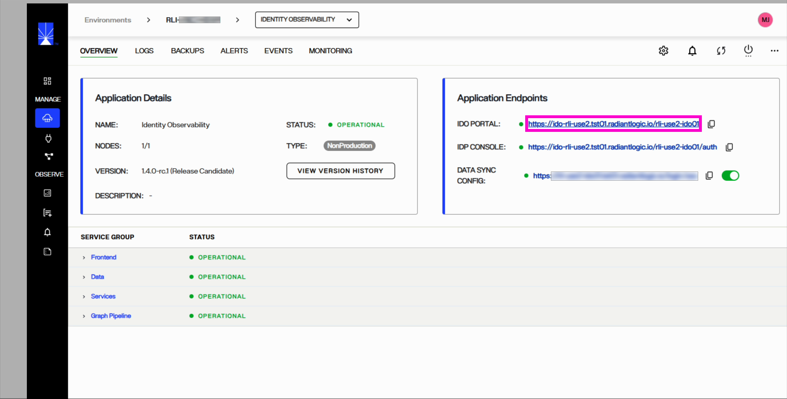

2. If the account already exists, choose **Add to existing account** and verify by email.
3. Once verified, you will be logged in to Identity Observability using your Okta credentials.
