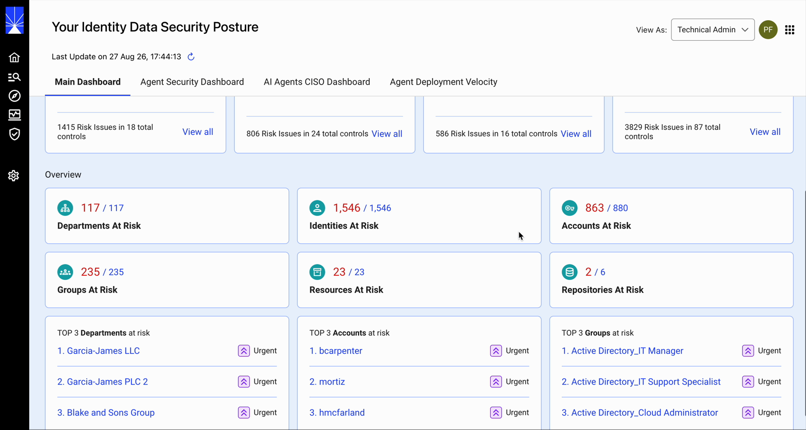
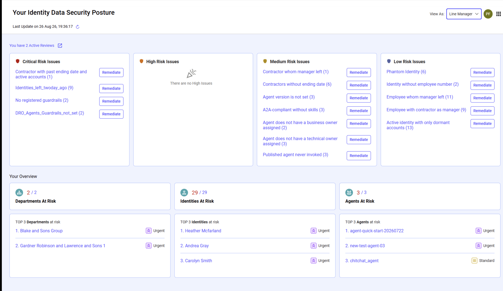
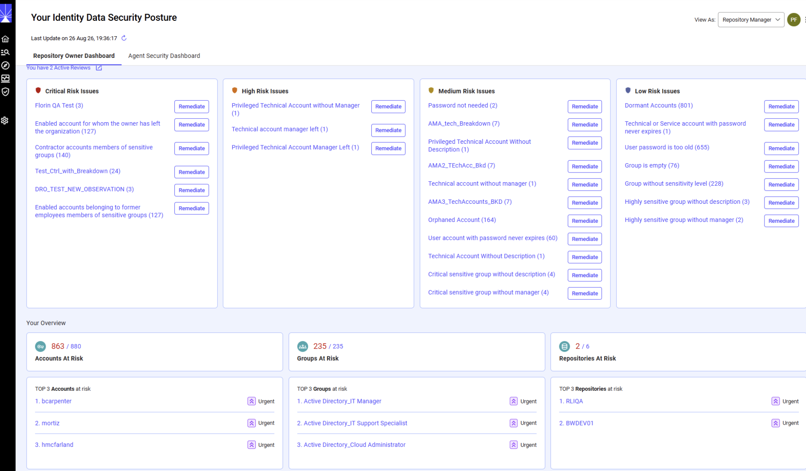
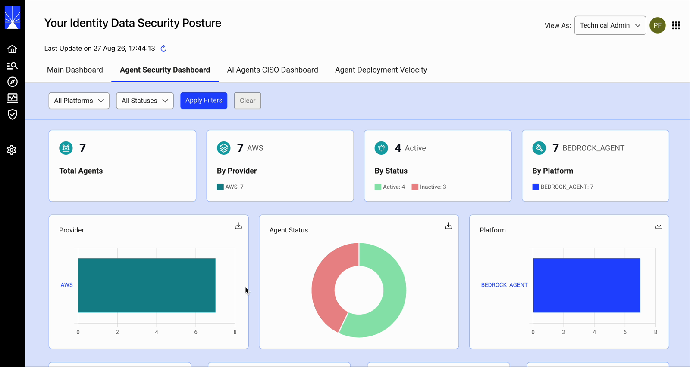
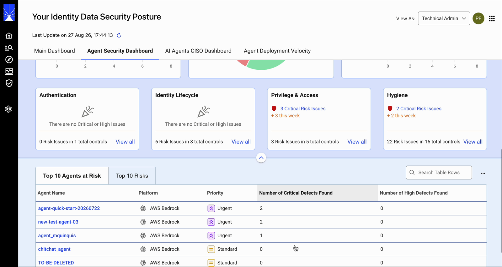
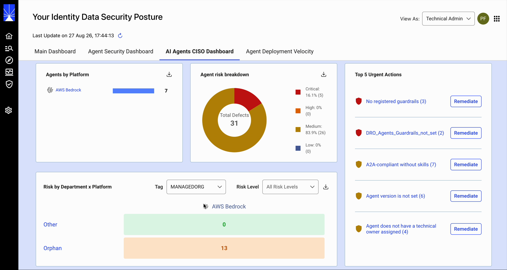
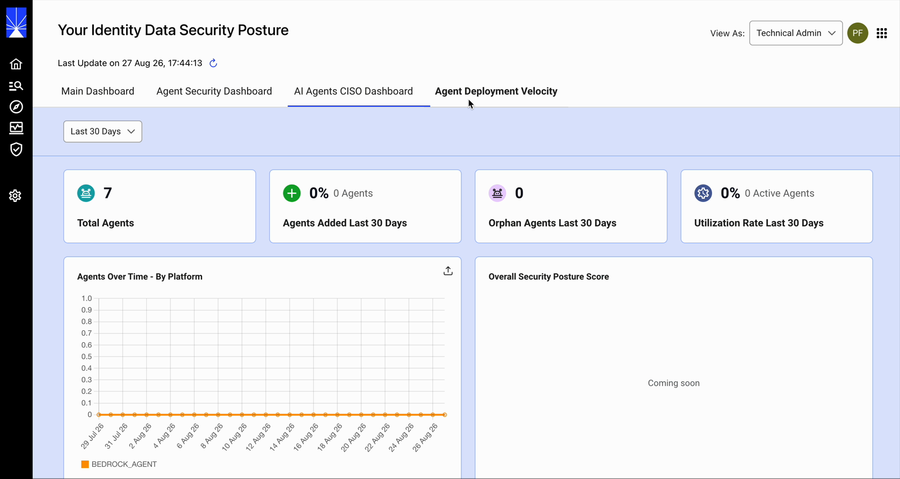
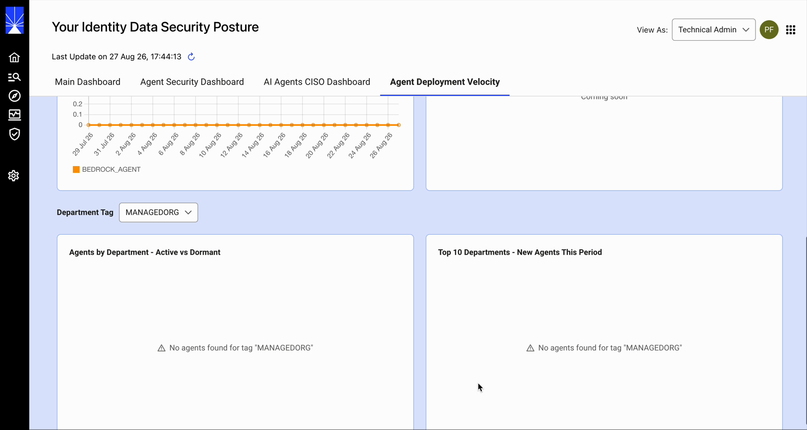

# Getting Started

When you sign in to Identity Observability, the landing page gives you an at-a-glance view of your organization's security posture. Use the dashboards and control summaries to find issues, understand their impact, and investigate them further.

Issues are grouped by risk level so you can quickly see what needs attention:

- Critical — red
- High — orange
- Medium — amber
- Low — blue

Select **View all** on a dashboard card or select a risk-level count to investigate related issues. Depending on your role, you can use these links to open:

- **Control family pages** for a breakdown of controls in a category.
- **Control detail pages** to review a specific control and its defects.
- **Object detail pages** to investigate departments, identities, accounts, groups, permissions, resources, repositories, and agents.

Two items at the top of the page apply to all dashboard information:

- **Last updated \<date, time\>:** Posture data is calculated on a schedule. Select the refresh icon to load the latest available results.
- **You have N active reviews:** This message appears when you have assigned access reviews. Select it to open the review in a new tab.

When a card has no findings at a particular risk level, it displays *There are no Critical or High Issues* rather than a count of zero.

> **Note**
> Your landing page is based on your role. You see only the data, actions, and dashboards available to you.

This guide explains what each role can view and do in Identity Observability.

## Select a view

Use the **View As** selector in the top bar to choose one of the views available to you. Selecting a view opens that view's default dashboard.

If you have one assigned role, the selector shows only that role. If you have multiple roles, you can switch between them without signing out.

Each view is based on your assigned entitlements. The view determines which data you can access, which links are available, and which actions you can take.

## Technical administrator

Technical administrators can view all available system data, including all control families, objects, and organizational information.

### What you can see

The landing page includes four control family cards:

- Authentication
- Identity Lifecycle
- Privilege & Access
- Hygiene

Each card shows the current issues by risk level, the change over the last seven days, the number of issues and active controls, and key volume metrics such as departments, identities, accounts, groups, resources, and repositories.

Issues are color-coded by risk level: Critical, High, Medium, and Low.

If agent data is available, the landing page also includes these dashboard tabs:

- Main Dashboard
- Agent Security Dashboard
- AI Agents CISO Dashboard
- Agent Deployment Velocity

### What you can do

You can open control family, control detail, and object detail pages to investigate issues across the organization. You can also start remediation for issues and review the audit trail to see what was remediated, by whom, and when.

Common ways to work include:

- **Start broad:** Review the dashboard, open a control family, investigate affected objects, and remediate issues.
- **Focus on risk:** Start with Critical and High issues, review trends, and track remediation progress.

## Line manager

Line managers can view data for the teams and departments they manage. This includes Hygiene and Identity Lifecycle information.

### What you can see

The dashboard provides an overview of your team's security posture, including control defects, risk scores, and control family summaries.

You can review identity lifecycle issues involving people on your team, such as:

- New employees
- Employees who changed roles or departments
- Employees who have left
- Terminated employees with active accounts

The top of the dashboard shows issues by risk level. The bottom of the dashboard highlights departments and identities with the highest risk scores.

If you manage agents, your dashboard also includes:

- An **Agents at Risk** tile in **Your Overview**
- A **Top 3 Agents at Risk** list
- Agent-related controls within the Critical, High, Medium, and Low risk sections

For example, **No registered guardrails** may appear as a Critical issue, while **Agent version is not set** may appear as a Medium issue.

### What you can do

You can open controls and object details within your scope. You can also remediate identity and department issues, and update sensitivity or reason attributes for employees, contractors, and departments.

### What you cannot do

- You cannot access accounts, groups, permissions, repositories, or resources outside your assigned scope.
- You cannot create, update, or delete controls or dashboards.

## Resource owner

Resource owners can view the applications, servers, systems, and other resources they manage.

### What you can see

You can monitor control families and issues associated with your resources, including the permissions connected to those resources.

Resource and permission detail pages help you understand how a resource is used, which permissions are associated with it, and where issues may exist.

### What you can do

You can open resource and permission detail pages, investigate related issues, and remediate issues for your resources and associated permissions where permitted.

## Repository owner

Repository owners can view the repositories they manage, such as HR systems, Active Directory domains, and Microsoft Entra ID tenants.

> **Note**
> The **View As** selector uses the name **Repository Manager**. The landing page tab is named **Repository Owner Dashboard**.

### What you can see

You can monitor control families and issues associated with your repositories, including related groups and accounts.

If you manage a repository that contains an agentic AI platform, an **Agent Security Dashboard** tab appears beside your repository dashboard. Your repository information remains available on the first tab.

### What you can do

You can investigate repository issues and remediate defects when you have permission to do so.

## Agent owner

You are automatically given an Agent Owner view the first time you are assigned as an agent's business owner or technical owner. You do not need to request a separate role.

### What you can see

The dashboard is limited to the agents you own. It includes these additional tiles:

- **Agents at Risk:** The number of your agents with open issues, compared with your total number of agents.
- **Top 3 Agents at Risk:** The three agents with the highest risk, with links to their detail pages.

The **Top 10 Agents at Risk** and **Top 10 Risks** tables are also limited to your agents.

### What you can do

You can open the detail page for any agent you own.

- Select **Agents at Risk** to open a filtered list of your at-risk agents.
- Select **Remediate** for an agent control to open the related control page, filtered to your agent scope.

### What you cannot do

- Links within detail pages that you open from this view are disabled.
- Agent information is not shown when you do not own any agents.

## Agent dashboards

Agent dashboards show the same agent data from different perspectives. They use the same risk families, risk levels, and table formats so that posture information stays consistent across views.

| Dashboard | Helps answer |
|---|---|
| Agent Security Dashboard | Where are my agents, and what issues affect them? |
| AI Agents CISO Dashboard | What is the overall risk posture, and what should be addressed first? |
| Agent Deployment Velocity | How quickly is agent use growing, and where is growth occurring? |
| Line manager landing page | What issues affect agents owned by my department? |
| Repository owner landing page | What issues affect agents in the repositories I manage? |

The dashboards available to you depend on your role. Technical administrators can open the first three dashboards from the landing-page tabs. Other roles access agent information from the dashboard tab or section available in their view.

> **Note**
> Agent dashboards are shown only when agent data is available. If the total number of agents is zero, agent dashboards are not displayed.

### Agent Security Dashboard

The Agent Security Dashboard helps you understand where agents are deployed and identify the security issues that affect them.

#### Filter the dashboard

Use **All Platforms** and **All Statuses** at the top of the dashboard to filter the information below.

1. Select a platform, status, or both.
2. Select **Apply Filters**.

Select **Clear** to remove filters and return to the full dashboard view.

#### Review deployment information

Four tiles show agent deployment counts:

| Tile | Shows |
|---|---|
| Total Agents | All agents within your scope |
| By Provider | The agent count for the largest provider, with a full provider breakdown below |
| By Status | Active and inactive agent counts |
| By Platform | Agent counts for each hosting platform |

The Provider, Agent Status, and Platform charts show the same information as bar and donut charts. Use the download icon on a chart to export its data.

#### Review security posture

The dashboard includes a card for each risk family:

- Authentication
- Identity Lifecycle
- Privilege & Access
- Hygiene

Each card shows the number of Critical and High issues, the weekly change, and the total number of issues and controls. Select **View all** to open the related issue list.

#### Use ranked tables

At the bottom of the dashboard, you can switch between two tables.

**Top 10 Agents at Risk**

| Column | Description |
|---|---|
| Agent Name | The agent name. Select it to open the agent detail page. |
| Platform | The platform that hosts the agent |
| Priority | Urgent or Standard |
| Number of Critical Defects Found | Number of Critical issues |
| Number of High Defects Found | Number of High issues |

**Top 10 Risks**

| Column | Description |
|---|---|
| Risk name | The control name. Select it to open the control detail page. |
| Risk level | Critical, High, Medium, or Low |
| Risk category | Authentication, Identity Lifecycle, Privilege & Access, or Hygiene |
| Number of defects identified | Number of identified issues |

Use **Search Table Rows** to find entries in either table. Use the overflow menu next to the search field to choose columns or export table data.

Selecting an agent opens its detail page. Selecting a risk opens its control detail page.

### AI Agents CISO Dashboard

The AI Agents CISO Dashboard provides an organization-wide view of agent risk. Use it to understand your overall posture, identify where risk is concentrated, and prioritize the most urgent work.

This dashboard shows all agents within your scope. It does not include a date-range selector or pre-applied filters.

#### Review key metrics

Each KPI tile includes a **View All** link that opens Query Builder with the relevant filter already applied.

| KPI | Shows |
|---|---|
| Total Agents | All agents within your scope |
| Risk >= High | The percentage of agents with at least one High or Critical issue |
| Orphaned Agents | The percentage of agents without an owner |
| Dormant Agents | The percentage of agents identified as dormant by the dormancy control |

#### Review charts and priority actions

| Widget | Shows |
|---|---|
| Agents by Platform | Agent counts by platform. Select a platform name to view its agents. |
| Agent Risk Breakdown | Total issues, grouped by risk level with counts and percentages |
| Top 5 Urgent Actions | The highest-priority actions, ranked by risk level and then by the number of deviations. Select an action to begin guided remediation. |
| Risk by Department × Platform | A heat map of issue counts by department and platform |

Use the **Tag** picker to choose the department tag used for the heat map rows. Use the **Risk Level** filter to show issues at one risk level. Select the download icon to export heat-map data.

The heat map always includes these additional rows:

- **Other:** Agents whose owners do not belong to a department.
- **Orphan:** Agents that do not have an owner.

> **How department scoping works**
> The dashboard includes departments with the selected department tag and their sub-departments. An agent is assigned to a department based on its business owner's department. Agents without a business owner are included in the **Orphan** row.

### Agent Deployment Velocity

The Agent Deployment Velocity dashboard focuses on adoption and growth rather than security exposure. Use it to track how agent usage changes over time and across your organization.

#### Choose a time period

Use the time-window selector in the upper-left corner to set the reporting period for time-based widgets. Static widgets do not change when you select a different time window.

#### Review adoption metrics

| Tile | Shows |
|---|---|
| Total Agents | All agents within your scope |
| Agents Added Last 30 Days | The number and percentage of agents created during the selected period |
| Orphan Agents Last 30 Days | Agents created during the selected period that do not have an owner |
| Utilization Rate Last 30 Days | Active agents as a percentage of all agents |

#### Review deployment trends

| Widget | Shows |
|---|---|
| Agents Over Time — By Platform | Agent growth over time, grouped by platform. Use the download icon to export data. |
| Overall Security Posture Score | A gauge that compares the current posture score with its target. The score is based on Critical and High issues and matches the score shown in the CISO dashboard. |
| Agents by Department — Active vs. Dormant | Active and dormant agent counts by department |
| Top 10 Departments — New Agents This Period | Departments with the most newly created agents. Select a department to view its agents. |

#### Filter by department

Use the required **Department Tag** picker to select the department tag for the department-based widgets. The picker includes all tags assigned to departments, including manually and dynamically assigned tags.

The department widgets display information only for the selected tag. If no agents have the selected tag, the dashboard displays *No agents found for tag "\<tag\>".*

> **How metrics are calculated**
> Growth and velocity metrics use agent creation dates. Agents without a creation date are not included in these calculations.

### Agent Security Dashboard for repository owners

The Agent Security Dashboard on the Repository Owner landing page uses the same layout as the main Agent Security Dashboard, with a few differences:

- It includes only agents in the repositories you own.
- It uses a repository filter instead of a platform filter. The filter includes **All repositories**.
- It continues to include the status filter.
- The repository list includes only repositories you own that contain at least one agent.
- Controls are grouped by risk level: Critical, High, Medium, and Low.
- Links within detail pages opened from this dashboard are disabled.

> **Note**
> There is no separate agent repository manager role. The Agent Security Dashboard is part of the existing Repository Manager view and appears only when you own at least one repository that contains agents.

