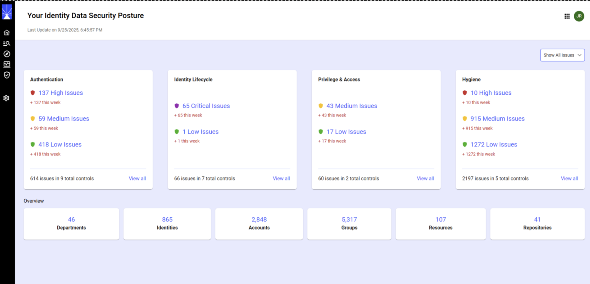

# Getting Started 
 
 Once you login to your Identity Observability account, you will see a a landing page that serves as the primary entry point with immediate visibility into the security posture of the organization using dashboards and control defect summaries. 

 Issues are color-coded so you know at a glance which need immediate attention: Critical (purple), High (red), Medium (yellow), or Low (green).

The landing page also has interactive “View all” links or risk level indicators that you can use to dig deeper based on your role. This lets you explore:

* Control Family Pages to see a detailed breakdown of all controls.
* Control Detail Pages for analysis of specific control defects.
* Object Detail Pages to investigate data objects such as departments, identities, accounts, groups, permissions, or resources.

 > The page is tailored for different roles. Each role sees only what’s relevant to their responsibilities, with access and actions scoped appropriately.

This guide provides an overview of what each role can access when they login to Identity Observability.

## Technical Administrator

If you are a technical administrator of the account, you can access:
* Full system visibility with no restrictions.
* All control families, entities, and organizational data.

### Available features

You will see four control family cards (Authentication, Identity Lifecycle, Privilege & Access, Hygiene) with current Status (issues by risk level), trend Indicators (7-day increase/decrease), total controls (issues vs. active controls) and volumetric KPIs (departments, identities, accounts, groups, resources, repositories).

You will also see color-coded risk prioritization (Critical, High, Medium, Low) for detected issues.

### Available actions

You can drill into to control family, control detail, and object detail pages.
From there, you can also initiate remediation for any issue across the system and track audit trails for who remediated what and when.

You may choose any of these workflows: 

* Top-Down: Overview -> controls -> entities -> remediation.

* Risk-Prioritized: Focus on Critical/High -> monitor trends -> track remediation progress.

## Line Managers 

If you are a line manager, you can access data and features related to the teams and departments you manage. You will have access to Hygiene and Identity Lifecycle.

### Available features:

You can see security posture overview of your team with control defects, risk scores, and family breakdowns. You can monitor Identity Lifecycle of your team such as identities of new employees, movers, employees who have left, and terminated employees with active accounts.

You will see issues by risk level at the top section of the landing page and top departments and identities ranked by risk score at the bottom.

### Available actions

From the landing page, you can drill into controls and objects detail within scope. From there, you can remediate identity/department issues and update sensitivity/reason attributes for employees, contractors, or departments.

**Limitations:**

* Line managers cannot access accounts, groups, permissions, repositories, or resources outside scope.

* Line managers cannot create, update, or delete controls or dashboards.

## Resource Owner

If you are a resource owner, you can access resources you manage (applications, servers, systems).

### Available features:

You can monitor control families and defects tied to the resources you own.

### Available actions:

You can drill into resource-level detail pages. You can also investigate and remediate issues related to your resources.

## Repository Owner

If you are a repository owner, you can access repositories you manage (HR systems, AD domains, Entra ID, etc.).

### Available features

You can monitor control family specific to repository-level issues.

### Available actions:

You can investigate repository issues and remediate defects where permitted.

 
 If you are assigned with multiple roles, your landing page may look like the following image:

 

