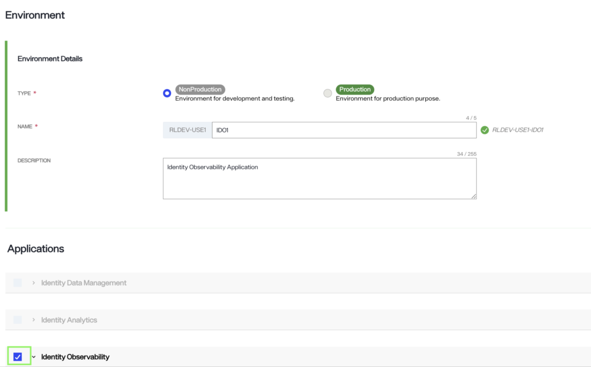
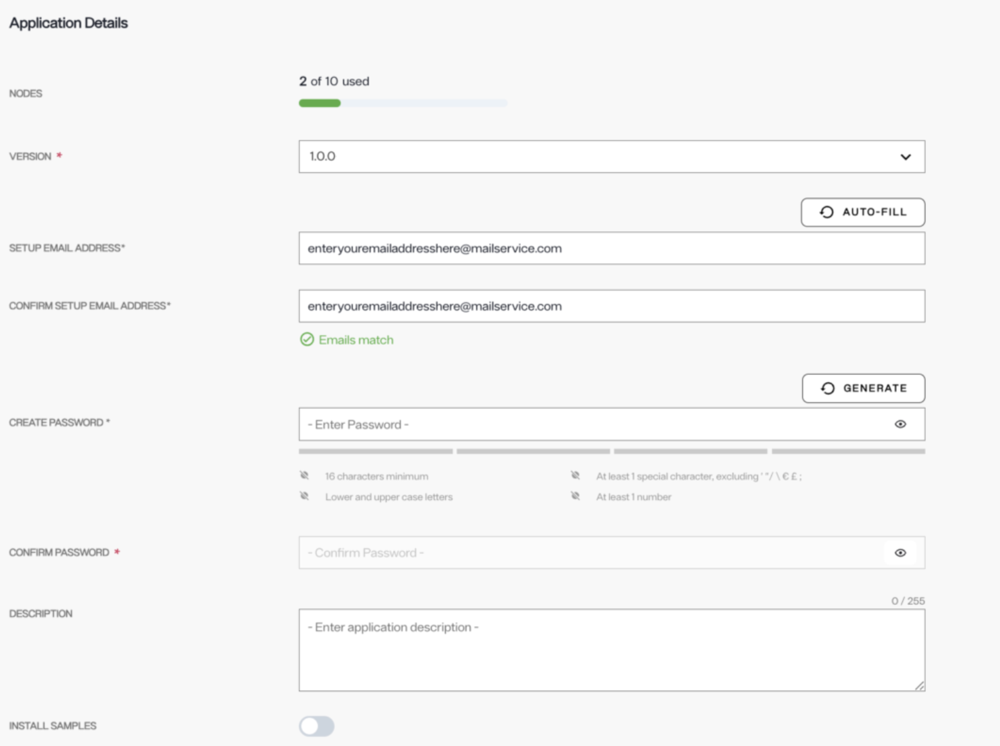
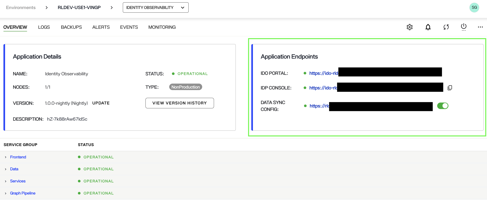

# Installing Identity Observability

To access Identity Observability in your environment, you will need to install it in the Environment Operations Center. This guide provides details on how to install an Identity Observability application and log into your account.

## Prerequisites
* Ensure you have necessary permissions, as only Tenant Administrators or Environment Administrators can add, update, or delete applications in the Environment Operations Center.

## Install Identity Observability

Follow these steps to install Identity Observability in a new environment:

1. After logging into your Environment Operations Center, navigate to the Environments page and click the “New Environment” button. Enter the required details.

2. Select the checkbox adjacent to Identity Observability. In the expanded view, fill out all required information listed below.

### Application Details
Under the Application Details section, provide the required details like the application version, password, and application description.

**Version**
To set the application Version, select the version drop down to display all available
versions. Select the desired version.

**Password**
Select a password by either entering your chosen password in the space provided, or by selecting the Generate button to have a password automatically generated for you.

> Note: Passwords must be a minimum of 16 characters, contain at least 1 special character, contain lower and upper case letters, and contain at least 1 number.

Depending on the complexity and strength of your password, you will receive a notification that your password is "Weak", "Fair", "Good", or "Strong". It is recommended you adjust the password until you receive a "Strong" rating. Adjust your password accordingly to ensure you have entered a strong password before proceeding to the confirmation step. To confirm your password, reenter or copy and paste your password in the confirmation space provided. If you selected to have a password automatically generated, the password will also automatically populate in the confirmation text box.

To reveal your original or confirmation password, select the eye icon (to-add) located within the text field you wish to view. Once the application has been successfully installed, the application's status changes to "Operational".

After successfully installing the application, admins can use this password to access the Identity Observability endpoints: Identity Observability site (IDO Dashboard), the Identity Data Provider Service (IDP console) and the Identity Data Pipeline service (ID Sync Config). 

### Form submission failure

If there is an issue with the form submission, an error message states that the new environment creation failed, and the new environment will no longer be visible in the environment list on the Environments home screen. Select **Dismiss** to close the error message and proceed to restart the workflow to create a new environment.

## Log in to Identity Observability endpoints

To access the Identity Observability site, use the following URLs and credentials. The URLs are displayed in the Application Overview page of Environment Operations Center. To navigate to this page, click Environments -> Environment Name -> name of the desired Identity Observability application. 

- **IDO Portal**: This is the primary interface of the Identity Observability portal where you can get information about your Identity Posture, access real-time dashboards, create controls, observations and more. To access this site for the first time, use "Setup" as the username and the password that you created while installing the application. 

- **IDP Console**: Admins can use this interface to manage users and roles for accessing the Identity Observability portal.

- **Data Sync Config**: This is a the data pipeline service for Identity Observability. It is used to set up data mapping and connector configurations for Identity Observability. Initially, you may need assistance from Radiant Logic to map your data configurations. 

