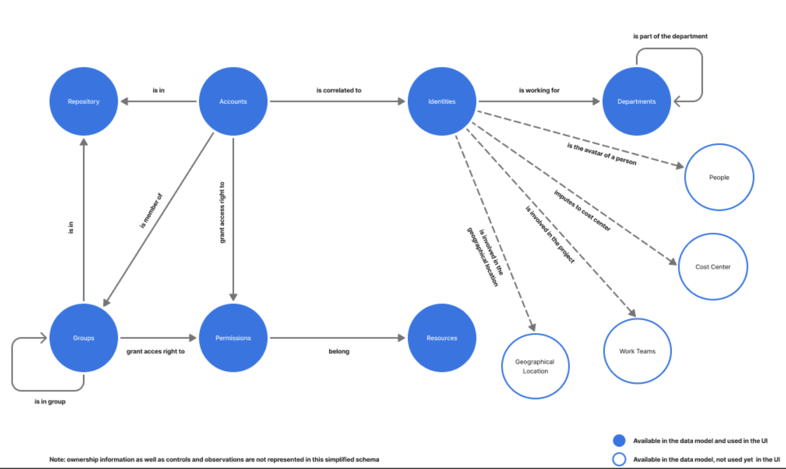

# Overview   

Identity Observability in the RadiantOne Identity Data Platform provides capabilities that are focused on ensuring the quality, accuracy, and actionability of identity-related data. It aims to provide a reliable foundation for access management and governance, authorization, and risk management. 
 
 It creates a real-time view of identities, attributes, and access rights, enabling organizations to continuously improve their identity data, while improving their security posture by reducing risks associated with misconfigurations, outdated data, and human error.  
 
## Data Model of Identity Observability 

The data model serves as the foundation for comprehensive identity visibility, organizing all identity-related entities and their relationships within a unified framework.  

Data from different backend systems are mapped to this data model and updated in real-time. 

Here is a simplified schema diagram of the data model of Identity Observability: 

  

This model is agnostic, which allows Identity Observability to ingest any type of data from multiple heterogeneous systems about identity, accounts and accesses and observe them in real-time in a centralized location through dashboards, custom queries, observation and controls. 

## Core Principles of Identity Observability 

* 360° Discovery: Gain a holistic view of identities, attributes, and access data across systems.  

* Data Analysis: Inspect and interpret identity data based on controls and observations to uncover gaps and anomalies.  

* Quality Assurance: Ensure identity data is accurate, fresh, and authoritative so that authorization and security tools operate effectively. 

* Data Health monitoring: Data changes can be detected in real time, with notifications delivered either to end users through messaging platforms such as Slack or Microsoft Teams, email, or to a risk signal endpoint in the form of a CAEP message. 

## Security and Risk Management Use Cases 

* Misconfiguration Detection: Spot access issues or changes that could cause account compromise, service outages, or data leaks.  

* Lifecycle Governance: Address onboarding and offboarding challenges to prevent orphaned accounts or excessive access rights.  

* System Integrity: Identify drifts and discrepancies between authoritative systems and security tools, such as missing accounts in privileged access management or mismatched provisioned rights. 

## Remediating issues 

Identity Observability not only helps detect issues, it also enables organizations to act on them using the remediation feature. Actions can be:  

* Automated Remediation Suggestions: Remediation action suggestions are displayed when discrepancies are detected.  

* Delegated Fixes: Updates and corrections can be handled directly by business data owners or managers.  

* Ops-driven Response: Security operations teams leveraging observability insights and alerts to resolve incidents quickly. 

Identity Observability empowers security teams and managers to monitor, analyze, and intervene on identity-driven risks. By delivering authoritative insights and enabling timely action, it transforms identity data into a trustworthy asset that strengthens enterprise resilience. 
 
To start using Identity Observability, install the product using the Environment Operations Center, work with professional services team to map your data and access the Identity Observability portal.  