# Overview

The MCP (Model Context Protocol) Server lets AI assistants such as Cursor or n8n query your Identity Observability catalog in plain English. Instead of writing code or building queries manually, you can ask direct questions about identities, accounts, access, and risk.

The assistant can answer questions about a specific person in the catalog and about the accounts associated with that person across connected systems. It can return identity details, access information, and risk-related context drawn from the catalog.

This document explains what the MCP Server does, how it can be used, and how technical administrators can configure it and provision access for users.

## What you can ask

You can ask about any identified person or about an account that belongs to that person. Depending on the data available in your environment, the assistant can help with the following types of questions:

* **Who they are:** identity details, such as name, email address, employee ID, job title, manager, department, start date, and departure date.
* **What they can access:** access details, such as group membership, assigned permissions, accessible resources, and whether an account is privileged.
* **Their associated risks:** risk details, such as risk level, risk score, MFA status, account status (active / disabled / locked), and how the account was reconciled to the identity.

Each question must include at least one specific identity, account, or resource. For example, use a person's name, email address, login, or repository name so the assistant has a clear target.

Broad requests without a specific target are not supported. For example, a request such as "show me everything risky" is too open-ended, while a question about a named user, account, or resource can be answered reliably.

### Example questions

**Basic lookups**

* What resources does Lawrence Brown have access to?
* What risks are associated with lawrence.brown@example.com?
* Is Evelyn Estrada in the Active Directory_Cloud Administrator group?
* Who is the manager of Lawrence Brown?
* Is the account eestrada in repository AD_CORP a privileged account?
* When was Lawrence Brown's account last used?

**Analysis questions**

* Compare the risk profiles of Lawrence Brown and Evelyn Estrada, and explain which one is more exposed.
* List the resources Lawrence Brown can access that no one else in his department can access.
* Is Lawrence Brown a contractor whose departure date has passed, and if so, what active accounts does he still have?

## Technical setup in RadiantOne Identity Observability

This section explains how to provision MCP access for end users in RadiantOne Identity Observability. Access is managed in Keycloak, which acts as the identity provider for the platform.

### Terminology

The following terminologies are used throughout this document. You will need to replace the placeholders with values from your own environment before running any command.

| Placeholder | Description | Example value |
| --- | --- | --- |
| `<tenant>` | Logical boundary for an Identity Observability deployment. In practice, this is both the URL path segment used for routing and the matching Keycloak realm name. A single platform can host multiple tenants, such as separate customers or environments. | `acme`, `acme-prod`, `acme-preprod` |
| `<app-external-dns>` | Public hostname of the Identity Observability application gateway. | `ido.example.com` |
| `<auth-external-dns>` | Public hostname of the Keycloak server used by Identity Observability. | `auth.example.com` |
| `<client_id>` / `<client_secret>` | OIDC client credentials created in Keycloak. Create one client for each end user or automation. | `mcp-john-doe`, `mcp-n8n-prod` |
| `<your-long-lived-token>` | Access token generated from a `<client_id>` / `<client_secret>` pair that includes the `mcp-access` role. | JWT access token |

The MCP Server runs in the same cluster as the rest of the Identity Observability platform. To allow a user or automation to call the MCP server, create an OIDC client in the tenant realm, assign the required role, and configure an appropriate token lifetime.

These steps require `realm-admin` privileges in the tenant realm in Keycloak. In some production environments, those permissions may be restricted by the customer's IT team.

### 1. Open the Keycloak Admin Console

1. Go to `https://<auth-external-dns>/auth/admin`.
2. Sign in with a `realm-admin` account.
3. In the realm selector, choose the tenant realm that matches your `<tenant>` value.

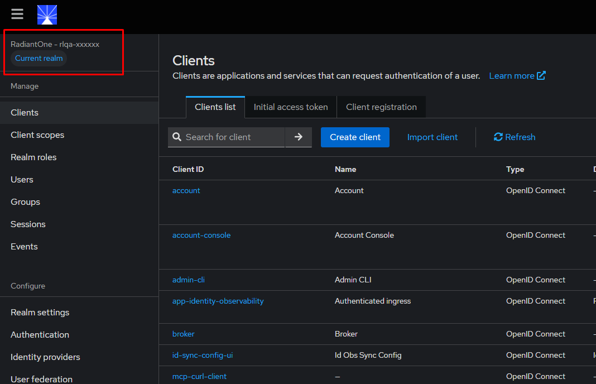

### 2. Create the OIDC client

Create a separate client for each end user or automation. This makes it easier to revoke access, review audit activity, and apply different token settings per client.

1. In the left navigation menu, select **Clients** and then **Create client**.

   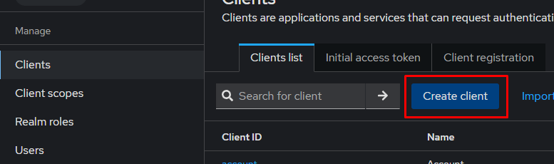

2. In **General settings**, configure the following:

   * **Client type**: `OpenID Connect`
   * **Client ID**: Use a descriptive name, such as `mcp-john-doe` for a user or `mcp-n8n-finance` for an automation.
   * **Name** and **Description**: Optional.

3. Select **Next**.

4. In **Capability config**, enable the following settings:

   * **Client authentication**: ON
   * **Direct access grants**: ON
   * **Service accounts roles**: ON

   The default state of the Capability config screen, before any toggles are enabled:

   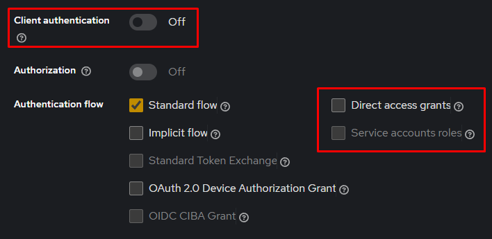

   After applying the settings above, the screen should look like this:

   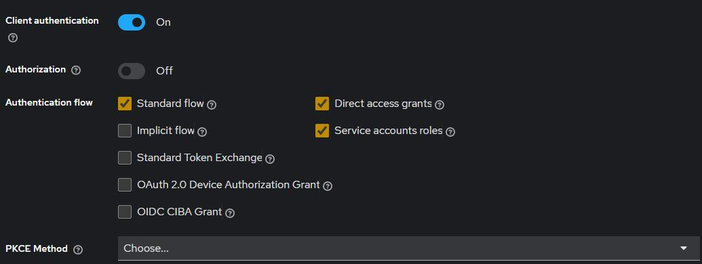

5. Select **Next**, leave **Login settings** empty, and then select **Save**.

6. Open the **Credentials** tab and copy the **Client secret**. This secret is used to request tokens for the client.

   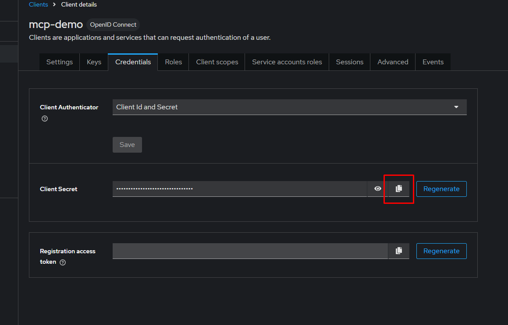

### 3. Assign the `mcp-access` role

The MCP middleware checks for the `mcp-access` role in the access token. Requests that do not include this role are rejected with HTTP 403.

1. Open the client details page.
2. Select the **Service accounts roles** tab.
3. Select **Assign role**.

   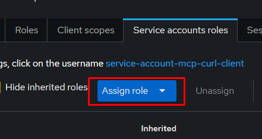

4. Search for `mcp-access`, select it, and assign it.

   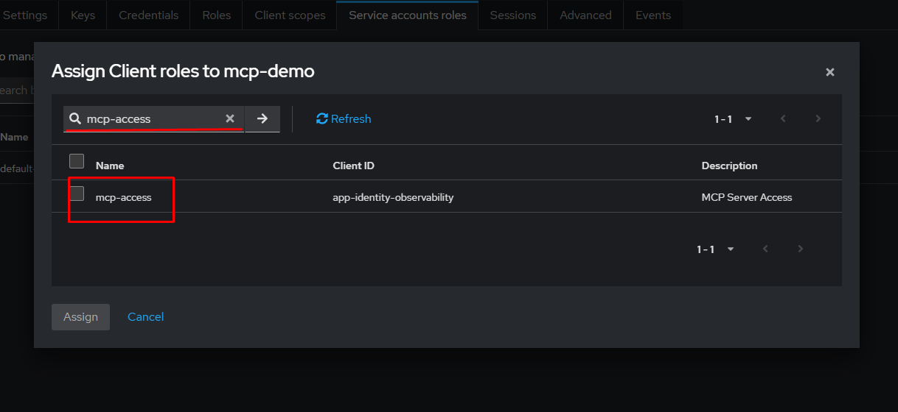

The `mcp-access` role is a composite role that already includes the `user` role, so no additional role assignment is required for basic MCP access.

### 4. Configure the access token lifespan

Set the token lifespan based on how the client will be used. Interactive chat scenarios typically require a much longer token lifetime than automated workflows.

1. Open the client's **Advanced** tab.

   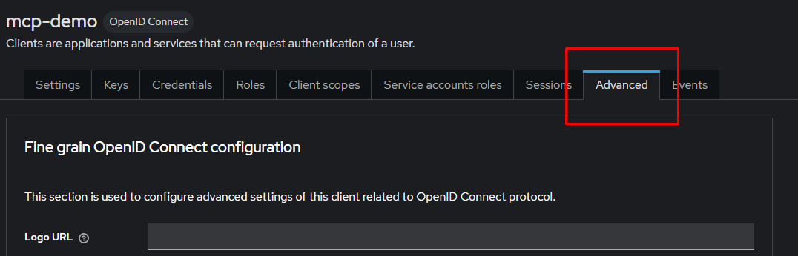

2. Locate **Advanced settings** → **Access Token Lifespan**.

   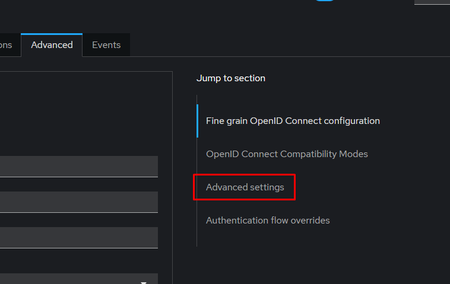

3. Set the token lifetime according to the client type:

   | Use case | Recommended TTL | Notes |
   | --- | --- | --- |
   | Chat mode, such as Cursor | 30 days or longer, subject to your security policy | The user pastes a token into a configuration file and usually does not refresh it interactively. |
   | Automation mode, such as n8n or scripts | 15 minutes | Automation can request fresh tokens as needed, so a short lifetime reduces risk if a token is exposed. |

4. Select **Save**.

   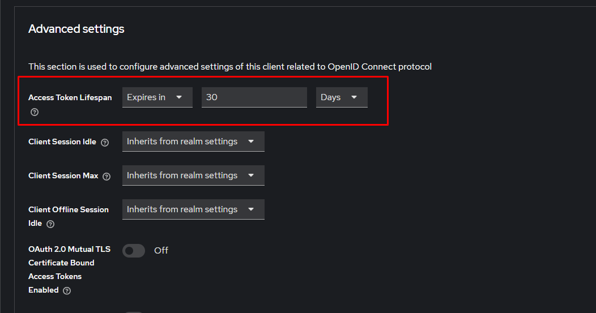

For chat-based usage, also update **SSO Session Max** to the same duration. To do this, open **Realm settings** → **Sessions** and set **SSO Session Max** to match the access token lifespan.

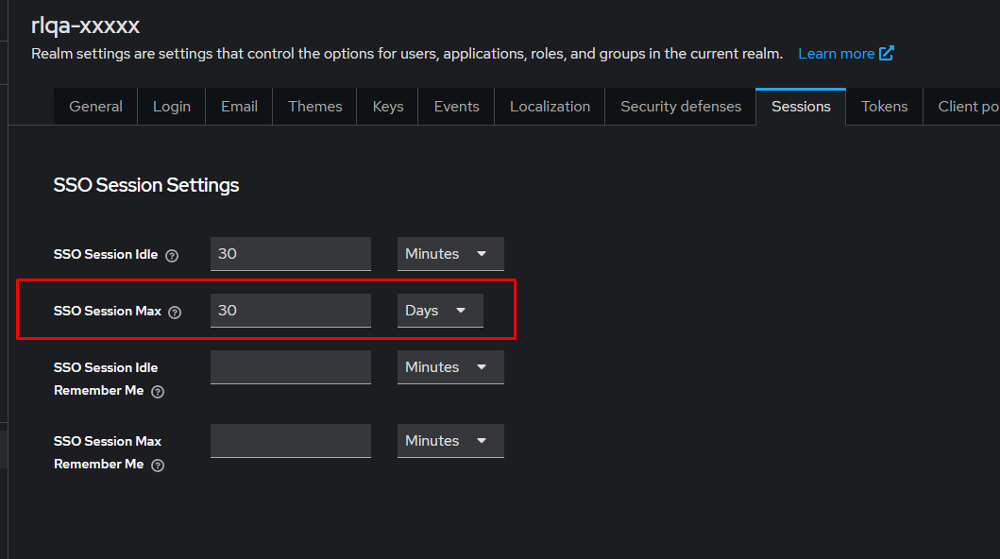

### 5. Generate a token for chat-based usage

For chat-based usage, administrators typically generate the token and provide it to the user. The token can be requested with the `client_credentials` grant.

```bash
curl -X POST \
  "https://<auth-external-dns>/auth/realms/<tenant>/protocol/openid-connect/token" \
  -d "grant_type=client_credentials" \
  -d "client_id=<client_id>" \
  -d "client_secret=<client_secret>" \
  | jq -r '.access_token'
```

Deliver the resulting token securely to the user. The user can then paste it into the MCP client configuration used for chat access.

### 6. Revoke access

Access can be revoked in several ways depending on the situation. A client can be disabled entirely, the `mcp-access` role can be removed, or existing tokens can be invalidated with a not-before setting.

| Option | Result | Typical use |
| --- | --- | --- |
| Disable the client | All existing tokens for that client stop working. | Offboarding or permanent removal of access |
| Remove the `mcp-access` role | Tokens remain valid, but MCP requests are rejected with HTTP 403. | Block MCP access while preserving the client for other uses |
| Set **Not Before** to the current time | Tokens issued before that time become invalid, while new tokens can still be issued. | Suspected token exposure |

To revoke a specific token, call the token revocation endpoint:

```bash
curl -X POST \
  "https://<auth-external-dns>/auth/realms/<tenant>/protocol/openid-connect/revoke" \
  -d "token=$TOKEN" \
  -d "client_id=<client_id>" \
  -d "client_secret=<client_secret>" \
  -d "token_type_hint=access_token"
```
