# Getting started with the MCP Server

This tutorial shows how to connect the MCP Server to your tools so you can query Identity Observability from where you already work. Choose the path that matches your use case:

- Use the MCP Server in a chat app such as Cursor (single user, conversational).
- Use the MCP Server in an automation tool such as n8n (workflows that run unattended).


## Use the MCP Server in your chat app (example: Cursor)

Connecting the MCP Server to your chat app lets you query Identity Observability without leaving your editor or chat window. Typical scenarios include:

- Ad-hoc investigations directly from your IDE: paste an email, login, or HR ID from code, a ticket, or another tool, and ask for full context such as manager, groups, and risks.
- Conversational drill-down: start from a broad question like "What risks are associated with this user?" and then refine follow-up questions like "Focus on the sensitive groups. Which other accounts hold them?".
- Alert triage: when an identity or account has a defect, pull its context (risk level, owner, suggested remediation) before opening a ticket.
- One-off comparisons: compare two identities in one prompt, for example "Compare Alice's and Bob's access."
- Access-chain investigation: start from a resource or permission and find who can reach it, for example "Who can access the SAP_ERP resource, and through which permissions?".

The steps below cover the simplest configuration: paste a URL and a token into the chat app, then send your first question.

### Obtain credentials

Before configuring anything locally, request these from the admin team operating Identity Observability:

| Item | What it looks like |
| --- | --- |
| MCP URL | HTTPS endpoint ending with `/mcp/`, for example `https://ido.example.com/acme/mcp/`. |
| Access token | A long string of letters and numbers. Treat this like a password and do not share it with colleagues. |

### Configure Cursor

Follow these steps to add the MCP Server to Cursor. Exact menu labels may vary slightly by version but follow the same pattern.

1. Open Cursor, select **Cursor Settings** from the menu (for example **File → Cursor Settings** or via Command Palette).

   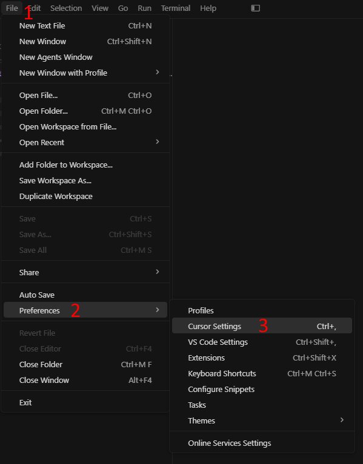

2. In settings, go to **Tools & MCPs** (or **MCP Tools**).

   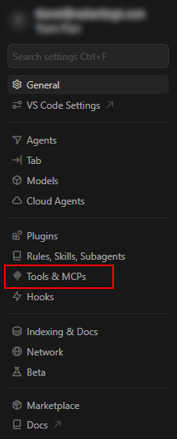

3. Select **Add Custom MCP** to open the `mcp.json` configuration file.

   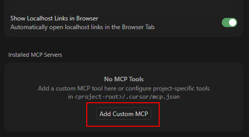

   Cursor creates or opens the MCP config file in your home directory (for example `~/.cursor/mcp.json` on macOS).

   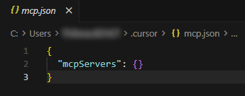

4. Replace the contents of `mcp.json` with the following JSON, then update the placeholders:

   ```json
   {
     "mcpServers": {
       "IDO": {
         "url": "<MCP URL from your admin>",
         "headers": {
           "Authorization": "Bearer <access token from your admin>"
         }
       }
     }
   }
   ```

   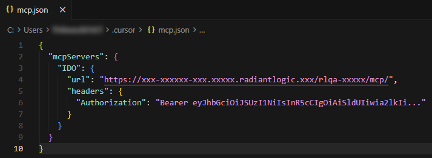

5. Save the file and restart Cursor.

After restart, the MCP Server should appear as **Connected** in the MCP tools list. At this point, you are ready to test the integration.

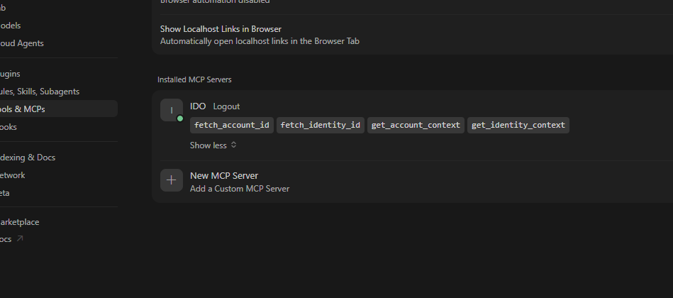

### Test the connection

In Cursor chat, type a question about your own identity or email. For example:

- `Give me a summary of <your.email@example.com>.`
- `Who is the owner of <your.email@example.com> on service ACME?`
- `Who can access the SAP_ERP resource?`

If the configuration is correct, the assistant returns a clear answer with real data such as name, manager, groups, and risks. If the assistant responds with "I don't have access to that information," an error code, or obviously fabricated data, use the troubleshooting tips below.

### Troubleshooting (chat app)

Use this table to diagnose issues based on what you see in the chat. For many problems you may need to locate the error code in the tool logs.

| What you see | What is happening | What to do |
| --- | --- | --- |
| No MCP server appears in the app's settings | The config file is missing, in the wrong location, or contains an error. The app may not have picked up the changes yet. | Re-open the MCP config file and confirm it is at the documented path. Check for typos in the URL and token, and remove extra spaces. Save and restart the app. |
| Assistant replies "I don't have access to that information" or shows error **401** | The access token is missing, expired, or invalid. | Confirm the token is present in the JSON configuration. Make sure it was not truncated or altered when pasted. If it still fails, contact your administrator with error code **401**. |
| Assistant shows error **403** | The token is valid but does not have permission to query the MCP Server. | Contact your administrator with error code **403**. |
| Assistant shows error **429** | Requests are being sent faster than the platform's rate limit. | Wait a minute and retry. If this happens frequently, contact your administrator with error code **429**. |
| Assistant says it cannot find the person you mentioned | The name or email does not match an identity in Identity Observability under that spelling. | Double-check the name or email. Matching is case-insensitive. For account-related questions, specify the target system. For identity-specific questions, try the HR employee ID. |
| Assistant returns names or values that look invented | The MCP Server is reachable, but the model is answering from its own knowledge instead of calling the MCP tools. | Ask again with a precise reference such as full email, full name, or login. If this continues, review MCP tool logs or adjust the system prompt in the client to emphasize calling tools. |

#### Finding the error code

The error code is a three-digit HTTP-like value (for example 401, 403, 429, 503) usually visible in the assistant's response or tool logs. If the code is not obvious in the reply:

1. Open **Cursor Settings** and go to **Tools & MCPs**.
2. Look for a red indicator or "Show output" button next to the MCP Server entry.
3. Open the output panel to view the raw MCP logs and confirm the error code.

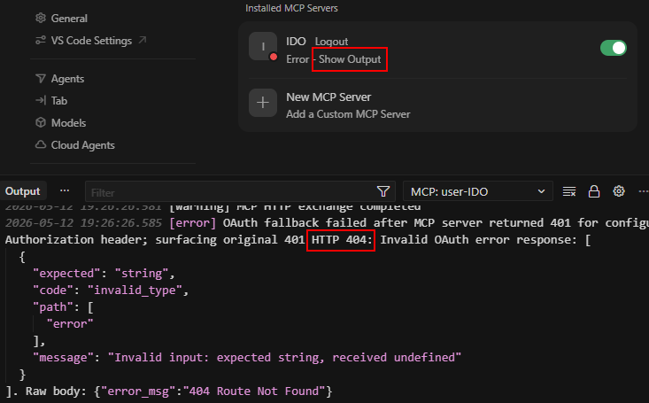

If you cannot resolve the issue, send the error code and an example of the question you asked to your administrator.


## Use the MCP Server in an automation tool (n8n)


With n8n, you can build automated workflows that call the MCP Server through the native MCP client tool. Common patterns include:

- Internal chat panels where colleagues can ask questions about access and risk without leaving your intranet.
- Scheduled reports, such as "Every Monday morning, generate a risk summary for the week's new joiners and post it to Slack."
- Enrichment steps in existing IGA pipelines, for example "After a new account is created, retrieve its risk profile and notify the owner if it is privileged."

The steps below create a simple end-to-end flow: an n8n chat interface backed by an AI agent that can call MCP tools. Once this is running, more advanced patterns become variations around the same agent node.

### Obtain Identity Observability credentials

Before opening n8n, request these credentials from your administrator:

| Item | Example | Purpose |
| --- | --- | --- |
| MCP URL | `https://ido.example.com/acme/mcp/` | Endpoint n8n will call to query Identity Observability. |
| Token endpoint | `https://auth.example.com/auth/realms/acme/protocol/openid-connect/token` | OAuth 2.0 endpoint where n8n requests new access tokens. |
| Client ID | `mcp-n8n-finance` | Client identifier used when requesting tokens. |
| Client Secret | Long random string | Secret paired with the client ID. Treat as sensitive. |

You will also need an API key or credential for your LLM provider (for example OpenAI, Anthropic, Mistral, or Vertex AI). The MCP Server supplies the tools; the LLM performs the reasoning.

### Create credentials in n8n

1. Open your n8n instance and go to the **Credentials** tab. Select **Create credential**.

   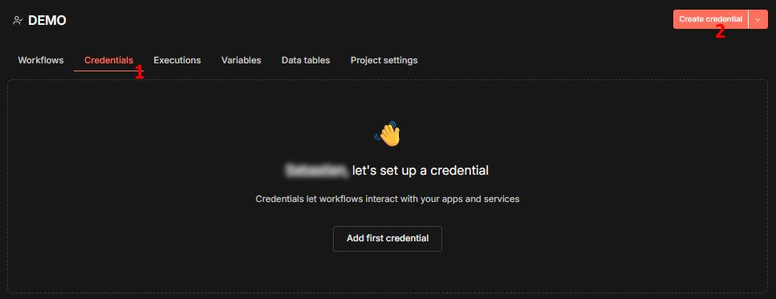

   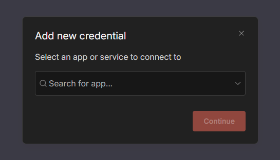

2. Search for and select **Bearer Auth** as the credential type, then choose **Continue**.

   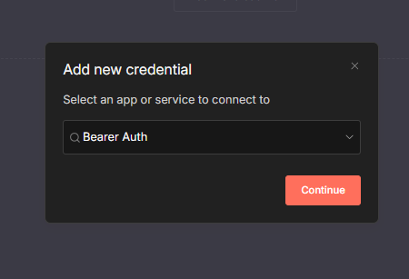

3. Switch the Bearer token field into **Expression** mode and paste:

   ```text
   {{ $json.raw_token }}
   ```

   Save the credential.

   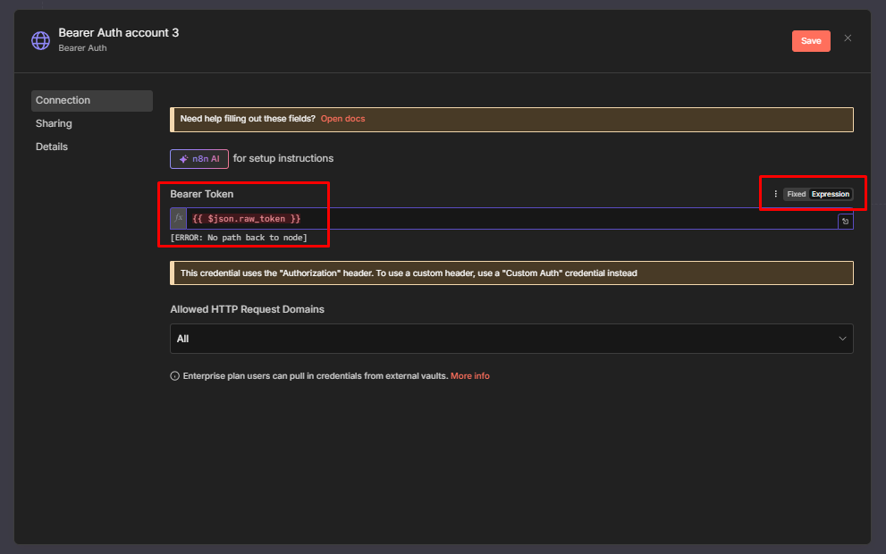

4. Back on the **Credentials** tab, select **Create credential** again.

5. Choose your LLM provider (for example "Mistral", "OpenAI", or another supported model connector), then select **Continue**.

   

   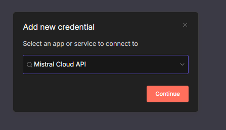

6. Sign in or paste the API key for your provider and save the credential.

   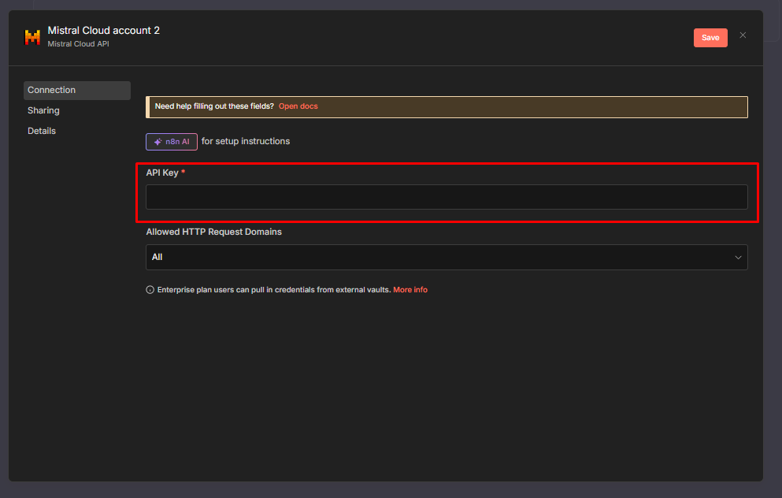

You now have one credential for the bearer token used with the MCP Server and one credential for the LLM.

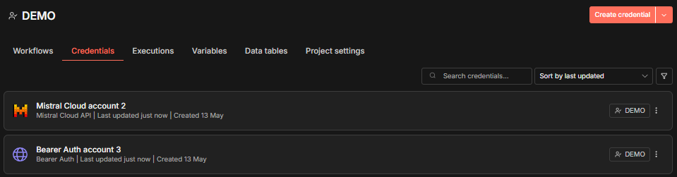

### Create the workflow

1. Copy the workflow JSON below.

   ```json
   {
     "nodes": [
       {
         "parameters": {
           "method": "POST",
           "url": "<your token open id request url>",
           "sendBody": true,
           "contentType": "form-urlencoded",
           "bodyParameters": {
             "parameters": [
               { "name": "grant_type", "value": "client_credentials" },
               { "name": "client_id", "value": "<your-client-id>" },
               { "name": "client_secret", "value": "<your-client-secret>" }
             ]
           },
           "options": {
             "allowUnauthorizedCerts": true,
             "timeout": 10000
           }
         },
         "id": "f5a4343b-0fc5-413f-9ef8-0f02630dabea",
         "name": "Get Token",
         "type": "n8n-nodes-base.httpRequest",
         "typeVersion": 4.2,
         "position": [320, 272]
       },
       {
         "parameters": {
           "promptType": "define",
           "text": "={{ $('When chat message received').item.json.chatInput }}",
           "hasOutputParser": true,
           "options": {
             "systemMessage": "Use your available MCP Tools. Always resolve an id first, then fetch its context. For a person, fetch the identity id, then the identity context, then the account id, then the account context. For a resource, fetch the resource id, then the resource context. For a permission, fetch the permission id, then the permission context.",
             "maxIterations": 10
           }
         },
         "type": "@n8n/n8n-nodes-langchain.agent",
         "typeVersion": 3,
         "position": [864, 272],
         "id": "65997ef4-eb1d-4eb9-b5b8-1855743233fd",
         "name": "AI Agent"
       },
       {
         "parameters": {
           "endpointUrl": "<mcp request url>",
           "authentication": "bearerAuth",
           "options": {}
         },
         "type": "@n8n/n8n-nodes-langchain.mcpClientTool",
         "typeVersion": 1.2,
         "position": [1056, 528],
         "id": "44acd691-1a22-47d1-a8d1-c09ba846b380",
         "name": "MCP Client",
         "rewireOutputLogTo": "ai_tool",
         "credentials": {
           "httpBearerAuth": {
             "id": "jYyQAa7Jk2cNOvGK",
             "name": "Bearer Auth account"
           }
         }
       },
       {
         "parameters": {
           "options": {
             "allowFileUploads": false,
             "responseMode": "responseNodes"
           }
         },
         "type": "@n8n/n8n-nodes-langchain.chatTrigger",
         "typeVersion": 1.4,
         "position": [64, 272],
         "id": "c077d57e-12b6-4e14-b510-acb0131c10cc",
         "name": "When chat message received",
         "webhookId": "73ac790f-94d1-4dee-8e7c-6e3721ed5544"
       },
       {
         "parameters": {
           "assignments": {
             "assignments": [
               {
                 "id": "f1e2d3c4-0001-4000-8000-aaaaaaaaaaaa",
                 "name": "bearer_token",
                 "value": "=Bearer {{ $json.access_token }}",
                 "type": "string"
               },
               {
                 "id": "f1e2d3c4-0002-4000-8000-bbbbbbbbbbbb",
                 "name": "expires_in",
                 "value": "={{ $json.expires_in }}",
                 "type": "number"
               },
               {
                 "id": "f1e2d3c4-0003-4000-8000-cccccccccccc",
                 "name": "raw_token",
                 "value": "={{ $json.access_token }}",
                 "type": "string"
               }
             ]
           },
           "options": {}
         },
         "id": "eed66a37-9aa7-4a13-a1ff-884828670eff",
         "name": "Format Bearer Token",
         "type": "n8n-nodes-base.set",
         "typeVersion": 3.4,
         "position": [544, 272]
       },
       {
         "parameters": {
           "message": "={{ $json.output }}",
           "waitUserReply": false,
           "options": {
             "memoryConnection": false
           }
         },
         "type": "@n8n/n8n-nodes-langchain.chat",
         "typeVersion": 1,
         "position": [1376, 272],
         "id": "882ba150-efef-4b35-acd5-692647b6fe07",
         "name": "Respond to Chat"
       }
     ],
     "connections": {
       "Get Token": {
         "main": [[{ "node": "Format Bearer Token", "type": "main", "index": 0 }]]
       },
       "AI Agent": {
         "main": [[{ "node": "Respond to Chat", "type": "main", "index": 0 }]]
       },
       "MCP Client": {
         "ai_tool": [[{ "node": "AI Agent", "type": "ai_tool", "index": 0 }]]
       },
       "When chat message received": {
         "main": [[{ "node": "Get Token", "type": "main", "index": 0 }]]
       },
       "Format Bearer Token": {
         "main": [[{ "node": "AI Agent", "type": "main", "index": 0 }]]
       }
     },
     "pinData": {},
     "meta": {
       "templateCredsSetupCompleted": true,
       "instanceId": "cd3acb52c7bad51f685dccfc81efd411e6db265d5ed0655b62470689e0850912"
     }
   }
   ```

2. In n8n, create or open a workflow and paste the JSON (Ctrl/Cmd + V). The starter workflow appears with all nodes and connections in place.

   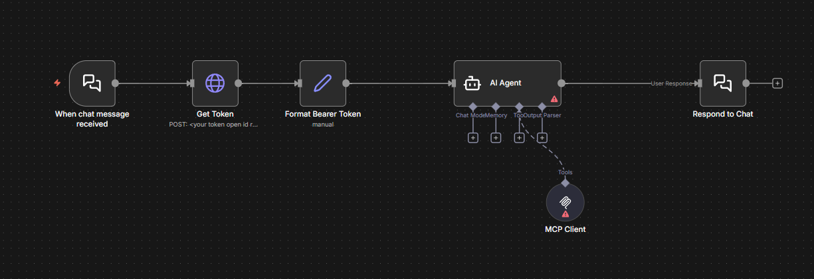

3. Open the **Get Token** node and update:

   - `<your token open id request url>` with the Token endpoint from your administrator.
   - `<your-client-id>` with the MCP client ID.
   - `<your-client-secret>` with the client secret associated with that ID.

   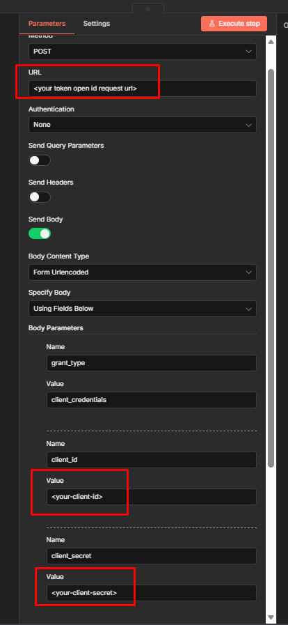

4. Open the **MCP Client** node and replace `<mcp request url>` with the MCP URL.

   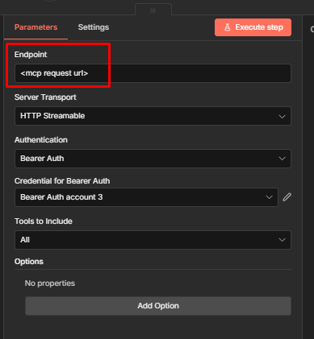

   The starter workflow does not yet have a chat model wired into the AI Agent.

5. Under the **AI Agent** node, select the **+** icon to add a model node.

6. Search for your LLM provider node (for example "Mistral", "OpenAI", etc.) and select it.

   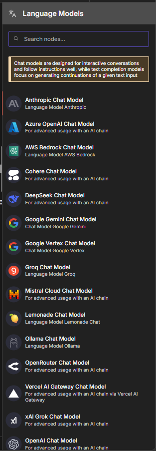

7. In the model node configuration, select the LLM credential you created earlier and choose the model you want to use.

   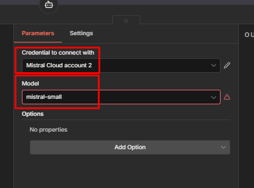

8. Save the workflow and click **Activate**.

   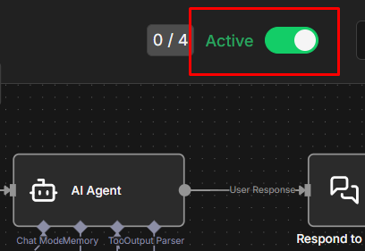

### Try the automation flow

1. In the workflow canvas, select **Open Chat** next to the **When chat message received** node (the chat trigger).

   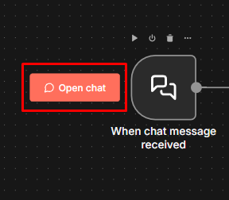

2. In the chat panel, type a question about a person you know exists in Identity Observability. For example:

   > Give me a quick summary of `<a.colleague@example.com>` — manager, department, risk level.

   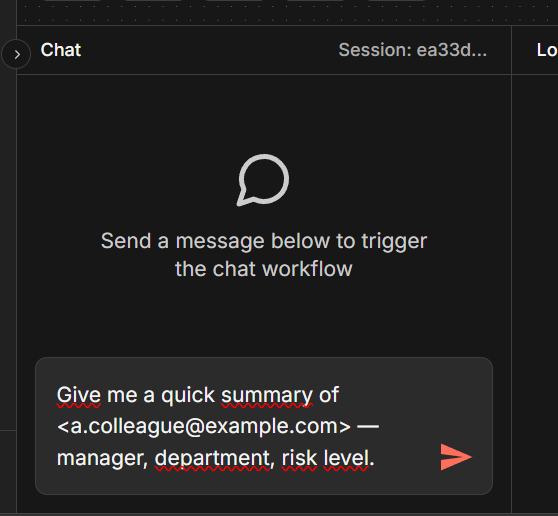

If everything is configured correctly, the agent responds with real Identity Observability data related to that person. If the response fails or the agent invents data, use the troubleshooting section below.

### Troubleshooting (n8n)

| What you see | What is happening | What to do |
| --- | --- | --- |
| Chat returns error **401** from the MCP | The token is invalid or not authorized to access the MCP Server. | Contact your administrator with error code **401**. |
| Chat returns "Permission denied" or error **403** | The token is valid but the underlying client does not have permission to query the MCP. | Contact your administrator with error code **403**. |
| No green dot around **MCP Client** while the workflow runs | The agent is answering without calling IDO; the MCP Client is not wired as a tool. | Open the MCP Client node and ensure it is connected to the **ai_tool** port on the AI Agent node (the dotted bottom port). If needed, delete and re-add the MCP Client node directly under the AI Agent so n8n wires it as a tool automatically. |
| The chat panel stays empty after you send a message | The agent finished, but **Respond to Chat** is not connected. | Ensure the AI Agent's main output is connected to the Respond to Chat node. |
| The agent invents data | The MCP tools are reachable, but the model is not consistently using them. | Ask again with a precise reference (full email or HR ID). If this persists, edit the system message in the AI Agent node to more strongly require use of MCP tools. |
| Error **429** appears intermittently | The workflow is hitting rate limits. | Insert a small delay between calls or ask your administrator to increase the allowed rate. |

For deeper inspection, open the **Output** panel on each n8n node. The output shows the raw JSON exchanged with the MCP Server and is the best place to look for low-level errors.
