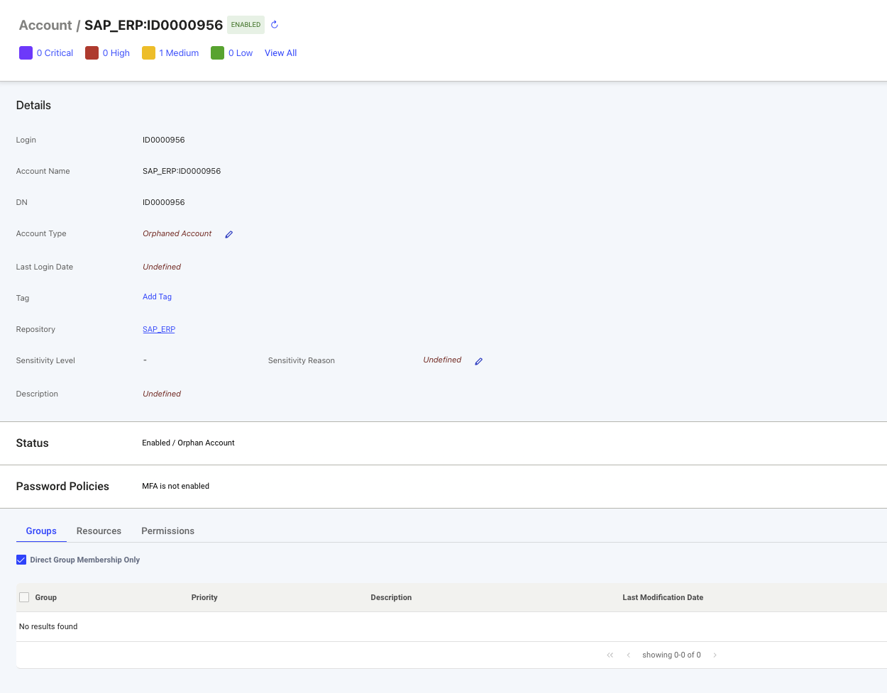

## Overview

Accounts represent user credentials and access points within various systems in an organization. 

Selecting an account login object link (as shown in the image below) from any Identity Observability interface (such as Observations or Controls) opens a detailed page about that account. 

 

The details include information about the account such as account status, ownership, and security configurations. 

 

The status next to the account name shows “Enabled” if the account is enabled in the repository and “Disabled” if it has been deactivated.  

 
A technical administrator or account owner can activate or deactivate the account using the “...” button in the top-right corner of the account detail page.  
 
  

## Key Attributes   

| Attribute | Description |
|-----------|-------------|
| Login | Login identifier. |
| Account Name | Human-readable name of the account. |
| DN | Directory path of the account. |
| Account Type | Classification: orphaned, service, or user account. |
| Last Login Date | Most recent login date. |
| Tag | Identity observability tags, added by end-users. |
| Repository | Source repository display name, with link to the HR repository detail page. |
| Sensitivity Level & Reason | Sensitivity classification of the object, either defined by a data source or end-user, with an explanation for the assigned level. |
| Description | Purpose and usage of the account. |

## Account owner attributes  

| Attribute | Description |
|-----------|-------------|
| Employee Number | Unique identifier of the account owner. |
| Full Name | Full name of the account owner, with link to their detail page. |
| Email | Email address of the account owner. |
| Active | Status of the account owner: active if currently employed, inactive if no longer with the organization. |
| Identity Type | Identity classification: true for employee, false for contractor. |
| Job Title | Current position title of the account owner. |
| Department | Department affiliation (short name and display name), with link to the department detail page. |
| Departure Date | End date of employment with the organization. |

## Status Attributes  

| Attribute | Description |
|-----------|-------------|
| Locked | Indicates whether the account is security locked (true or false). |
| Privileged Account | Indicates whether the account has elevated privileges (true or false). |
| Creation Date | Date the account was created. |
| Expire Date | Date when the account is set to expire. |
| Last Modification Date | Date of the most recent change to the account. |
| Last Login Date | Date of the most recent login. |

## Password Policy Attributes  

| Attribute | Description |
|-----------|-------------|
| MFA Active | Indicates whether multi-factor authentication is currently enforced for sign-ins. |
| MFA Allowed | Specifies whether the account is permitted to use MFA methods. |
| MFA Registered | Indicates whether at least one MFA method has been registered. |
| MFA Required | Indicates whether MFA is mandatory for sign-in. |
| Smart Card Required | Requires smart card authentication for logon; prevents password-only login. |
| Do Not Expire Password | Prevents the password from expiring under domain policy. |
| Password Expired | Indicates whether the password has expired per policy. |
| Password Not Required | Allows the account to exist without a password. |
| Password Cannot Change | Prevents the user from changing their own password. |
| Next Password Change Date | Scheduled date when the password will next expire. |
| Password Last Set Date | Date/time when the password was last updated. A value of 0 means a change is required at the next login attempt. |
| Bad Password Date | Timestamp of the most recent failed login attempt. |
| Bad Password Count | Number of consecutive failed login attempts since the last successful login. |

## Relationship Tables  

At the bottom of the page, several tables are displayed with objects associated with the account.  

By default, relationship tables display direct associations only. You can expand results to include subgroups, inherited permissions, or indirect memberships by unchecking or checking the filter boxes at the top of each table.  

An example of this filtering option is shown below:
 
 

### Groups  

| Attribute | Description |
|-----------|-------------|
| Group | Display name of the group, with link to the group detail page. |
| DN | Distinguished Name of the group. |
| Group Priority | Group risk score, expressed as a priority level. |
| Description | Purpose and function of the group. |
| Last Modification Date | Date of the most recent change to the group. |
| Repository | Source repository, with link to the HR repository detail page. |

### Resources  

| Attribute | Description |
|-----------|-------------|
| Resource | Display name of the resource, with link to the resource detail page. |
| Resource Priority | Resource risk score, expressed as a priority level. |
| Description | Purpose and function of the resource. |
| Resource Type | Type of resource (e.g., file share, server, profile, application). |
| Resource Family | Family of the resource (e.g., SharePoint, AD, LDAP). |

### Permissions  

| Attribute | Description |
|-----------|-------------|
| Permission | Access right name, with link to the permission detail page. |
| Permission Priority | Permission risk score, expressed as a priority level. |
| Description | Purpose and function of the permission. |
| Permission Type | Type of permission (e.g., role, right). |
| Resource | Target system or application, with link to the resource detail page. |

### Service Account Managers  

| Attribute | Description |
|-----------|-------------|
| Full Name | First and last name of the manager, with link to the identity detail page. |
| Identity Priority | Identity risk score, expressed as a priority level. |
| Email | Contact email of the manager. |
| Active | Employment status: active if currently employed, inactive if no longer with the organization. |
| Identity Type | Identity classification: true for employee, false for contractor. |
| HR Repository | HR repository display name, with link to the HR repository detail page. |
| Expertise Domain | Type of ownership (e.g., business owner, technical owner, reviewer). |
| Manager Type | Indicates if the manager is principal or delegated. |
| Actions | Provides the option to remove the owner. |

In the Service account managers table, functional administrators or account owners can perform the following actions:

- **Add Manager**: Click Add Manager to assign a new account manager.  
- **Remove Manager**: Click the bin icon in the Actions column to remove a manager.  

 
