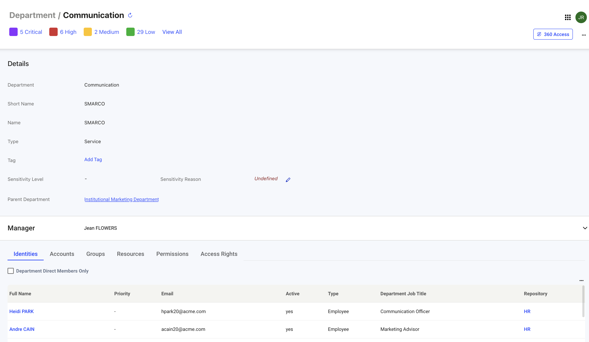
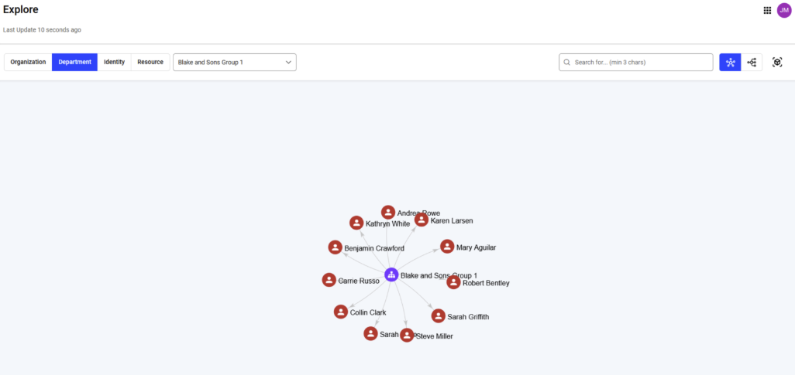

## Overview

Departments represent organizational units within the company. Selecting a department object link from any Identity Observability interface (such as Observations or Controls) opens a detailed page about that department. The details include information such as departmental structure, membership, and associated risks. An example of the page is included below:  

 

Clicking on the ‘360 Access’ button opens a data visualization interface where you can explore information about the department members and access chain of the selected department. 

 

## Key Department Attributes

The following attributes related to the department are displayed in the first part of the department detail interface.

| Attribute                 | Description                                                                 |
|----------------------------|-----------------------------------------------------------------------------|
| Department                 | Department name.                                                            |
| Short Name                 | Abbreviated identifier for the department.                                  |
| Display Name               | Full department name.                                                       |
| Type                       | Type of department (e.g., service, business unit).                          |
| Description                | Purpose and function of the department.                                     |
| Tag                        | Identity observability tags, added by end-users.                            |
| Sensitivity Level & Reason | Sensitivity classification of the department, either defined by a data source or end-user, with an explanation for the assigned level. |
| Parent Department          | Link to the parent department in the organizational hierarchy.              |

## Manager Section

By clicking the “Manager” option, you can view information about the direct manager of the department.

| Attribute       | Description                                                                 |
|-----------------|-----------------------------------------------------------------------------|
| Employee Number | Unique identifier of the direct manager.                                    |
| Display Name    | Full name of the direct manager, with a link to their detail page.          |
| Email           | Email address of the direct manager.                                        |
| Active          | Employment status: active if currently employed, inactive if no longer with the organization. |
| Identity Type   | Identity classification: true for regular employees, false for contractors. |
| Repository      | HR source repository name, with link to the repository detail page.         |

## Relationship Tables

At the bottom of the page, several relationships associated with the department are displayed in tables. The following sections describe the attributes shown in each table.

### Identities

| Attribute        | Description                                                                 |
|------------------|-----------------------------------------------------------------------------|
| Full Name        | First and last name, with link to the identity detail page.                 |
| Identity Priority| Identity risk score, expressed as a priority level.                         |
| Email            | Contact email address.                                                      |
| Active           | Employment status: active if currently employed, inactive if no longer with the organization. |
| Identity Type    | Identity classification: true for regular employees, false for contractors. |
| Job Title        | Current position title.                                                     |
| HR Repository    | HR source repository name, with link to the repository detail page.         |
| User Actions     | Department Direct Members Only: When checked, hides identities belonging to sub-departments and shows only direct members of the department. |

### Accounts

| Attribute          | Description                                                                 |
|--------------------|-----------------------------------------------------------------------------|
| Login              | Login identifier, with link to the account detail page.                     |
| Account Name       | Display name of the account.                                                |
| Account Priority   | Account risk score, expressed as a priority level.                          |
| Last Login Date    | Most recent login date (if available from backend data).                    |
| Disabled           | Indicates whether the account is enabled or disabled.                       |
| Repository         | Source system (e.g., AD, Entra ID), with link to the repository detail page.|
| Account Type       | Classification of the account: orphaned, service, or user.                  |
| Identity Full Name | Full name of the associated identity, with link to the identity detail page. |
| Identity Email     | Email of the associated identity.                                           |
| Identity Active    | Employment status of the associated identity.                               |
| Department         | Department name, with link to the department detail page.                   |
| User Actions       | Department Direct Members Only: When checked, hides accounts owned by identities in sub-departments.   Include Disabled Accounts: By default, only enabled accounts are shown. Checking this option adds disabled accounts to the display. |

### Groups

| Attribute             | Description                                                                 |
|-----------------------|-----------------------------------------------------------------------------|
| Group                 | Display name of the group, with link to the group detail page.              |
| DN                    | Distinguished Name of the group.                                            |
| Group Priority        | Group risk score, expressed as a priority level.                            |
| Description           | Purpose and function of the group.                                          |
| Last Modification Date| Most recent modification date of the group.                                |
| Repository            | Data source directory, with link to the repository detail page.             |
| User Actions          | Department Direct Members Only: When checked, hides groups whose member accounts belong only to identities in sub-departments. |

### Resources

| Attribute       | Description                                                                 |
|-----------------|-----------------------------------------------------------------------------|
| Resource        | Display name of the resource, with link to the resource detail page.         |
| Resource Priority | Resource risk score, expressed as a priority level.                        |
| Description     | Purpose and function of the resource.                                        |
| Resource Type   | Resource type (e.g., file share, server, profile, application).              |
| Resource Family | Resource family (e.g., SharePoint, AD, LDAP).                                |
| User Actions    | Department Direct Members Only: When checked, hides resources accessible only by accounts owned by identities in sub-departments. |

### Permissions

| Attribute          | Description                                                                 |
|--------------------|-----------------------------------------------------------------------------|
| Permission         | Access right name, with link to the permission detail page.                 |
| Permission Priority| Permission risk score, expressed as a priority level.                       |
| Description        | Purpose and function of the permission.                                     |
| Permission Type    | Type of permission (e.g., role, right).                                     |
| Permission Family  | Permission family (e.g., filesystem).                                       |
| Resource           | Target system or application, with link to the resource detail page.        |
| User Actions       | Department Direct Members Only: When checked, hides permissions accessible only by accounts owned by identities in sub-departments. |

### Access Rights

| Attribute          | Description                                                                 |
|--------------------|-----------------------------------------------------------------------------|
| Resource           | Target system or application, with link to the resource detail page.        |
| Permission         | Access right name, with link to the permission detail page.                 |
| Permission Priority| Permission risk score, expressed as a priority level.                       |
| Permission Type    | Type of permission (e.g., role, right).                                     |
| Account Login      | Account login ID, with link to the account detail page.                     |
| Account Name       | Display name of the account, with link to the account detail page.          |
| Last Login Date    | Last login date of the account.                                             |
| Account Repository | Repository name, with link to the repository detail page.                   |
| User Actions       | Include Disabled Accounts: By default, only enabled accounts are shown. Checking this option adds disabled accounts to the display.   Department Direct Members Only: When checked, hides access rights tied only to accounts owned by identities in sub-departments. |

## Available Actions

Users can perform different actions in the department detail interface based on their roles as shown below: 

### For Technical Administrators
- Add or remove tags of any department.
- Update sensitivity level and reason of any department.  
- Fix issues detected for any department through the “Remediate Issues” side panel.  

### For Department Manager
- Add or remove tags of the department they manage.
- Update sensitivity level and reason of the department they manage.
- Fix their departments' detected issues through the “Remediate Issues” side panel. 

### For Auditors
- Can view all details but can not make any edits.

### For Other Roles
- Can view details permitted to them.
