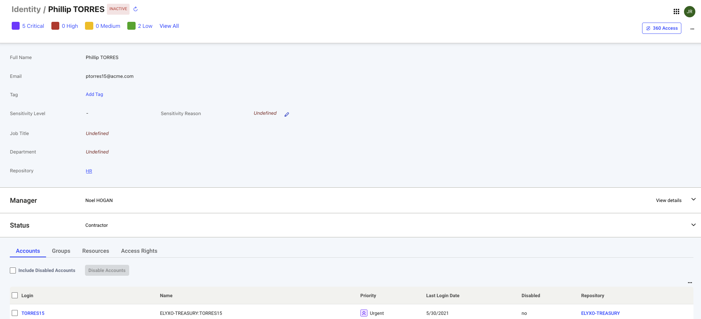
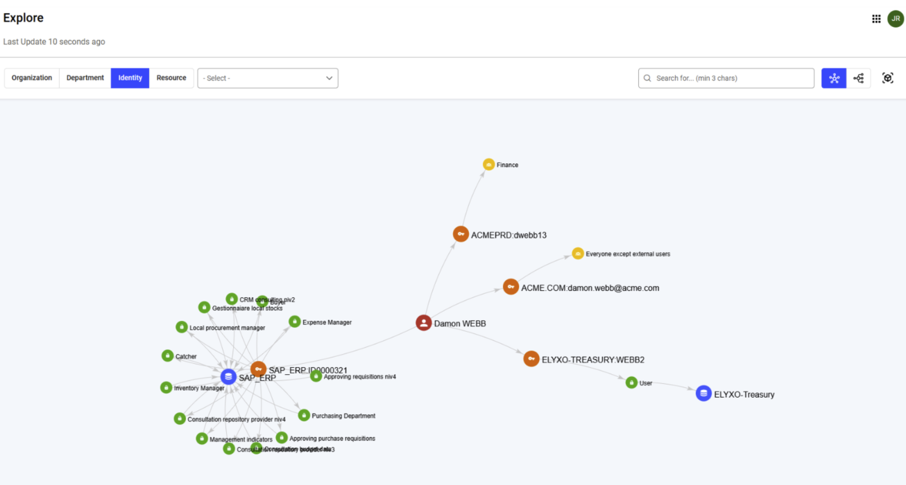

## Overview

An identity represents a person (an employee or a collaborator) within the company. Selecting an identity object link from any Identity Observability interface (such as Observations or Controls) opens a detailed page about that identity. The details include information about the identity, their access rights, and associated risks. An example of the page is included below:  

 

The status next to the identity name shows “active” if the individual is still in the organization and shows “inactive” if the identity is no longer a part of the organization.  

Clicking on the ‘360 Access’ button opens a data visualization interface where you can explore the access chain of the selected identity in the Explore menu. 

 

# Key Identity Attributes

The first section of the identity detail page includes the following attributes related to the identity.

| Attribute                  | Description                                                                                                                                       |
|----------------------------|---------------------------------------------------------------------------------------------------------------------------------------------------|
| Employee Number            | Unique identifier for the employee, sourced from HR data.                                                                                         |
| Full Name                  | Employee’s first and last name.                                                                                                                   |
| Email                      | Primary work email address.                                                                                                                        |
| Tag                        | Identity observability tags, added by end-users.                                                                                                   |
| Sensitivity Level & Reason | Indicates the sensitivity classification of the identity, either defined by a data source or the end-user, with an explanation for the assigned level. |
| Department                 | Display name of the department, with a link to the department’s detail page.                                                                       |
| Job Title                  | Current job/position title of the employee.                                                                                                       |
| Repository                 | HR data source repository name, with a link to its detail page.                                                                                   |

## Direct Manager Attributes

By clicking the “Manager” option, you can view information about the direct manager of the identity.

| Attribute        | Description                                                                 |
|------------------|-----------------------------------------------------------------------------|
| Employee Number  | Unique identifier of the direct manager.                                    |
| Display Name     | Full name of the direct manager, with a link to their detail page.          |
| Email            | Direct manager’s email address.                                             |
| Internal         | Employment classification: true if internal employee, false if contractor. |
| Sensitivity Level| Sensitivity classification of the manager.                                  |
| Sensitivity Reason | Explanation for the assigned sensitivity level of the manager.             |

## Status Attributes

By clicking the “Status” option, you can view information about the identity’s employment status.

| Attribute      | Description                                                                                                                                     |
|----------------|-------------------------------------------------------------------------------------------------------------------------------------------------|
| Active         | Employment status: active if currently employed, inactive if no longer with the organization.                                                    |
| Identity Type  | Identity classification of the employee (internal attribute value is set to true for a regular employee and false for a contractor).              |
| Employee Type  | Denotes if the employee is full-time, part-time or a contractor.                                                                                 |
| Arrival Date   | Start date of employment with the organization.                                                                                                  |
| Departure Date | End date of employment with the organization.                                                                                                    |

## Relationship Tables

At the bottom of the page, several relationships associated with the identity tables are displayed. The following sections provide information about the attributes displayed in these tables.

### Accounts

The accounts table includes information about the account related attributes of the identity. The attributes included in the table are listed below:

| Attribute       | Description                                                                                                 |
|-----------------|-------------------------------------------------------------------------------------------------------------|
| Login           | Login identifier, linked to the account detail page.                                                        |
| Account Name    | Display name of the account.                                                                                |
| Account Priority| Account risk score, expressed as a priority level.                                                          |
| Last Login Date | Most recent login date (as provided from the backend data).                                                 |
| Disabled        | Indicates whether the account is enabled or disabled.                                                       |
| Repository      | Data Source repository name (e.g., AD, Entra ID), with link to the repository detail page.                  |

By default, the table only shows enabled accounts. You can include disabled accounts in the display by clicking the “Include Disabled Accounts” option.  

You can also disable one or more accounts by clicking the checkbox next to the desired row and clicking the “Disable Accounts” option.

### Groups

The Groups table displays the following attributes of the groups associated with the identity.

| Attribute       | Description                                                                 |
|-----------------|-----------------------------------------------------------------------------|
| Group           | Display name of the group, with link to the group detail page.             |
| DN              | Distinguished Name of the group.                                           |
| Group Priority  | Group risk score, expressed as a priority level.                           |
| Description     | Purpose and function of the group.                                         |
| Last Modification Date | Date of the most recent modification to the group.                 |
| Repository      | Data source repository name, with link to the repository detail page.      |

By default, only direct groups are shown. If the user unchecks the "Direct Group Membership Only" box at the top of the table, subgroups will also be displayed.

### Resources

The resource table displays information about the resources that the identity has access to. The attributes included in this table are described below:

| Attribute       | Description                                                                 |
|-----------------|-----------------------------------------------------------------------------|
| Resource        | Display name of the resource, with link to the resource detail page.       |
| Resource Priority | Resource risk score, expressed as a priority level.                      |
| Description     | Purpose and function of the resource.                                      |
| Resource Type   | Category of resource (e.g., file share, server, profile, application).     |
| Resource Family | Resource family (e.g., SharePoint, AD, LDAP).                              |

### Access Rights

The access rights table displays information about the permissions granted to the identity. The attributes of this table are described below:

| Attribute          | Description                                                                 |
|--------------------|-----------------------------------------------------------------------------|
| Resource           | Target system or application name, with link to the resource detail page.  |
| Permission         | Access right name, with link to the permission detail page.                |
| Permission Priority| Permission risk score, expressed as a priority level.                      |
| Permission Type    | Type of permission (e.g., role, right).                                    |
| Account Login      | Account login ID, with link to the account detail page.                    |
| Account Name       | Display name of the account, with link to the account detail page.         |
| Last Login Date    | Last login date of the account.                                            |
| Account Repository | Data source repository name, with link to the repository detail page.      |

By default, only enabled accounts are shown. To include disabled accounts, the user can check the "Include Disabled Accounts" box at the top of the table.  

The table lists all assignments by default. To display only direct access right assignments and exclude assignments inherited via groups, roles, or profiles, check the "Direct Assignments Only (without group)" box at the top of the table.

### My Team

If a user is designated as a team manager, they can view the "My Team" table which displays information about the team members they manage.

| Attribute       | Description                                                                 |
|-----------------|-----------------------------------------------------------------------------|
| Employee Number | Unique identifier of the employee as provided from the HR source.           |
| Identity Priority | Identity risk score, expressed as a priority level.                       |
| Full Name       | First and last name, with link to the identity detail page.                 |
| Email           | Primary email address.                                                      |
| Active          | Employment status: active if currently employed, inactive if no longer with the organization. |
| Internal        | Employment classification: true if internal employee, false if contractor.  |
| Job Title       | Current position title.                                                     |
| Department      | Department name, with link to the department detail page.                   |
| Repository      | HR data source repository name, with link to the repository detail page.    |

### Managed Resources

When the identity owns or manages resources, they can see the “Managed Resources" table with the following attributes:

| Attribute       | Description                                                                 |
|-----------------|-----------------------------------------------------------------------------|
| Expertise Domain| Name of the role indicating domain of expertise (e.g., business owner, technical owner, reviewer). |
| List of Object Types | Types of objects managed (e.g., application, server, share).           |
| Display Name    | Display name of the object, with link to the object detail page.            |
| Name            | Technical/system name of the object, with link to the object detail page.   |
| Object Priority | Object risk score, expressed as a priority level.                           |
| Description     | Object description and function.                                            |

## Available Actions

Users can perform different actions in the identity detail interface based on their roles as shown below: 

### For Line Managers
- Add or remove tags related to the identity they manage.
- Update sensitivity level and reason attributes of the identity they manage. 
- Fix issues related to the identity through the “Remediate Issues” side panel.  

### For Technical Administrators
- Add or remove tags related to the identity they manage.
- Update sensitivity level and reason attributes of the identity they manage. 
- Fix issues related to the identity through the “Remediate Issues” side panel.
- Disable accounts in the Account Relationship Table. 

### For Auditors
- Can view all details but can not make any edits.

### For Other Roles
- Can view details permitted to them.

