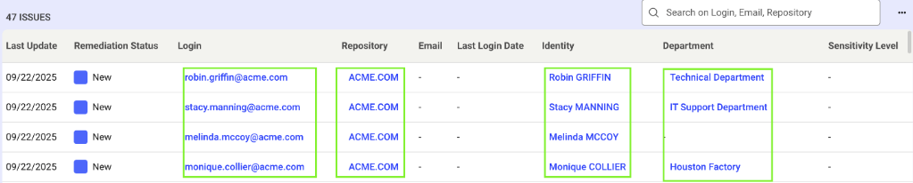
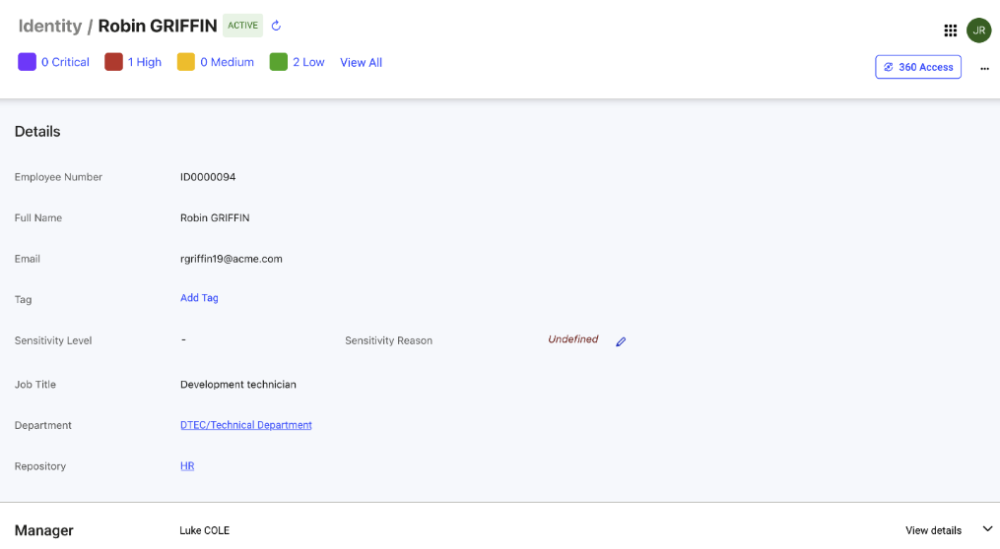
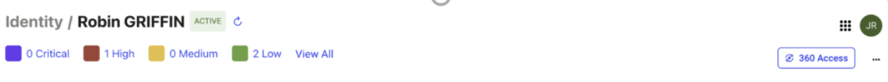
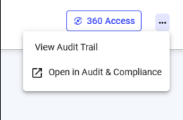
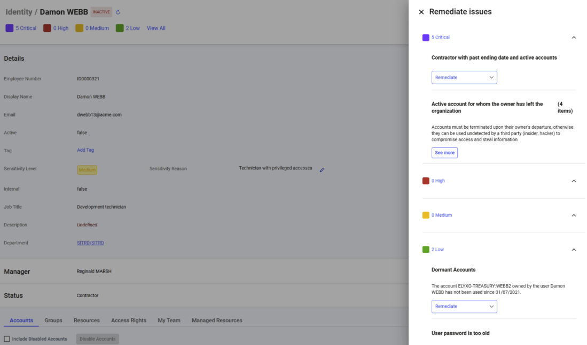
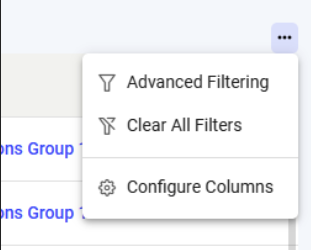
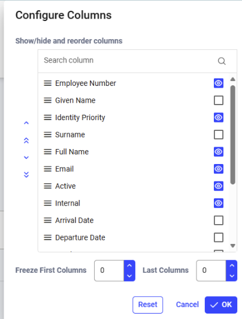

## Overview

This documentation offers guidance on navigatingObject Details interface in Identity Observability. Object Details interfaces serve as specialized dashboards, displaying detailed information about each object in the graph database, including its attributes and relationships to other objects. 

For example, the following Control list displays accounts that do not have MFA enabled. Each account includes multiple associated objects such as login, repository, identity, and department. You can view the details of any object by clicking its hyperlink. 
 
 

Once you click on an object, you will see a detailed page that looks like the following: 

 

### General Interface Structure

The interface supports navigation, data management, remediation, and data quality. Navigation features include the 360° view, swim lanes, network charts, and drilldowns for exploring relationships. Data management allows bulk actions, exports, tagging, and search/filtering for quick access. Remediation tools highlight control gaps, provide role-based fixes, track progress, and enable collaboration. Data quality is ensured through freshness timestamps, source information, change history, and validation of incomplete or inconsistent data. 

#### Page Structure 

All detail pages follow a consistent two-section layout with a header that displays the entity type and name, along with the number of issues per risk level. 

Example: 

 

The top section presents primary attributes first, followed by secondary attributes organized by section, with action buttons for updates when permitted. The refresh button allows you refresh the page to view the latest information. 

The “…” button in the top-right corner allows you to view the audit trail, showing who updated which attributes and when, who remediated issues, the status of each action, and additional details.

 

The ”Open in Audit & Compliance” option displays object details within the Audit & Compliance section, enabling point-in-time analysis, review of historical changes, and access to audit reports and advanced analytics. 

In the header section, below the title of the page, the number of issues of the entity is displayed per risk level, with the ability to list the issues by clicking on the numbers or “view all” links.  

  

This opens a side panel listing the related control defects that allows to work on remediation. 

 
 
The bottom section shows related objects in tables, with bulk action capabilities where allowed. Users can click the three-dot menu at the top right of each table to configure columns, allowing them to hide or show columns, reorder them, freeze the first or last columns for easier viewing, or reset to the default layout. 
 
 

Column-specific filtering is available through “Advanced Filtering,” and all filters can be cleared at once using “Clear All Filters.” 

 

### Access Control and Permissions

The details shown for each object type will vary depending on the user roles and data visibility, and all information is updated in real or near-real time depending on backend capabilities. Contextual actions are available based on user permissions allowing end-users to update attributes or remediate issues when they own the object or hold administrative roles.

> User roles can be either static (manually assigned by the admin/owner in the IDP console) or dynamic (automatically determined from the organization’s data mapped to Identity Observability).

| Role                 | Scope                                                                                           | Visibility                                                                                          | Rights                                          | Type                                   |
|-----------------------|-------------------------------------------------------------------------------------------------|----------------------------------------------------------------------------------------------------|------------------------------------------------|----------------------------------------|
| Technical Administrators | Read and write capabilities across the entire platform (no restrictions)                        | All data and configurations                                                                         | Full remediation rights                         | Static    |
| Auditors              | Read only access for the entire platform.                                                       | Comprehensive read-only view                                                                       | No remediation rights                           | Static   |
| Line Managers         | Read and write capabilities over identities and departments they manage; cannot access other teams’ data or unrelated resources | Team members’ identity data, department info, and relationships within Department and Identity detail pages | Remediation limited to managed identities and departments | Dynamic |
| Resource Owners       | Applications, servers, shares, and other resources they own; cannot access resources owned by others | Full details of owned resources and permission structures within Resource and Permission detail pages | Remediation limited to owned resources          | Dynamic |
| Repository Owners     | Repositories they own (AD domains, Entra ID, LDAP, directory, etc.) plus associated accounts and groups; cannot access repositories owned by others | Repository, Account, and Group detail pages for owned repositories                                 | Remediation limited to owned repositories       | Dynamic |
