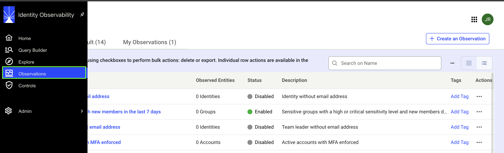
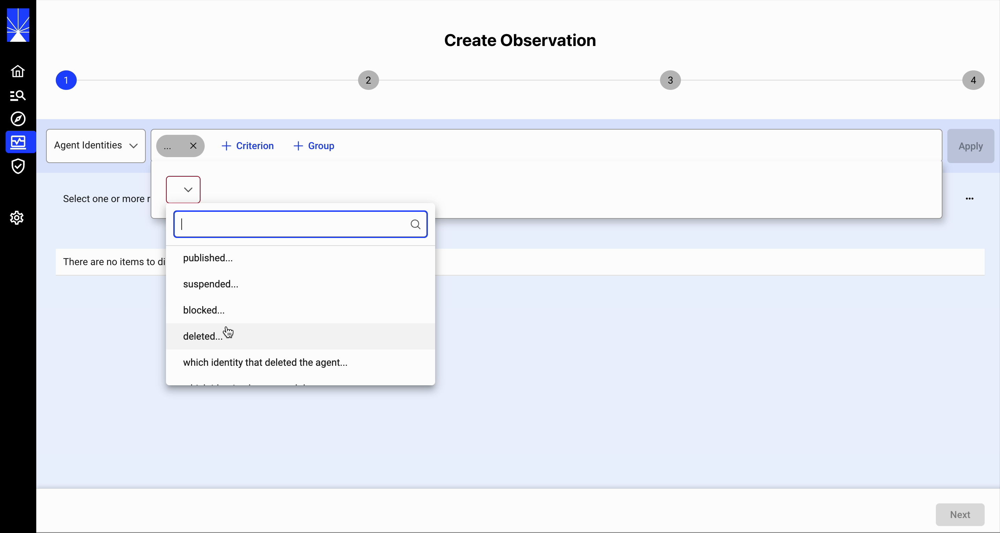
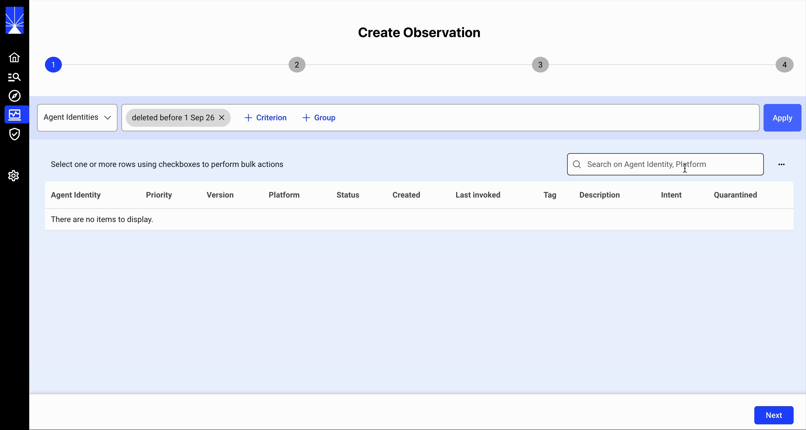
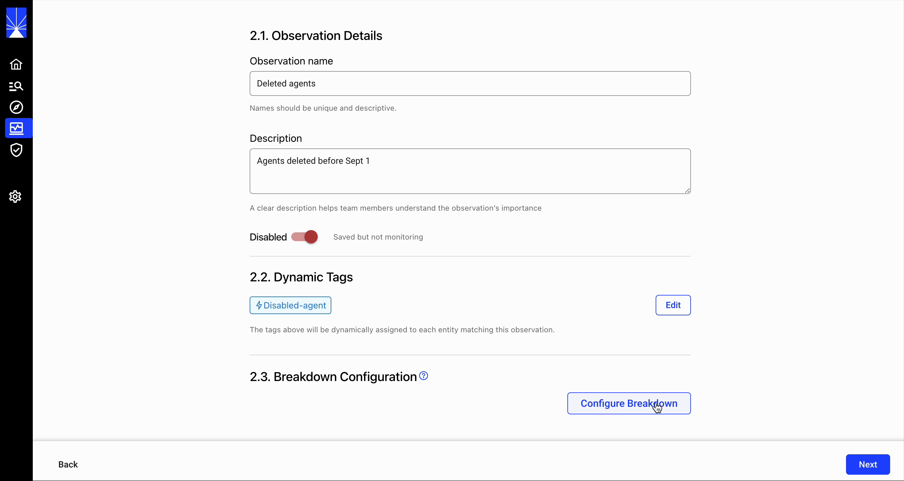
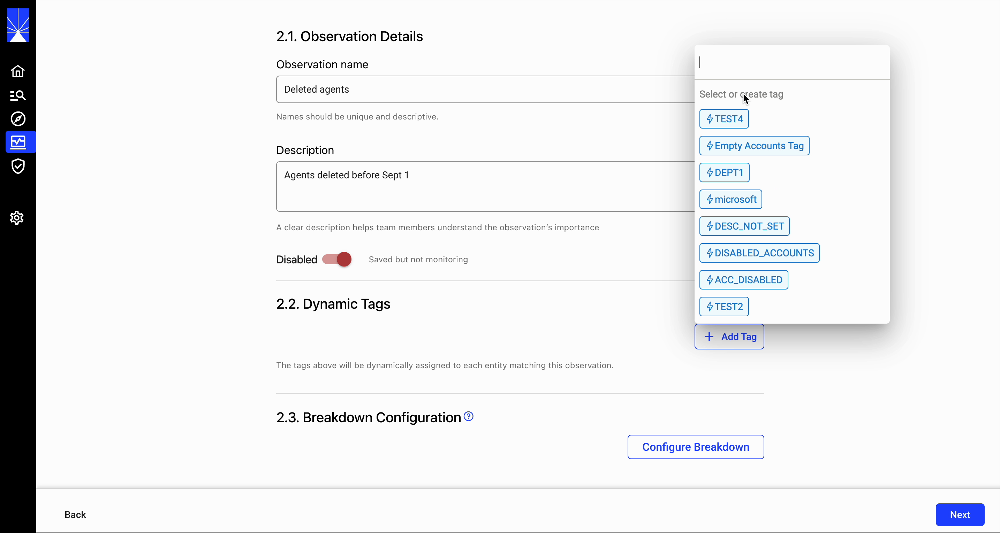
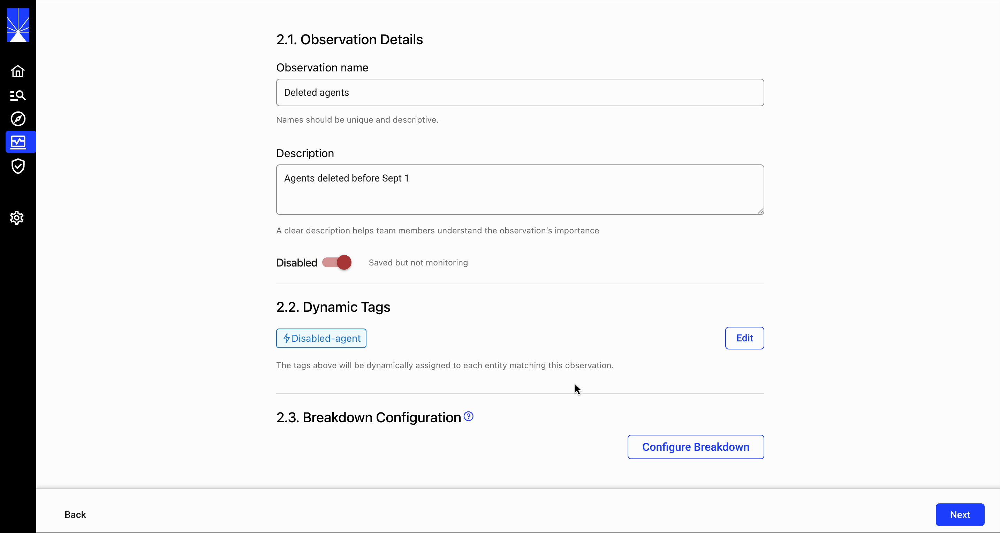
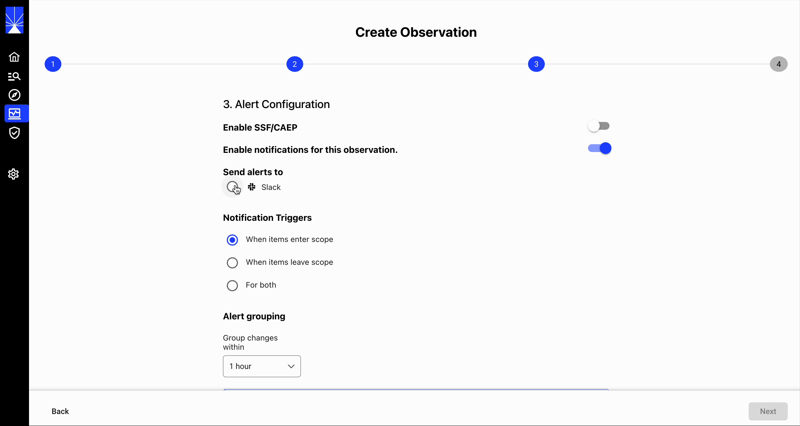
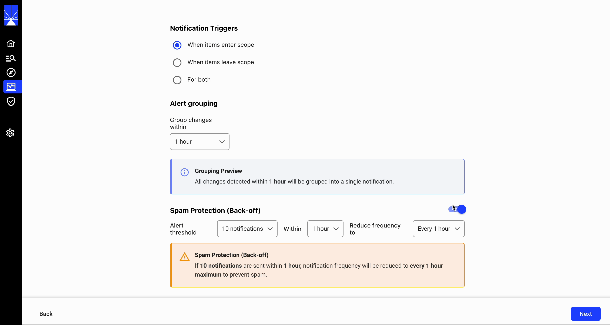
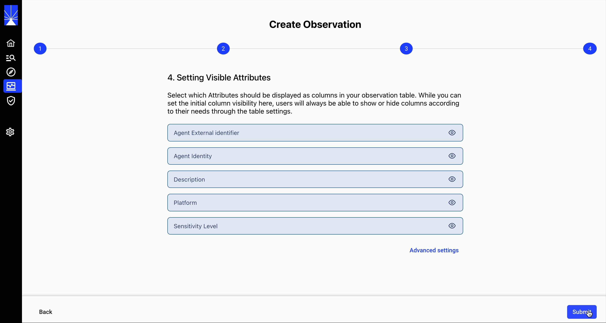
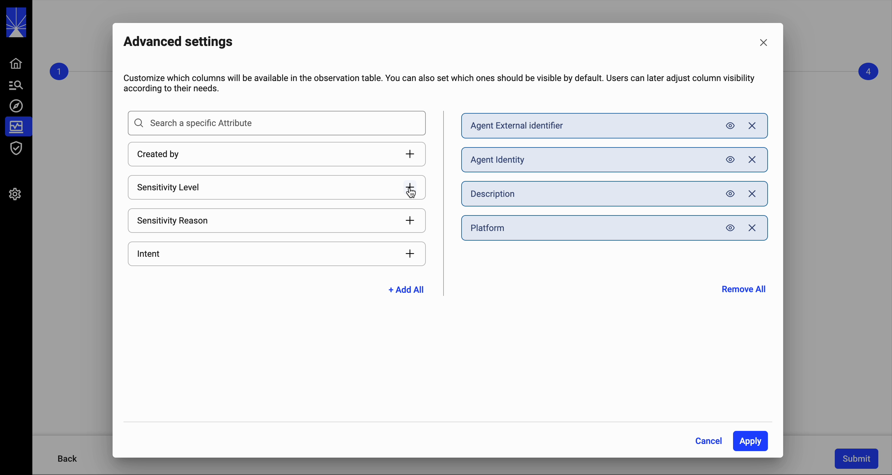

# Overview
 
This document provides an overview of Observations and outlines the steps to create and view observations.  
 
Observations are near real-time queries that you can create to get up-to-date visual information about identity-related events in the form of dashboard. You can use the results of an observation to take timely and appropriate actions, ensuring continuous and effective oversight of user identities, agent identities and access. 
 
You have the flexibility to enable existing Observations or create new observations tailored to your business needs. For example, you might set up an observation to track contractors whose accounts are set to expire on a particular date. This enables you to track and follow up on changes over time. You can quickly pinpoint accounts that need review or deactivation, allowing you to take prompt actions such as alerting the appropriate manager or disabling the account. Additionally, you can generate reports and build custom dashboards to share these insights with others. 

## Steps to create an observation

An observation is a saved, continuously evaluated query over a population of entities. The creation workflow has four steps: define what to watch, describe and tag it, decide how you want to be alerted, and choose the columns of the resulting table.

1. Click the Observation menu item in the left navigation. This opens the Observation management interface, which lists existing observations and provides a button to create a new one.

   

2. Click the "Create an observation" button in the top right corner to start the observation creation workflow.

3. On the Criteria step, use the entity dropdown on the left to select the population you want to observe: Identities, Departments, Accounts, Groups, or Agent Identities. Then define one or more conditions using **Criterion** and **Group**.

   Each criterion is built from an attribute, an operator, and a value. The attributes offered depend on the entity you selected. For agent identities, for example, you can build conditions on lifecycle events such as published, suspended, blocked, or deleted, on the identity that created, published, invoked, blocked, or deleted the agent, and on values such as last updated or aggregated risk level. Operators vary by attribute type and include **before**, **after**, **less than**, **more than**, and **in less than**.

   

   Use **Group** to nest conditions and control how they combine. To watch agent identities that were deleted before a given date, for example, select **Agent Identities**, choose the **deleted** attribute, set the operator to **before**, and enter the date.

4. Click **Apply**. The table below refreshes with the entities that currently match, so you can confirm the criteria return what you expect before continuing. Click **Next**.

   

5. On the Observation Details step, complete the following sections.

   **2.1. Observation Details.** Give the observation a unique, descriptive name and a description that explains its purpose and scope to the rest of your team. Use the status toggle to decide whether the observation begins monitoring right away or is saved in a disabled state for later. A disabled observation is saved but does not evaluate criteria or raise alerts.

   

   **2.2. Dynamic Tags.** Click **Add Tag** to attach one or more tags to the observation. Select an existing tag from the list or type a new name and click **Create** to add one. Tags are assigned dynamically to every entity that matches the observation, so they follow the population as it changes. Click **Edit** to change the tags later.

   

   **2.3. Breakdown Configuration.** This section is optional. Click **Configure Breakdown**, then use **Breakdown by** to select the criteria you want the results segmented on. Leave the section untouched if you do not need a breakdown.

   

   Click **Next**.

6. On the Alert Configuration step, decide how and when this observation notifies people.

   * **Enable SSF/CAEP.** Turn this on to publish Shared Signals Framework (SSF/CAEP) events for this observation. Leave it off if your deployment does not consume those signals.
   * **Enable notifications for this observation.** Turn this on to reveal the notification settings. Leave it off to create the observation without alerting.
   * **Send alerts to.** Select the delivery channel, then choose the configuration to use, for example a specific Slack workspace.
   * **Notification Triggers.** Choose whether to alert when items enter scope, when items leave scope, or for both.

   

   * **Alert grouping.** Set the window in which changes are bundled into a single notification. The Grouping Preview below the field restates your selection so you can confirm it.
   * **Spam Protection (Back-off).** Turn this on to cap notification volume. Set the alert threshold, the window it applies to, and the reduced frequency to fall back to. The preview restates the resulting behavior, for example: if 10 notifications are sent within 1 hour, frequency is reduced to a maximum of one every hour.

   

   > Delivery channels and their configurations are set up by a technical administrator under **Admin > Settings**. If the channel or workspace you need is not listed, contact your platform administrator.

   Click **Next**.

7. On the Setting Visible Attributes step, choose which attributes appear as columns in the observation table. Click the eye icon next to an attribute to show or hide it. Viewers can still adjust column visibility from the table settings afterwards, so this sets the starting view rather than a permanent one.

   

   If an attribute you want is not listed, click **Advanced settings**. In the dialog, search for an attribute and click the plus icon to add it, or click the X to remove one from the table. Use **+ Add All** and **Remove All** to work with the full list at once. Click **Apply** to return to the step with your changes in place.

   

8. Click **Submit**. To view the observation you created, go to Observations > My Observations and click its name. If you saved the observation in a disabled state, you can activate it from the My Observations page.

> Note that the delivery channels and settings for the alerts need to be configured by an technical administrator via the "Admin > Settings" page.  

