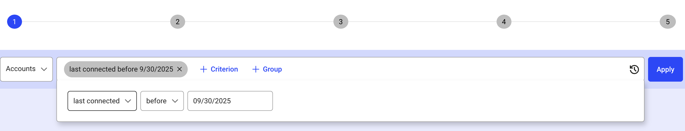

# Overview
 
This document provides an overview of Observations and outlines the steps to create and view observations.  
 
Observations are near real-time queries that you can create to get up-to-date visual information about identity-related events in the form of dashboard. You can use the results of an observation to take timely and appropriate actions, ensuring continuous and effective oversight of user identity and access. 
 
You have the flexibility to enable existing Observations or create new observations tailored to your business needs. For example, you might set up an observation to track contractors whose accounts are set to expire on a particular date. This enables you to track and follow up on changes over time. You can quickly pinpoint accounts that need review or deactivation, allowing you to take prompt actions such as alerting the appropriate manager or disabling the account. Additionally, you can generate reports and build custom dashboards to share these insights with others. 

## Steps to create an observation 

1. Click the Observation menu item in the left navigation. This will open the Observation management interface that contains existing observations as well as a button to create a new observation.

  

2. Click the "Create an observation" button in the top right corner to initiate the observation creation workflow. 

3. Using the "Search for" dropdown, select a category for which you want to build the observation. Define one or more criteria for observation using the Criterion and Group options. Suppose you want to create an observation for Accounts that last logged in before a certain date. To do so, you would choose the 'Account' category from the dropdown, set the criterion to 'last connected before,' and enter a date (for example, 'before 09/30/2025').

  

4. Click "Apply" to review your changes, and then click "Next" to move forward.

5. On the Name & Status tab, provide a suitable name and description for the observation. Then, choose whether you want the observation to be active immediately or saved in a deactivated state for future use. Click Next.

  

6. On the Breakdown configuration tab, you can add additional filters or criteria for your observation by clicking the Configuration Breakdown option and selecting the configurations that you would like to add. This step is optional. Click “Skip for now” to skip this step.

7. On the Alert Configuration Tab, activate and configure alerting as needed by:

  * Specifying the triggering events, such as when a new item is detected, when an item is removed from the list, or both.

  * Setting grouping parameters, for example grouping notifications every 30 minutes, 1 hour, 4 hours, or daily.

  * Activating protection to prevent too many notifications from being sent in a short period of time.

  * Selecting the delivery channel, such as email, Slack, Teams, or webhook, and configuring the recipients for notifications.

> Note that the delivery channels and settings for the alerts need to be configured by an technical administrator via the "Admin > Settings" page.  

8. On the Setting Visible Attributes tab, select the attributes that you want to display or hide in the Observation table by clicking on the “eye” icon next to the attribute name. If you do not see a desired attribute in the displayed list, click Advanced settings to add additional attribute(s).  Click "Next" after selecting the attributes.

9. After making all desired changes, select “Submit”. To view the observation you just created, navigate to Observations > My Observations and click on the observation name. If the Observation isn't already activated, you can activate it from the My Observations page. 
