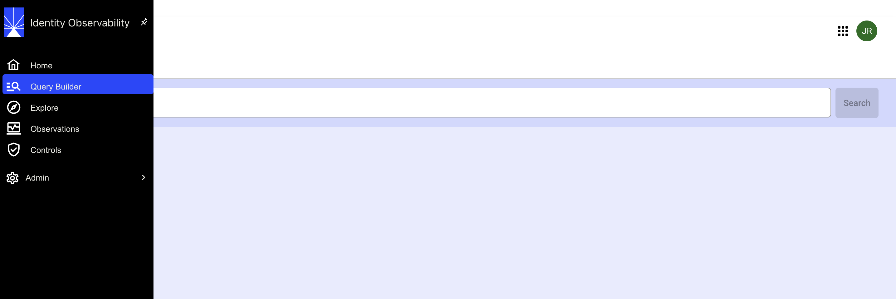
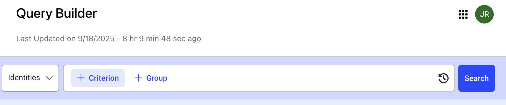

# Query Builder  
 
Query Builder allows users to construct, run, and manage custom queries within the platform to extract and analyze data relevant to the users. 
 
 
## Getting started 

To open Query Builder, login to the Identity Observability portal and click the Query Builder option in the left navigation panel.  

    

 Query builder screen will be displayed. You can create your query by selecting different options shown in the dropdown.  
 
    

 
### Example usage  
Suppose you want to find identities that have been removed between August 1, 2025, and September 1, 2025.  
 
To get this data, make the following selections in the query builder: 

1. Choose Identities from the “Search for” dropdown.   

2. Choose “that have been removed” as the criterion. 

3. Choose “between” as the filter for date range “August 1, 2025” and “September 1, 2025”.  

 
The results will show matching identities along with details such as full name, employee number, email address, active identity status, start and end date, department, job title, repository, and priority.  

 
