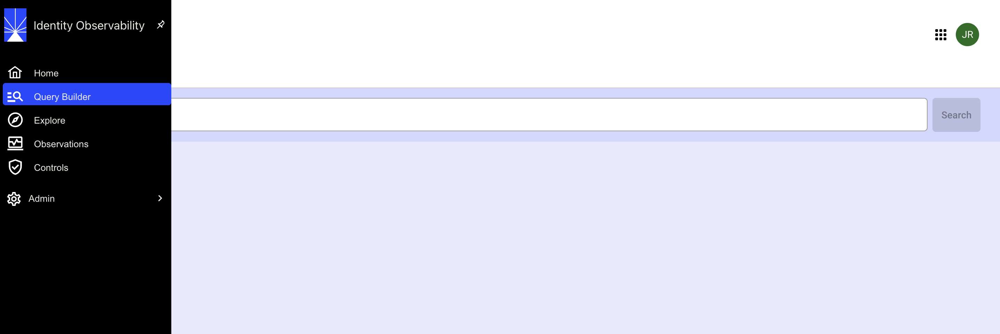
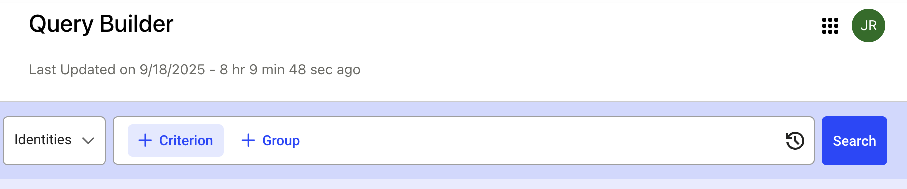

# Query Builder  
 
Query Builder makes it easy to create, run, and manage custom queries so you can find and analyze the data you need. You can search for both agents and standard user identities directly in Query Builder. 
 
## Getting started 

To open Query Builder, login to the Identity Observability portal and click the Query Builder option in the left navigation panel.  

   

 Query builder screen will be displayed. You can create your query by selecting different options shown in the dropdown.  
 
   

Select Agent Identity from the Search for selector to query agents by any attribute, including backend labels. You can create more advanced queries by linking conditions with AND/OR and grouping them when necessary. 
 
### Example usage  

Suppose you want to find identities that have been removed between August 1, 2025, and September 1, 2025.  
 
To get this data, make the following selections in the query builder: 

1. Choose Identities from the “Search for” dropdown.   

2. Choose “that have been removed” as the criterion. 

3. Choose “between” as the filter for date range “August 1, 2025” and “September 1, 2025”.  

The results will show matching identities along with details such as full name, employee number, email address, active identity status, start and end date, department, job title, repository, and priority.  

**Querying for Agent Identities**

To search for agents by specific attributes:

1. Choose Agent Identity from the Search for dropdown.

2. Add your criteria, combining conditions with AND/OR and grouping as needed.

3. Run the query to view matching agents in the results panel.

 
