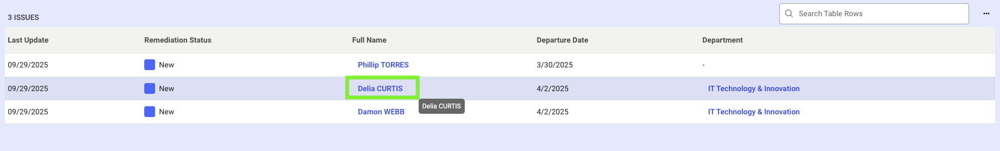

## Remediation Audit Trail  

 Remediation Audit trail records all end-user activities in Identity Observability related to remediation, such as attribute updates, accounts disabled etc., providing traceability for data modification. 

The Audit Trail page can be accessed through the admin settings page, control detail page as well as object detail page.  

It provides details such as the action taken, who performed the action, the affected entity, the time of occurrence, and the action’s status.  

 
1. Technical administrators can access this page by clicking on “Admin > Settings > Audit Trail”. This will list all actions performed through Identity Observability.  

  

 
2. Non admins users and technical administrators can view this page by navigating to a control from the Controls page and clicking the “View Audit Trail” link in the top left corner. 

  

This lists the audit trail related to remediation of a specific control.

3. Non admin users and technical administrators can also view the Audit Trail by:
    * Clicking on an object to open its detail page. Example:

     
    
    * Then, clicking on the (…) menu and selecting “View Audit Trail”. Example:

     

### Understanding Audit Trail  

| Field            | Description                                                                                                                                  | Examples / Possible Values                                                                                                                                                                                                 |
|------------------|----------------------------------------------------------------------------------------------------------------------------------------------|-----------------------------------------------------------------------------------------------------------------------------------------------------------------------------------------------------------------------------|
| Remediation Value | Type of action performed, displayed in one of the following formats: • entity/remediation action (for control issue remediation) • entity/attribute (for attribute updates)  Refer to the remediation code listed in the remediation table above. | Account/disable Identity/updateEmail                                                                                                                                                                                     |
| Entity Type      | The classification of the entity subject to remediation.                                                                                     | Accounts, Identities, Departments, Resources, Repositories                                                                                                                                                                  |
| Affected Entity  | The name and unique identifier (ID) of the impacted entity.                                                                                   | Account: 12345 Identity: jdoe                                                                                                                                                                                            |
| Action Status    | Indicates the progress or result of the remediation action (distinct from issue status).                                                     | error – Action failed due to an execution error cancel – Action was canceled before completion running – Action is in progress submitted – Action was submitted but not yet started completed – Action finished successfully |

### Filtering Audit Trails  

An audit trail can be filtered by dates so you can specify the date range for which the trail should be displayed. 

  

You can also filter the audit trail by:  

* actor (user who performed the remediation action)
* modified object ( the account, the identity …) 
* remediation action type 
* entity type 
* affected entity 
* status 

  

Optionally, you can enable the "Group by Remediation Bulk Actions" option to reveal which remediation operations were performed in bulk. 

  

By clicking the “View Details” option under Action, you can find additional technical details about that action (such as details about a timeout status or an error status). 