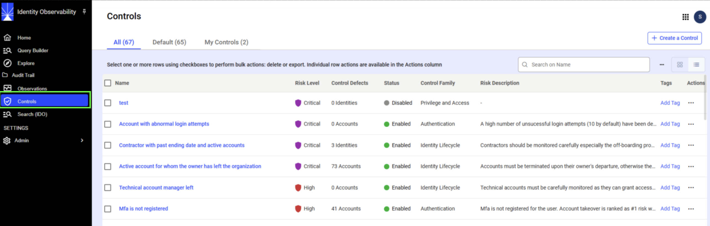
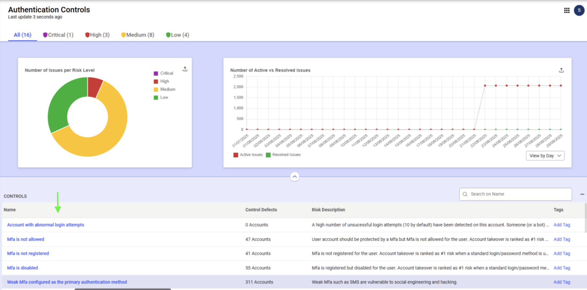
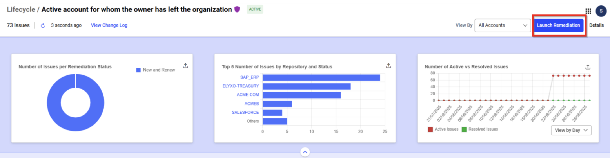
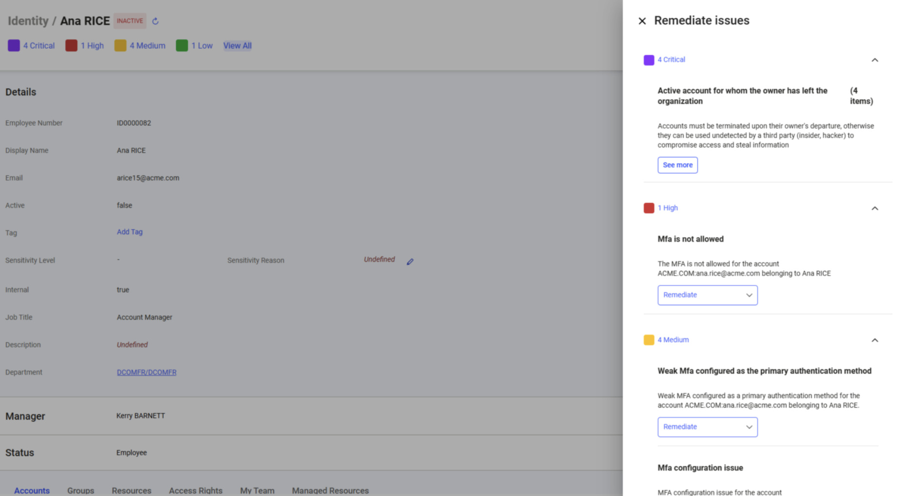
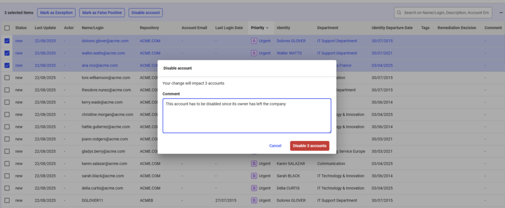
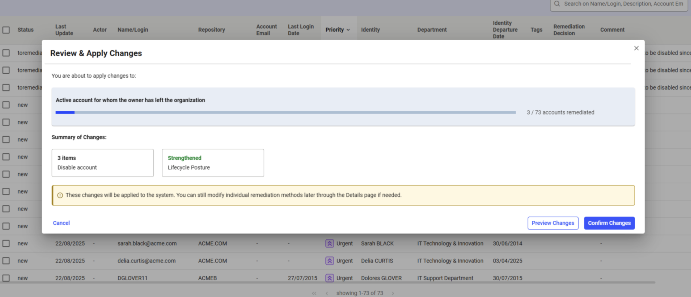

# Overview  

Remediation is the process of addressing identified issues (control defects) detected by the enabled controls in your Identity Observability portal. Issues can be resolved individually or in bulk.  

You can initiate remediation actions from the **Controls** page or by clicking on an object assosicated with the issue.  

## Remediation Access  

The ability to perform remediation is available to the following roles:  

- **Technical and Functional Administrators**: Full access with no restrictions.  
- **Line Managers**:For departments and identities they manage.  
- **Resource Owners**: For resources and related permissions they manage.  
- **Repository Owners**: For repositories they manage, including related groups and accounts.  

> **Note:** In the initial release of Identity Observability, remediation is only supported for **built-in controls** (i.e., controls provided by default in the project or configured by Radiant Logic professional services). Custom controls created through the end-user interface are not currently eligible for remediation.  

## Initiating Remediation  

Remediation can be started from either:  
- The **Control UI** (landing page or Controls page)  
- The **object detail page** (e.g., identity, account, group, repository, resource, or department)  

Both methods are described below.  

### Remediation via the Landing Page  

Technical administrators can initiate remediation from the landing page by selecting any of the **Control Families**.  

Issues (control defects) are displayed either under **All** or grouped by **risk level**.  
Click a control name to open the remediation options.  

### Remediation via Controls  

Users with remediation access—including technical administrators—can also start remediation from the **Controls** page:  

1. Navigate to the **Controls** page.  

   

2. Select a control name from the table.  
   
   
   
3. This opens an interface listing all issues related to the selected control. Click **Launch Remediation** in the top-right corner.  

   

   
4. Next, select the issues to remediate:  
- Resolve them **individually** or  
- Select multiple issues and remediate in **bulk mode**.  
   

5. To remediate:  
- Check the box next to an issue.  
- Click one of the available action buttons.  
   - Example actions include: **Mark as Exception**, **Mark as False Positive**, and **Disable Account**.  

### Remediation via Object Detail Page  

On detail pages (for identities, accounts, groups, repositories, resources, or departments), the number of related issues is displayed.  

Clicking the issue count or selecting **View All** opens a side panel with the associated controls. 

  

If only one issue exists for a control, you can remediate it directly by selecting **Remediate**.  

When multiple issues are present (e.g., *“Active account for which the owner has left the company”*), click **See More** to view the complete list of defects.  

This action opens the control detail page, filtered to show only the relevant issues. From there, you can address issues individually or in bulk by selecting **Launch Remediation**.  

### Example: Remediation Workflow  

In the example below, remediation involves disabling associated accounts:  

1. Select the **Disable Account** action.  
   
    

   > In this example, three similar issues are being remediated simultaneously.  

2. Confirm the action by clicking **Disable X Accounts**.  

3. Choose **Apply Changes** to proceed, or **Discard Changes** to cancel.  

    

4. Select **Preview Changes** to review the updates.  

5. Click **Confirm Changes** to make the remediation permanent.  

## Remediation Actions

The following remediation actions are available in Identity Observability. The actions vary depending on the issue that needs to be remediated. 

| Remediation Code                   | Action                          | Description                                                                                                                                          |
|------------------------------------|---------------------------------|------------------------------------------------------------------------------------------------------------------------------------------------------|
| defects/set_exception              | Mark as Exception               | This indicates that a detected security issue is acknowledged but accepted as a legitimate exception to the normal security policy, during a specific period or indefinitely. |
| defects/set_false_positive         | Mark as False Positive          | The detected issue is actually not a real problem. This indicates that the issue should not be considered by the end-users nor in the interfaces and by the security scoring feature. |
| defects/set_processed              | Mark as Processed               | The remediation action to fix the identified problem has been handled outside Identity Observability.                                                |
| account/add_manager                | Add Account Manager             | Assigns a manager to oversee and administer the technical/service account by picking an identity.                                                     |
| account/disable                    | Disable Account                 | Deactivates the account, preventing access.                                                                                                           |
| account/disable_mfa                | Disable Account MFA             | Turns off multi-factor authentication for the account.                                                                                                |
| account/enable                     | Enable Account                  | Activates or reactivates an account to allow access.                                                                                                  |
| account/enable_mfa                 | Enable Account MFA              | Enforces multi-factor authentication on the account for stronger security.                                                                            |
| account/mark_as_service_account    | Mark As Service Account         | Designates the account as a non-human service or technical account.                                                                                    |
| account/reconcile                  | Reconcile Account               | Allows to set the account as user account and select the Identity who owns the account.                                                               |
| account/remove_manager             | Remove Account Manager          | Revokes a manager of the service/technical account from a previously assigned manager.                                                                |
| account/set_description            | Set Account Description         | Sets a description for the service/technical account.                                                                                                 |
| account/set_do_expire_password     | Set Account Password to Expire  | Configures the account so its password must expire periodically.                                                                                      |
| account/set_dont_expire_password   | Set Account Password Not Expire | Configures the account password to never expire.                                                                                                      |
| account/set_email_address          | Set Account Email Address       | Assigns or updates the email address associated with the account.                                                                                     |
| account/set_ password_can_change   | Allow Account Password Change   | Grants the user permission to change their password.                                                                                                  |
| account/set_ password_cant_change  | Restrict Account Password Change| Restricts the user from changing their password.                                                                                                      |
| account/set_password_expiration_date | Set Account Password Expiration Date | Defines the specific date on which the password will expire.                                                                                          |
| account/set_password_not_required  | Set Account Password Not Required | Allows the account to function without requiring a password.                                                                                          |
| account/set_password_required      | Set Account Password Required   | Enforces that the account must have a password set.                                                                                                   |
| account/set_sensitivity_level      | Set Account Sensitivity Level   | Assigns a sensitivity classification from level 1 (low) to level 4 (critical) to the account and describe the sensitivity reason.                     |
| account/set_user_name              | Set Account Username            | Sets the username associated with the account.                                                                                                        |
| account/unlock                     | Unlock Account                  | Unlocks an account that was previously locked.                                                                                                        |
| department/add_manager             | Add Department Manager          | Assigns a manager for the department by picking an identity.                                                                                          |
| department/remove_manager          | Remove Department Manager       | Removes department manager.                                                                                                                           |
| department/set_sensitivity_level   | Set Department Sensitivity Level| Sets the sensitivity classification of the department from level 1 (low) to level 4 (critical) and describes the sensitivity reason.                  |
| group/add_manager                  | Add Group Manager               | Assigns an owner for the group by picking an identity.                                                                                                |
| group/add_member                   | Add Group Member                | Adds a user account as a member of the group.                                                                                                         |
| group/remove_manager               | Remove Group Manager            | Revokes an owner of the group.                                                                                                                        |
| group/remove_member                | Remove Group Member             | Removes a user account from group membership.                                                                                                         |
| group/set_description              | Set Group Description           | Defines or updates descriptive information about the group.                                                                                           |
| group/set_sensitivity_level        | Set Group Sensitivity Level     | Sets a sensitivity classification for the group from level 1 (low) to level 4 (critical) and describes the sensitivity reason.                        |
| identity/add_job_and_department    | Add Job and Department to Identity | Associates a job role and department with an identity.                                                                                                |
| identity/delete_job_and_department | Delete Job and Department from Identity | Removes the job role and department assignment from an identity.                                                                                      |
| identity/disable                   | Disable Identity                | Set the identity as inactive, meaning she is not working for the organization anymore.                                                                |
| identity/enable                    | Enable Identity                 | Set the identity as active, meaning she is working for the organization.                                                                              |
| identity/set_departure_date        | Set Identity Departure Date     | Records or updates the date when the individual is expected to leave.                                                                                  |
| identity/set_direct_manager        | Set Identity Direct Manager     | Assigns or updates the direct manager of the identity.                                                                                                |
| identity/set_email                 | Set Identity Email              | Sets or modifies the email address linked to the identity.                                                                                            |
| identity/set_employee_number       | Set Identity Employee Number    | Records or updates the employee number for the identity.                                                                                              |
| identity/set_identity_type         | Set Identity Employee Type      | Defines the identity as a specific employee type (supplier, contractor, manager, and so on).                                                          |
| identity/set_sensitivity_level     | Set Identity Sensitivity Level  | Assigns a sensitivity classification to the identity from level 1 (low) to level 4 (critical) and describes the sensitivity reason.                   |
| permission/add_manager             | Add Permission Manager          | Assigns a manager for the permission by picking an identity.                                                                                          |
| permission/remove_manager          | Remove Permission Manager       | Removes identity managers of the permission.                                                                                                          |
| permission/set_description         | Set Permission Description      | Sets description of a permission.                                                                                                                     |
| permission/set_sensitivity_level   | Set Permission Sensitivity Level| Assigns sensitivity classification to the permission from level 1 (low) to level 4 (critical) and describes the sensitivity reason.                    |
| repository/set_sensitivity_level   | Set Repository Sensitivity Level| Assigns sensitivity classification to the repository from level 1 (low) to level 4 (critical) and describes the sensitivity reason.                    |
| resource/add_manager               | Add Resource Manager            | Assigns a manager responsible for the resource by picking an identity.                                                                                |
| resource/remove_manager            | Remove Resource Manager         | Removes a resource manager.                                                                                                                           |
| resource/set_description           | Set Resource Description        | Sets description about the resource.                                                                                                                  |
| resource/set_sensitivity_level     | Set Resource Sensitivity Level  | Assigns a sensitivity classification to the resource from level 1 (low) to level 4 (critical) and describes the sensitivity reason.                    |
