## Guided Remediation in Slack with AIDA

This guide explains how to enable Guided Remediation in Slack with Radiant Logic’s AIDA, including the required configuration steps and integration details.

### Prerequisites

Before you begin, ensure that you have:

* Your Identity Observability (IDO) portal URL
* AIDA is activated in your Identity Observability instance in the Environment Operations Center.
* Permission to create and install Slack apps

If you don’t have app permissions in Slack, ask your admin to either enable app management for your account or install the app for you and share the credentials.

### Step 1: Gather necessary URLs

1. Login to Identity Observability and navigate to:
   **Admin > Settings > Remediation > Guided Remediation in Slack**

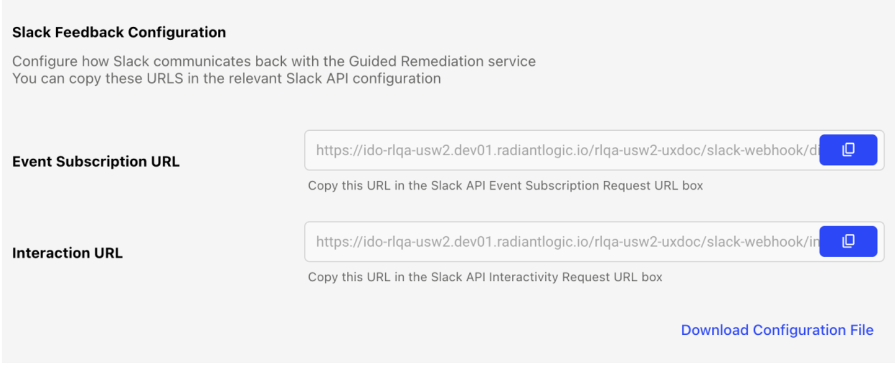

2. Make note of **Event Subscription URL** and **Interaction URL** as you will need these while configuring the Slack App.

### Step 2: Create the Slack App Using a Manifest File

1. Go to [https://api.slack.com/apps](https://api.slack.com/apps) and click **Create an App**.
2. Choose **From Manifest** and select your workspace.
3. Paste the manifest below and ensure you replace the following:

   a. Replace the Request URL values for Event Subscriptions and Interactivity with the URLs obtained in Step 1.
   b. Update the app name if needed.

```
{
  "display_information": { "name": "AIDA" },
  "features": {
    "app_home": {
      "home_tab_enabled": false,
      "messages_tab_enabled": true,
      "messages_tab_read_only_enabled": false
    },
    "bot_user": { "display_name": "AIDA" }
  },
  "oauth_config": {
    "scopes": {
      "bot": [
        "channels:history",
        "im:history",
        "chat:write",
        "im:write",
        "users:read",
        "users:read.email"
      ]
    }
  },
  "settings": {
    "event_subscriptions": {
      "request_url": "<ido_portal_url>/obs/slack-webhook/discussion",
      "bot_events": ["message.im"]
    },
    "interactivity": {
      "is_enabled": true,
      "request_url": "<ido_portal_url>/obs/slack-webhook/interaction"
    }
  }
}
```

4. Create the app and ensure that the Event Subscription URL is verified.

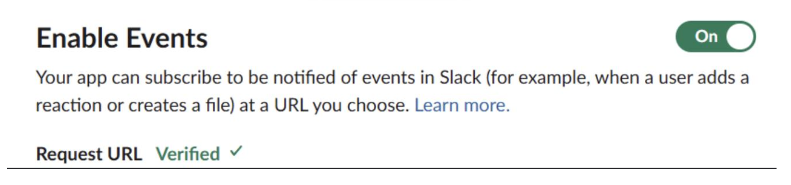

5. Save changes.

Note that you can also create the app from scratch without using the Manifest. You will need to enter the appropriate values manually and select all the scopes shown in the manifest file. You will also need to enable event subscription with `message.im` permission and enable interactivity.


### Step 3: Install the App

1. Go to **Install App**. Click the green **Install** button. A new page will open to confirm the installation.
2. Click **Allow**. You will then be redirected back to Install App in your Slack app settings, where you can copy the **Bot User OAuth Token** (starting with `xoxb`).

### Step 4: Enable AIDA Messaging

1. In the **App Home** section, enable the **Messages Tab** and select the “Slash commands and messages from the messages tab” option.

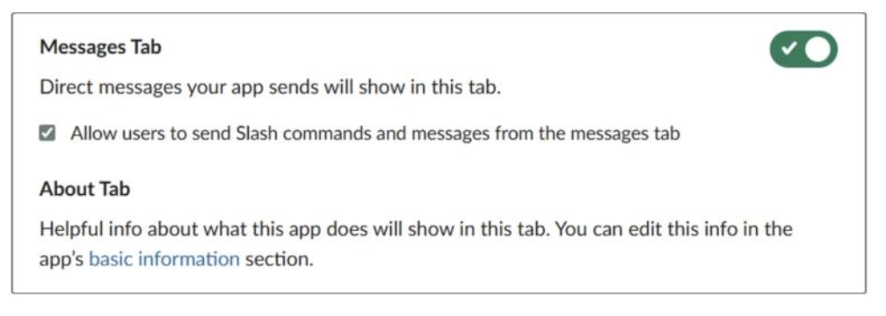


### Step 5: Configure Credentials in Identity Observability

1. Login to Identity Observability and navigate to Admin > Remediation > Guided Remediation in Slack. 

2. Under **Slack Connection Configuration**, provide your Slack Workspace URL
   (example: https://radiant-dev.slack.com/api/chat.postMessage)
   and the token that you copied earlier.

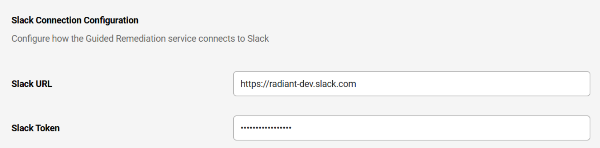


### Step 6: Enable Guided Remediation for a Control

1. In your Identity Observability Portal, navigate to **Controls** and select a control that you want to be alerted about via Slack.

2. In the Control detail interface, click the (...) menu and click **Configure Alert**.

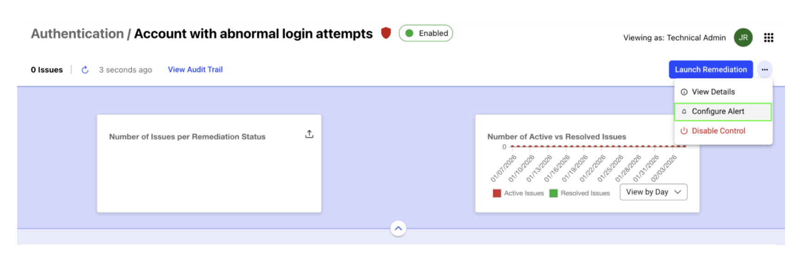

3. Next, toggle on the **Enable Guided Remediation with Slack** option.

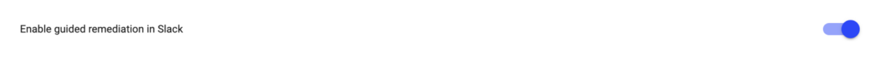


### Step 7: Receive Guided Remediation Alerts

When an issue related to a Control is detected, you’ll receive a Slack alert with suggested remediation actions. 

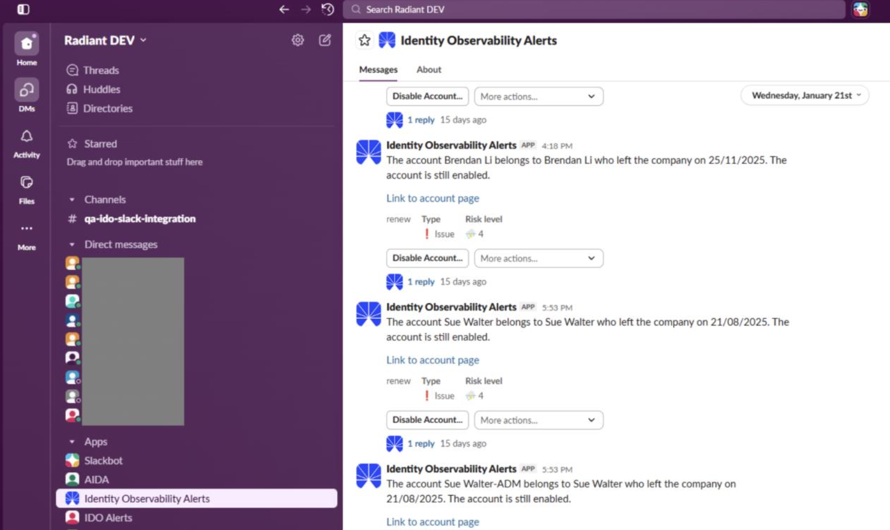


Note that you will be notified only if you are a manager linked to the control object. This is described further in the following section:

When a guided remediation notification is triggered, Identity Observability uses a deterministic routing order to identify who should receive the notification in Slack.

* Rules are evaluated sequentially per object type.

* As soon as a rule finds one valid recipient, the process stops.

* If a rule cannot be resolved (no owner, manager, or department), the next rule is evaluated.

* “Manager” always means the direct manager of the previous identity in the chain.

* “Department-manager” means the manager of the department associated with that identity.

* Technical administrators can adjust the default rule order using the Umbrella Configuration API. You can locate all the endpoints at:
  `https:/<your-ido-portal-url>/api/docs`


#### Notification Routing Logic by Object Type

| Object Type | Routing Order (Evaluated Top to Bottom) | Description |
|-------------|------------------------------------------|-------------|
| Accounts | 1. user-account-owner-manager<br>2. user-account-owner-department-manager<br>3. user-account-owner-manager-manager<br>4. user-account-owner-manager-department-manager<br>5. user-account-owner-department-department-manager<br>6. user-account-owner-department-manager-manager<br>7. service-account-manager<br>8. service-account-manager-manager<br>9. service-account-manager-department-manager<br>10. account-repository-manager<br>11. account-repository-manager-manager<br>12. account-repository-manager-department-manager<br>13. account-group-manager<br>14. account-group-group-manager<br>15. account-group-repository-manager<br>16. account-group-group-repository-manager<br>17. account-resource-manager | Moves from the account owner’s management chain to department and repository managers, and finally to resource and group ownership structures. |
| Groups | 1. group-manager<br>2. group-manager-manager<br>3. group-manager-department-manager<br>4. group-repository-manager<br>5. group-repository-manager-manager<br>6. group-repository-manager-department-manager<br>7. group-group-manager<br>8. group-group-group-manager<br>9. group-group-repository-manager<br>10. group-group-group-repository-manager<br>11. group-resource-manager | Prioritizes group ownership first, then repository and hierarchical group managers, finishing with related resource managers. |
| Repositories | 1. repository-manager<br>2. repository-manager-manager<br>3. repository-manager-department-manager | Routes through the repository’s manager hierarchy. |
| Permissions | 1. permission-manager<br>2. permission-permission-manager<br>3. permission-manager-manager<br>4. permission-manager-department-manager<br>5. permission-permission-manager-manager<br>6. permission-permission-manager-department-manager<br>7. permission-resource-manager<br>8. permission-resource-manager-manager<br>9. permission-resource-manager-department-manager | Starts with permission owners, checks permission owners’direct managers, checks parent permission managers, then resource and department managers. |
| Resources | 1. resource-manager<br>2. resource-manager-manager<br>3. resource-manager-department-manager | Follows the resource ownership and departmental hierarchy. |
| Identities | 1. identity-manager<br>2. identity-department-manager<br>3. identity-manager-manager<br>4. identity-manager-department-manager<br>5. identity-department-department-manager<br>6. identity-department-manager-manager | Notifies the person’s management chain and related department structure. |
| Departments | 1. department-manager<br>2. department-department-manager<br>3. department-manager-manager<br>4. department-manager-department-manager<br>5. department-department-manager-manager<br>6. department-department-manager-department-manager | Follows the organizational hierarchy from department leaders to higher-level or parent departments. |


##### Example: Account Defect Notification Flow

If a defect is found on an account:

1. The system first checks `user-account-owner-manager`.

   * If that manager exists, the notification is sent to them in Slack, and processing stops.
2. If not, it checks `user-account-owner-department-manager`.

   * The first existing, valid rule (manager or department leader) defines the recipients.
3. If none resolve, the engine continues down the list until a match is found.


### Step 7: Respond to the alert

Choose the action that fits your use case, or chat with the bot for more details. For more information about the alert, expand the “reply” included in the alert.

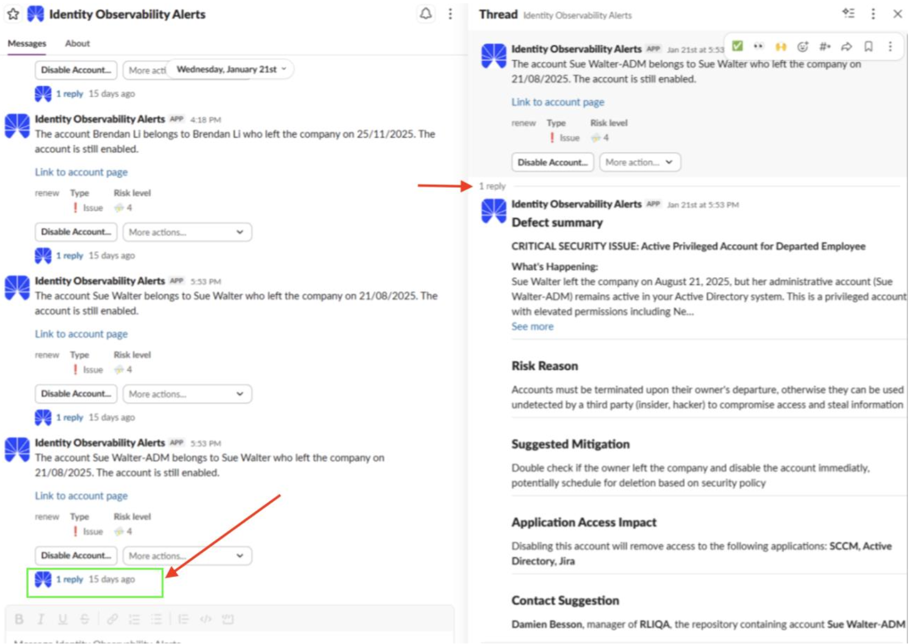

You can reply to that thread with any follow-up questions to get more insights about the issue.

After understanding the details, you can choose a remediation action such as disabling the account (as shown in the image below).

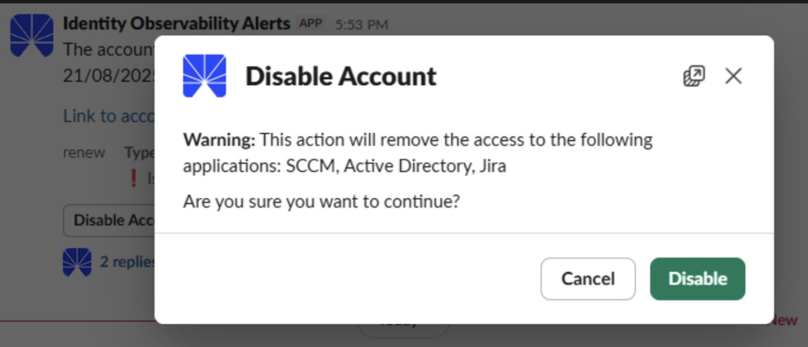

Alternatively, you can also choose other available actions, such as:

* Inquiring why you received the notification.

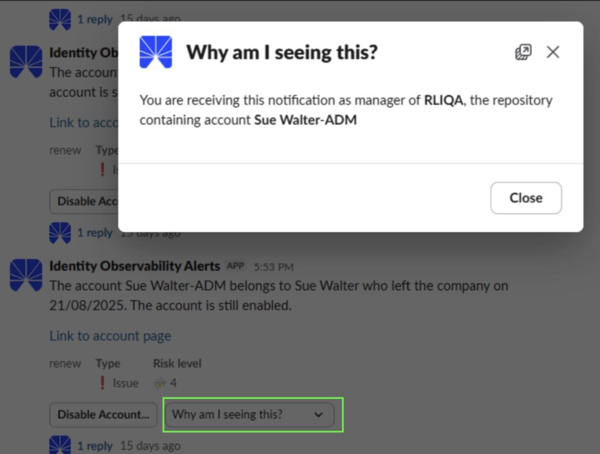

* Set exception

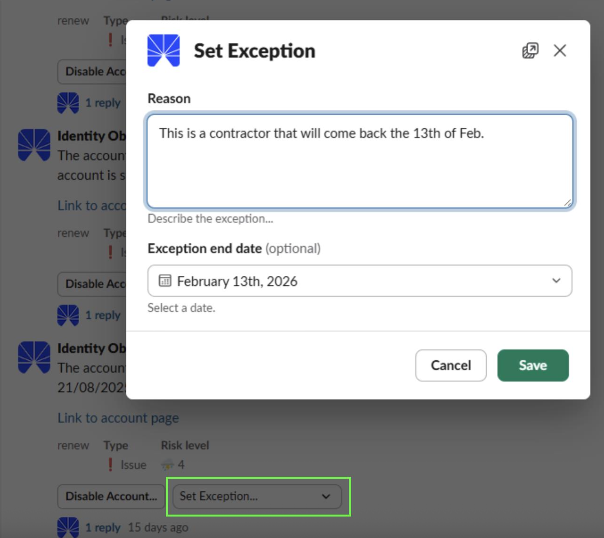

* Delegate the action to one of your direct reports (someone you manage).

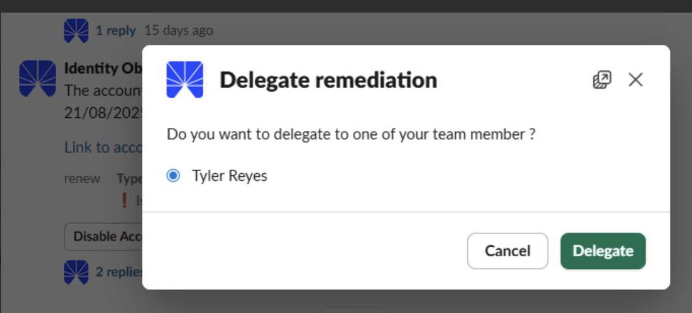


### Remediation Actions Available in Slack

The following remediation actions can be executed directly from Slack.

| Action | Example |
|--------|----------|
| identity/disable_all_accounts | Remediation of control IDO_HR10: Contractor with a past end date who still has active accounts. |
| identity/set_departure_date | Remediation of control IDO_HR08: Contractor without an end date. |
| identity/set_email | Remediation of control IDO_HR03: Resource owner without an email address. |
| identity/set_direct_manager | Remediation of control IDO_HR12: Contractor without an assigned manager. |
| account/add_manager | Remediation of control IDO_ACC61: Privileged technical account without an assigned manager. |
| account/enable_mfa | Remediation of control IDO_ACC66: User account with MFA disabled. |
| account/set_password_required | Remediation of control IDO_ACC09: User account configured with password not required. |
| account/set_description | Remediation of control IDO_ACC63: Privileged technical account without a description. |
| group/add_manager | Remediation of control IDO_GROUP08: Critical or sensitive group whose owner has left. |
| group/set_description | Remediation of control IDO_GROUP15: Critical or sensitive group without a description. |

For any remediation action not listed below, use the link provided in the Slack notification message. That link redirects you to the control detail page in Identity Observability, where the remediation can be performed.

### AIDA’s visibility scope

The Guided Remediation feature is powered by Radiant One's Artificial Intelligence Data Assistant (AIDA). When using AIDA, end users can access information only for the objects they are responsible for. This default behavior is defined in a JSON configuration file, which can be modified via the API.

AIDA’s visibility is strictly controlled and limited to predefined paths in the data model. For each defect object type (account, group, identity, permission, resource), the configuration defines multiple views.

Each view contains the following:

* **Fetch section** – Defines which graph nodes, relationships, and attributes AIDA is allowed to query.
* **Output section** – Defines which paths are materialized and which attributes are exposed to the end user (via labels and optional formatted values).

AIDA cannot access or expose anything outside these declared objects and attributes:

| Object with defect | Access granted to AIDA |
|--------------------|------------------------|
| **Account** | - The account itself (full profile, MFA/password settings, reconciliation data, risk and sensitivity metrics)<br>- Groups the account belongs to (ID, name, description, sensitivity)<br>- Resources linked to the account (directly or via groups – ID, type, sensitivity)<br>- The account owner (identity profile: name, email, employee info)<br>- Owner’s manager(s) (manager identity profile)<br>- Owner’s departments (identifiers and descriptions)<br>- Department managers (manager identity profile)<br>- Owner’s other accounts (same account details plus repository metadata)<br>- Resources of owner’s other accounts<br>- Owner’s department team members (identity profiles)<br>- Resources of those team members |
| **Group** | - The group itself (ID, name, DN, description, sensitivity, lifecycle dates)<br>- Parent groups (including higher‑level parents)<br>- Resources assigned to the group (ID, type, sensitivity)<br>- Resources inherited from parent groups<br>- Accounts in the group (limited to 100 – profile and risk metrics)<br>- Account owners (identity information) |
| **Identity** | - The identity itself (profile, risk and sensitivity metrics)<br>- HR repository metadata<br>- Identity’s departments (identifiers and descriptions)<br>- Department managers (manager identity profile) |
| **Permission** | - Groups directly linked to the permission (group identity and sensitivity)<br>- Accounts in those groups (account profile, MFA/password settings, risk metrics, owner information) |
| **Resource** | - Permissions linked to the resource<br>- Groups linked to those permissions<br>- Accounts in those groups (account profile, repository metadata, owner identity information) |


