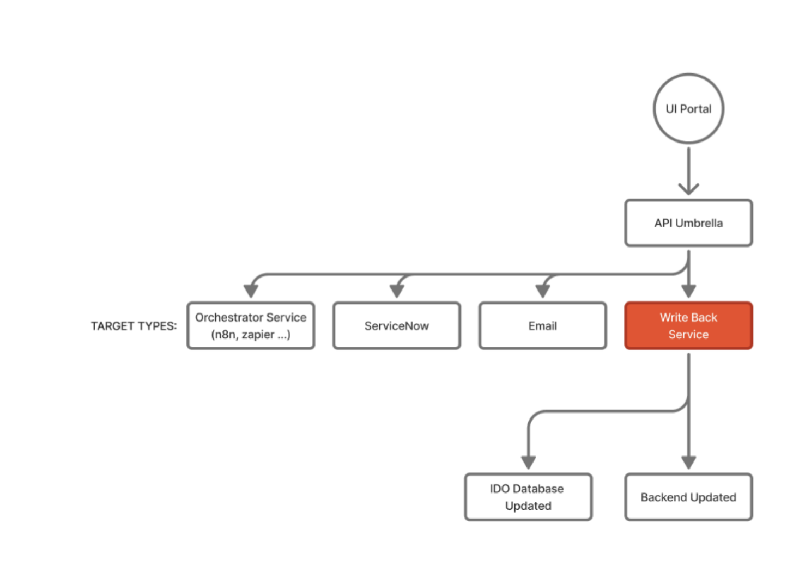
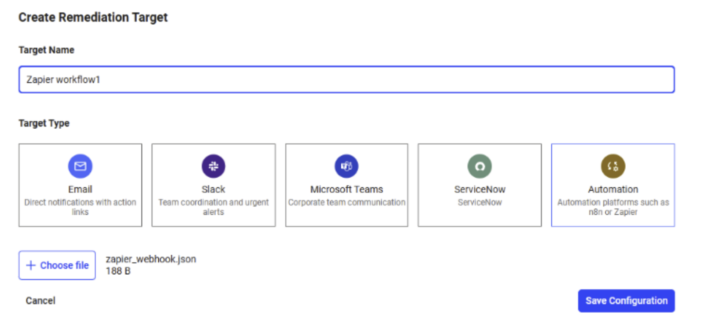
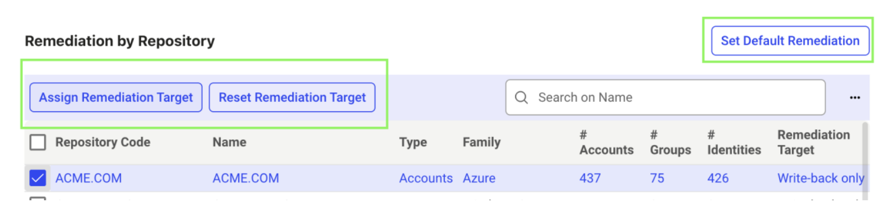

## Overview

When a remediation action is performed, it initiates an operation that determines where and how the change is applied. Based on your remediation policy, the update may be:

- Written back to the original backend system, or
- Stored in the Identity Observability database, or
- Sent as a remediation notification through channels such as Teams, Slack, email, or ticketing systems.

Remediation notifications in Identity Observability are alerts triggered whenever a remediation operation any action that modifies an entity, such as enabling or disabling accounts or updating identity details is completed.

This document explains the types of post-remediation operations and details the process for setting up remediation notifications and policies.

## Post remediation workflow

When a remediation action is performed, it triggers a specific operation that determines where and how the change is applied. Depending on your remediation policy configuration, the update may be written back to the original backend system, stored in the Identity Observability database, or sent as a notification through channels such as Teams, Slack, email, or ticketing systems. These operations are documented below.

  

### 1. Write Back to the Backend

By default, when a remediation action is triggered from the Identity Observability interface, the change is written back to the connected backend sources such as the Identity Observability Graph Database or your Data Source (example: Entra ID) through the Write Back Service.

The write-back process follows the defined lineage, meaning it updates the backend according to how the data is mapped in the pipeline. For example, if a group description attribute in Identity Observability is mapped to the description attribute in Entra ID, updating it in Identity Observability will automatically update it in Entra ID.

If an attribute is not mapped to a backend source, its value is stored directly in the Identity Observability database. This applies to attributes such as sensitivity level, sensitivity reason, and, when not mapped, group owners, technical account managers, or resource managers. It also applies to account type values (such as orphaned, user or technical), which can be defined by users in the Identity Observability UI or in the pipeline configuration.

### 2. Send Remediation Notifications

If you prefer not to use direct write-back to backend systems, remediation can be handled through notifications instead. By defining remediation policies for each data source, you can send messages through channels such as Teams, Slack, or email, create tickets in systems like ServiceNow, or route actions to custom third-party tools through webhooks (for example an IGA solution) depending on your configuration. This allows third-party platforms or automation tools such as n8n or Zapier to manage the remediation process.

The following section describes how to configure remediation notifications.

## Configuring Remediation Target Notifications

The remediation target determines where remediation notifications get delivered. These might include communication platforms (Email, Slack, Microsoft Teams), ticketing systems, or logging destinations.

Follow these steps to configure remediation targets:

1. Log in to your Identity Observability portal.
2. Navigate to the Settings section.
3. Click **Create Remediation Target**.
  
  

4. Select the target type.
5. Choose your JSON configuration file.
6. Click **Save Configuration**.


## Example Configuration Files

### ServiceNow Notification Integration

To configure ServiceNow notifications, create a webhook target pointing to your ServiceNow instance and API endpoint.

Example configuration (`target_servicenow.json`):

```json
{
    "service": "webhook",
    "displayname": "ServiceNow Target",
    "config": {
        "url": "https://<instance_id>.service-now.com/api/<scope_id>/<api_id>/<resource_relative_path>",
        "method": "POST"
    }
}
```


### Slack Notification Integration

To configure Slack notifications, obtain your Slack API credentials.

Example configuration (`target_slack.json`):

```json
{
    "service": "slack",
    "displayname": "Slack Target",
    "config": {
        "api-url": "https://<instance_name>.slack.com/api/chat.postMessage",
        "channel": "<channel_id>",
        "username": "<@username>",
        "http-config": {
            "authorization": {
                "credentials": "<token>",
                "type": "Bearer"
            }
        }
    }
}
```


### Microsoft Teams Notification Integration

To configure Microsoft Teams notifications, obtain the MS Teams webhook URL.

Example configuration (`target_msteams.json`):

```json
{
    "service": "msteams",
    "displayname": "MS Teams Target",
    "config": {
        "webhook-url": "<msteams_webhook_url>"
    }
}
```


### Orchestrator Notification Integration  
(e.g., n8n, Zapier, etc.)

To configure orchestrator notifications, provide the webhook URL.

Example configuration (`target_orchestrator.json`):

```json
{
    "service": "webhook",
    "displayname": "Orchestrator Target",
    "config": {
        "url": "<webhook_url>",
        "method": "POST"
    }
}
```

## Advanced Example

You can also build custom integrations with these providers to further automate your workflow. Here’s an example of how to create a ServiceNow Integration.


### Setting Remediation Policies

After saving your remediation targets, you can assign a custom target or select the write-back option for each repository. To do this, go to **Admin > Settings > Remediation** and click **Remediation Policies**.

  

Select the repository where you want to apply the policy using the checkbox. Then click **Assign Remediation Target** and choose your desired target. You can change the target at any time by selecting **Reset Remediation Target**. You can also set the default remediation (write-back only) by clicking the **Set Default Remediation** button.
